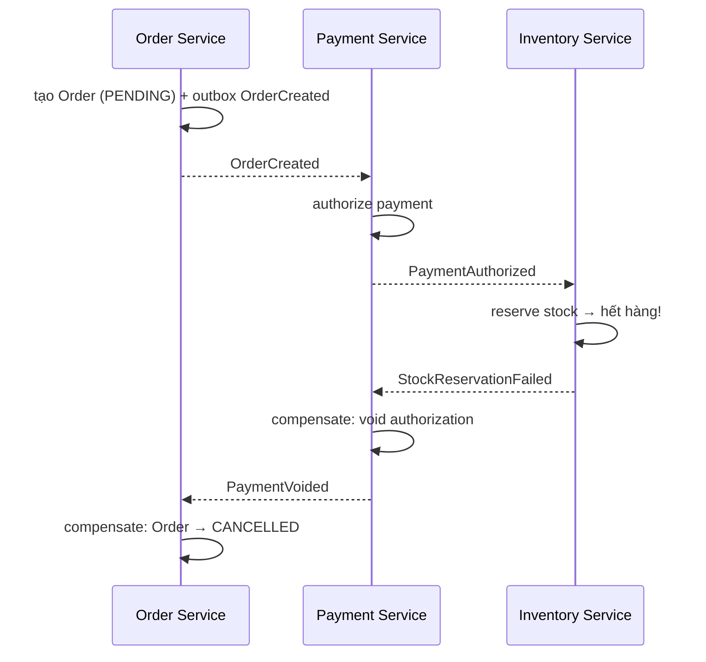

# Module 13 — Messaging & Event-Driven: Kafka, RabbitMQ

> **Mục tiêu:** sau module này bạn giải thích được vì sao và khi nào cần messaging bất đồng bộ; mô tả được kiến trúc bên trong Kafka (partition, offset, segment, replication, ISR, high watermark, KRaft) và RabbitMQ (exchange, binding, queue, ack, DLX, quorum queue); cấu hình được producer/consumer cho từng mức đảm bảo (at-most-once, at-least-once, exactly-once); thiết kế được hệ thống event-driven chịu được duplicate, mất thứ tự, poison pill, rebalance storm; áp dụng được các pattern idempotent consumer, transactional outbox + CDC, inbox, saga choreography; và debug được các sự cố production như consumer lag tăng vọt, under-replicated partitions, message bị xử lý hai lần.
> **Cấp độ:** Cơ bản → Nâng cao (Senior)
> **Thời lượng gợi ý:** 6 ngày (≈ 36 giờ: 20 giờ lý thuyết + 16 giờ bài tập/dự án)
> **Yêu cầu trước:** Module về Java Concurrency, Spring Boot, Spring Data/JPA & Transaction, Database (isolation, index). Biết chạy Docker / Docker Compose.
> **Nguồn tham khảo:**
> - Trong kho: [`Ebook IT/Newman_Building-Microservices.pdf`](../../Ebook%20IT/Newman_Building-Microservices.pdf) — chương "Microservice Communication Styles" (request-response vs event-driven), "Implementing Microservice Communication", "Workflow" (saga).
> - Trong kho: [`Ebook IT/Kubernetes Microservices with Docker .pdf`](../../Ebook%20IT/Kubernetes%20Microservices%20with%20Docker%20.pdf) — Chapter 12 "Using Apache Kafka" (chạy Kafka trên Kubernetes).
> - Trong kho: [`Ebook IT/Design Pattern.pdf`](../../Ebook%20IT/Design%20Pattern.pdf) — Observer (nền tảng ý tưởng pub/sub), Command (message như một object yêu cầu).
> - Ngoài: Apache Kafka Documentation (kafka.apache.org/documentation — mục Design, Configuration, Operations, KRaft); Confluent Docs (Schema Registry, Schema Evolution and Compatibility); Spring for Apache Kafka Reference (docs.spring.io/spring-kafka — "Handling Exceptions", "Non-Blocking Retries", "Transactions"); RabbitMQ Docs (rabbitmq.com/docs — AMQP 0-9-1 Model Explained, Consumer Acknowledgements and Publisher Confirms, Dead Letter Exchanges, Quorum Queues); microservices.io (Chris Richardson — Transactional Outbox, Idempotent Consumer, Saga, Event Sourcing); Debezium Docs (Outbox Event Router); Martin Kleppmann — *Designing Data-Intensive Applications*, Chapter 11 "Stream Processing".

## Mục lục
1. [Vì sao cần messaging bất đồng bộ — Queue vs Pub/Sub vs Log](#p1)
2. [Kiến trúc Kafka: broker, topic, partition, replication, KRaft](#p2)
3. [Kafka Producer internals](#p3)
4. [Kafka Consumer internals](#p4)
5. [Ordering, chọn key, retention & log compaction](#p5)
6. [Spring for Apache Kafka](#p6)
7. [Schema evolution: Avro & Schema Registry](#p7)
8. [RabbitMQ: mô hình AMQP và độ tin cậy](#p8)
9. [Kafka vs RabbitMQ — bảng quyết định](#p9)
10. [Pattern event-driven: idempotent consumer, outbox + CDC, inbox, event sourcing, saga](#p10)
11. [Duplicate, ordering, backpressure, replay trong thực tế](#p11)
12. [Monitoring & vận hành](#p12)
13. [Dự án mini của module](#du-an-mini)
14. [Checklist tự đánh giá](#checklist-tu-danh-gia)

---

<a id="p1"></a>
## 1. Vì sao cần messaging bất đồng bộ — Queue vs Pub/Sub vs Log

### 1.1 Khái niệm

Trong kiến trúc gọi đồng bộ (REST/gRPC), service A gọi B và **chờ** B trả lời. Điều này tạo ra ba loại coupling:

| Loại coupling | Ý nghĩa | Hậu quả khi B gặp sự cố |
|---|---|---|
| **Temporal coupling** | A và B phải cùng "sống" tại cùng thời điểm | B down → A lỗi theo |
| **Availability coupling** | Availability của A ≈ tích availability của các phụ thuộc | 5 dependency × 99.9% ≈ 99.5% |
| **Load coupling** | Peak traffic của A dồn thẳng vào B | B quá tải → timeout → retry storm |

**Messaging bất đồng bộ** chèn một **message broker** ở giữa: A ghi message vào broker rồi đi tiếp; B đọc message khi sẵn sàng. Lợi ích:

- **Decoupling theo thời gian:** B có thể down 10 phút, message vẫn nằm trong broker.
- **Load leveling / buffering:** broker hấp thụ peak, consumer xử lý theo tốc độ của mình.
- **Fan-out:** một event "OrderPlaced" có thể được nhiều service (Inventory, Email, Analytics) tiêu thụ mà producer không cần biết.
- **Khả năng mở rộng:** thêm consumer để tăng throughput.

Cái giá phải trả:
- **Eventual consistency** — kết quả không có ngay.
- **Độ phức tạp vận hành** — thêm một hệ thống phân tán phải giám sát.
- **Debug khó hơn** — luồng nghiệp vụ trải qua nhiều hop, cần correlation id / tracing.
- **Phải tự xử lý duplicate, ordering, poison message**.

> 💡 **Góc nhìn Senior:** Đừng dùng messaging chỉ vì "nghe hiện đại". Nếu caller *cần câu trả lời ngay để trả cho user* (ví dụ: kiểm tra số dư trước khi cho rút tiền), dùng sync. Messaging hợp với: tác vụ có thể trễ (gửi email, cập nhật search index), fan-out sự kiện nghiệp vụ, tích hợp hệ thống có tốc độ khác nhau, ingest dữ liệu lớn (log, clickstream, CDC).

### 1.2 Ba mô hình: Queue, Pub/Sub, Log

```
(1) Point-to-point QUEUE (work queue) — mỗi message chỉ 1 consumer nhận
   Producer ──► [ m5 m4 m3 m2 m1 ] ──► Consumer A (m1, m3, m5)
                                   └─► Consumer B (m2, m4)
   Message bị XÓA sau khi ack.  → RabbitMQ classic/quorum queue, SQS, JMS Queue

(2) PUB/SUB (topic truyền thống) — mỗi subscriber nhận bản sao
   Producer ──► Exchange/Topic ──► Queue-Email   ──► Email svc
                               ├─► Queue-Stock   ──► Inventory svc
                               └─► Queue-Audit   ──► Audit svc
   → RabbitMQ fanout/topic exchange, JMS Topic, Google Pub/Sub, SNS

(3) LOG (append-only, partitioned) — message KHÔNG bị xóa khi đọc
   Partition 0: | 0 | 1 | 2 | 3 | 4 | 5 | 6 | 7 |  ← append ở cuối
                          ▲               ▲
             group "billing" offset=2   group "analytics" offset=6
   Mỗi consumer group tự giữ vị trí (offset); có thể tua lại (replay).
   → Apache Kafka, Redpanda, Pulsar (segment storage), Kinesis, RabbitMQ Streams
```

| Tiêu chí | Queue | Pub/Sub truyền thống | Log (Kafka) |
|---|---|---|---|
| Sau khi đọc | Xóa | Xóa khỏi queue của subscriber | Giữ theo retention |
| Nhiều nhóm consumer độc lập | Không (cạnh tranh) | Có (mỗi nhóm 1 queue) | Có (consumer group) |
| Replay | Không | Không | **Có** (seek offset) |
| Ordering | FIFO trong queue, nhưng mất khi nhiều consumer/requeue | Như queue | **Đảm bảo trong partition** |
| Routing linh hoạt | Trung bình | **Cao** (routing key, headers) | Thấp (topic + key) |
| Trạng thái đọc nằm ở | Broker (per-message ack) | Broker | Consumer (offset — lưu trong `__consumer_offsets`) |

### 1.3 Message, Command, Event — phân biệt ngữ nghĩa

- **Command**: "Hãy làm X" (`ChargePayment`). Có một người nhận chủ định, có thể bị từ chối. Thường đi qua queue.
- **Event**: "X đã xảy ra" (`PaymentCharged`). Sự thật trong quá khứ, bất biến, đặt tên ở thì quá khứ. Producer không biết/không quan tâm ai nghe.
- **Query/Reply qua messaging**: request-reply bất đồng bộ (reply-to queue + correlation id) — dùng hạn chế.

> ⚠️ **Lỗi thường gặp:**
> - Đặt tên event như command (`SendEmailEvent`) → producer đang ngầm điều khiển consumer, coupling ngược lại.
> - Dùng Kafka như RPC (gửi request rồi block chờ reply trên topic khác) → độ trễ cao, phức tạp, mất lợi ích của async.
> - Nghĩ rằng "đưa vào queue là xong" — broker chỉ chuyển trách nhiệm, không xóa bỏ việc xử lý lỗi, duplicate, ordering.

### 🛠 Bài tập phần 1

**Bài 1.1 — Phân loại tình huống (Cơ bản)**
- Đề bài: Với 6 tình huống sau, chọn sync REST, queue, pub/sub hay log và giải thích: (a) kiểm tra tồn kho khi user bấm "Thêm vào giỏ"; (b) gửi email xác nhận đơn hàng; (c) đồng bộ dữ liệu sản phẩm sang Elasticsearch; (d) thu thập clickstream 50k event/s cho analytics; (e) xử lý resize ảnh upload; (f) thông báo "OrderPlaced" cho 4 service khác nhau.
- Tiêu chí đạt: mỗi lựa chọn có ít nhất 1 lý do về coupling/latency/throughput/replay; chỉ ra ít nhất 1 tình huống mà log tốt hơn queue nhờ replay.

**Bài 1.2 — Tính availability (Trung bình)**
- Đề bài: Checkout gọi đồng bộ 4 service (Inventory 99.9%, Payment 99.95%, Shipping 99.5%, Email 99%). Tính availability tổng. Sau đó đề xuất chuyển những call nào sang async và tính lại.
- Tiêu chí đạt: tính đúng tích xác suất; giải thích vì sao Email/Shipping-quote có thể async còn Payment thì cân nhắc kỹ.

**Bài 1.3 — Command hay Event (Nâng cao)**
- Đề bài: Thiết kế tên và payload cho 5 message trong luồng đặt hàng; xác định cái nào là command, cái nào là event, ai sở hữu schema. Lý giải vì sao "event thì producer sở hữu schema, command thì consumer sở hữu".
- Tiêu chí đạt: tên event ở thì quá khứ; payload có `eventId`, `occurredAt`, `aggregateId`, `version`.

<details>
<summary>Gợi ý lời giải</summary>

- 1.1: (a) sync — user cần kết quả ngay; (b) queue hoặc pub/sub; (c) log/CDC — cần replay khi rebuild index; (d) log — throughput cao, nhiều consumer; (e) work queue (RabbitMQ) — task phân phối, ack từng message; (f) pub/sub hoặc Kafka topic với 4 consumer group.
- 1.2: `0.999 × 0.9995 × 0.995 × 0.99 ≈ 0.9836` (≈ 98.4%, ~5.9 ngày downtime/năm). Bỏ Email và Shipping ra khỏi đường đồng bộ: `0.999 × 0.9995 ≈ 0.9985`.
- 1.3: `PlaceOrder` (command, Order service sở hữu), `OrderPlaced` (event), `PaymentAuthorized`, `StockReserved`, `OrderConfirmed`. Event là "hợp đồng công khai" của producer — producer định nghĩa sự thật về domain của mình; command là API của consumer — consumer định nghĩa nó chấp nhận gì.

```json
{
  "eventId": "01J9Z3K6V8Q4...",      // UUIDv7
  "eventType": "OrderPlaced",
  "version": 1,
  "occurredAt": "2026-10-03T08:15:30Z",
  "aggregateId": "order-123",
  "payload": { "customerId": "c-9", "totalAmount": 450000, "currency": "VND" }
}
```
</details>

---

<a id="p2"></a>
## 2. Kiến trúc Kafka: broker, topic, partition, replication, KRaft

### 2.1 Khái niệm cốt lõi

```
                        Kafka Cluster
 ┌──────────────────────────────────────────────────────────────┐
 │  Broker 1               Broker 2               Broker 3      │
 │  ┌──────────────┐       ┌──────────────┐       ┌───────────┐ │
 │  │ orders-P0 (L)│       │ orders-P0 (F)│       │orders-P0(F)│ │
 │  │ orders-P1 (F)│       │ orders-P1 (L)│       │orders-P1(F)│ │
 │  │ orders-P2 (F)│       │ orders-P2 (F)│       │orders-P2(L)│ │
 │  └──────────────┘       └──────────────┘       └───────────┘ │
 │        Controller quorum (KRaft): metadata log               │
 └──────────────────────────────────────────────────────────────┘
   L = leader replica, F = follower replica. Replication factor = 3
```

- **Broker**: một tiến trình Kafka server, lưu partition trên đĩa, phục vụ read/write.
- **Topic**: tên logic cho một luồng record (ví dụ `orders`). Topic chỉ là tập hợp các partition.
- **Partition**: một **append-only log có thứ tự**. Là đơn vị song song (parallelism), đơn vị phân phối dữ liệu và đơn vị đảm bảo ordering.
- **Offset**: số thứ tự (int64) tăng dần của record trong một partition. Offset chỉ có nghĩa *trong* partition đó.
- **Record**: gồm `key`, `value`, `headers`, `timestamp`, (topic, partition, offset).
- **Replication factor (RF)**: số bản sao của mỗi partition. Một replica là **leader** (nhận tất cả produce, và mặc định cả fetch), các replica còn lại là **follower** kéo (fetch) dữ liệu từ leader.

### 2.2 Bên dưới nắp capo: segment và index

Mỗi partition là một thư mục trên đĩa, chia thành nhiều **segment**:

```
/var/kafka-logs/orders-0/
  00000000000000000000.log        ← dữ liệu record (batch nén)
  00000000000000000000.index      ← offset → vị trí byte (sparse index)
  00000000000000000000.timeindex  ← timestamp → offset
  00000000000005367851.log        ← segment đang active (tên = base offset)
  00000000000005367851.index
  00000000000005367851.timeindex
  leader-epoch-checkpoint
```

- Chỉ **active segment** được ghi. Segment được "roll" khi đạt `log.segment.bytes` (mặc định 1 GiB) hoặc `log.roll.ms`/`log.roll.hours` (mặc định 7 ngày).
- Retention xóa **cả segment** (không xóa từng record) → dữ liệu có thể sống lâu hơn `retention.ms` một chút.
- Index là **sparse** (mỗi `log.index.interval.bytes` = 4 KiB mới có 1 entry) → tìm offset = binary search trên index rồi quét tuần tự một đoạn ngắn.
- Vì sao Kafka nhanh: ghi tuần tự (sequential I/O), dựa vào **OS page cache** thay vì cache trong heap, **zero-copy** (`sendfile`) khi gửi dữ liệu cho consumer (khi không dùng TLS), batch + nén cả batch (`lz4`, `zstd`, `snappy`, `gzip`).

### 2.3 Replication, ISR, High Watermark

```
Leader P0:     [0][1][2][3][4][5][6]       LEO = 7
Follower B2:   [0][1][2][3][4][5]          LEO = 6
Follower B3:   [0][1][2][3][4]             LEO = 5
                              ▲
                     High Watermark (HW) = 5
   Consumer (read_uncommitted) chỉ đọc được offset < HW, tức 0..4
```

- **LEO (Log End Offset)**: offset kế tiếp sẽ được ghi trên một replica.
- **ISR (In-Sync Replicas)**: tập replica (gồm cả leader) đang "theo kịp" leader. Follower bị loại khỏi ISR nếu không fetch kịp tới LEO của leader trong `replica.lag.time.max.ms` (mặc định 30 s).
- **High Watermark**: offset lớn nhất đã được replicate tới **tất cả** replica trong ISR. Consumer chỉ thấy record dưới HW → tránh đọc dữ liệu có thể bị mất khi leader đổi.
- **`acks=all` + `min.insync.replicas`**: producer chỉ nhận thành công khi record đã nằm trên mọi replica trong ISR, và ISR phải có ít nhất `min.insync.replicas` thành viên; nếu không, broker trả `NotEnoughReplicasException`.

**Cấu hình durable chuẩn production:** `replication.factor=3`, `min.insync.replicas=2`, producer `acks=all`. Chịu được mất 1 broker mà vẫn ghi được; mất 2 broker thì từ chối ghi (ưu tiên consistency hơn availability).

**Leader election:**
- Khi leader chết, controller chọn leader mới **từ ISR** → không mất record đã commit (dưới HW).
- `unclean.leader.election.enable=false` (mặc định): nếu ISR trống, partition **offline** thay vì chọn một replica tụt hậu làm leader. Bật `true` = ưu tiên availability, chấp nhận **mất dữ liệu**.
- **Leader epoch** (KIP-101) được dùng để follower truncate log chính xác khi leader thay đổi, tránh lệch dữ liệu giữa các replica (trước đây truncate theo HW có thể gây mất/lệch).
- **Preferred leader**: replica đầu tiên trong danh sách assignment; `auto.leader.rebalance.enable=true` định kỳ trả leadership về preferred leader để cân tải.

### 2.4 ZooKeeper vs KRaft

| | ZooKeeper mode (cũ) | KRaft mode |
|---|---|---|
| Metadata lưu ở | ZooKeeper ensemble riêng | Topic nội bộ `__cluster_metadata`, đồng thuận bằng Raft giữa các controller |
| Controller | 1 broker được bầu làm controller qua ZK | Quorum controller (thường 3 hoặc 5 node), active controller là Raft leader |
| Failover controller | Chậm: controller mới phải load toàn bộ metadata từ ZK | Nhanh: standby controller đã có metadata trong bộ nhớ |
| Giới hạn số partition | Vài trăm nghìn | Hàng triệu (thiết kế) |
| Trạng thái | Deprecated, **bị loại bỏ trong Kafka 4.0** | Production-ready từ 3.3, là chế độ duy nhất từ 4.0 |

Process roles trong KRaft: `process.roles=broker`, `controller`, hoặc `broker,controller` (combined — chỉ nên dùng cho dev/cluster nhỏ).

```properties
# server.properties — KRaft controller tách riêng (production)
process.roles=controller
node.id=1
controller.quorum.voters=1@ctrl1:9093,2@ctrl2:9093,3@ctrl3:9093
# (Kafka 3.9+/4.x có thể dùng controller.quorum.bootstrap.servers với dynamic quorum)
listeners=CONTROLLER://:9093
controller.listener.names=CONTROLLER
```

### 2.5 Chạy Kafka local bằng Docker Compose

```yaml
# docker-compose.yml — single-node KRaft (CHỈ cho dev)
services:
  kafka:
    image: apache/kafka:3.9.0
    ports: ["9092:9092"]
    environment:
      KAFKA_NODE_ID: 1
      KAFKA_PROCESS_ROLES: broker,controller
      KAFKA_LISTENERS: PLAINTEXT://:9092,CONTROLLER://:9093
      KAFKA_ADVERTISED_LISTENERS: PLAINTEXT://localhost:9092
      KAFKA_CONTROLLER_LISTENER_NAMES: CONTROLLER
      KAFKA_LISTENER_SECURITY_PROTOCOL_MAP: CONTROLLER:PLAINTEXT,PLAINTEXT:PLAINTEXT
      KAFKA_CONTROLLER_QUORUM_VOTERS: 1@localhost:9093
      KAFKA_OFFSETS_TOPIC_REPLICATION_FACTOR: 1
      KAFKA_TRANSACTION_STATE_LOG_REPLICATION_FACTOR: 1
      KAFKA_TRANSACTION_STATE_LOG_MIN_ISR: 1
```

```bash
# Tạo topic 6 partition
docker exec -it kafka /opt/kafka/bin/kafka-topics.sh --bootstrap-server localhost:9092 \
  --create --topic orders --partitions 6 --replication-factor 1
# Mô tả topic: leader, replicas, ISR
docker exec -it kafka /opt/kafka/bin/kafka-topics.sh --bootstrap-server localhost:9092 \
  --describe --topic orders
```

> 💡 **Góc nhìn Senior:**
> - **Số partition** quyết định parallelism tối đa của một consumer group (consumer > partition thì consumer thừa ngồi chơi). Ước lượng: `partitions ≥ max(target_throughput / throughput_per_producer_partition, target_throughput / throughput_per_consumer)`. Có thể **tăng** partition nhưng **không giảm** được, và tăng partition **phá vỡ mapping key → partition** (ordering theo key bị ảnh hưởng trong giai đoạn chuyển tiếp).
> - Quá nhiều partition: tốn file handle, tăng thời gian leader election/recovery, tăng end-to-end latency do replication, tốn bộ nhớ batch phía producer.
> - Đặt replica ở các **rack/AZ** khác nhau: `broker.rack` → replica-aware placement. Có thể bật **follower fetching** (KIP-392, `replica.selector.class` + `client.rack`) để consumer đọc từ replica cùng AZ, giảm chi phí cross-AZ.

> ⚠️ **Lỗi thường gặp:**
> - `replication.factor=1` trên production "cho tiết kiệm" → mất broker = mất dữ liệu.
> - `min.insync.replicas=3` với RF=3 → chỉ cần 1 broker restart (rolling upgrade) là mọi producer `acks=all` lỗi.
> - `advertised.listeners` sai → client kết nối bootstrap được nhưng sau đó gọi tới hostname nội bộ không resolve được (lỗi kinh điển với Docker/K8s).
> - Bật `unclean.leader.election.enable=true` cho topic tài chính.

### 🛠 Bài tập phần 2

**Bài 2.1 — Quan sát segment (Cơ bản)**
- Đề bài: Tạo topic `demo` với `segment.bytes=1048576` (1 MiB). Dùng `kafka-producer-perf-test.sh` đẩy 50 MB. Liệt kê thư mục partition, giải thích tên file.
- Tiêu chí đạt: chỉ ra được base offset trong tên file; giải thích vai trò `.index` và `.timeindex`; dùng `kafka-dump-log.sh --files ... --print-data-log` đọc được vài record.

**Bài 2.2 — Mô phỏng mất broker (Trung bình)**
- Đề bài: Dựng cluster 3 broker (Compose). Tạo topic RF=3, `min.insync.replicas=2`. Chạy producer `acks=all` liên tục. Lần lượt stop 1 rồi 2 broker, ghi lại hành vi.
- Tiêu chí đạt: báo cáo thay đổi ISR (`--describe`), loại exception khi chỉ còn 1 broker, và thời gian leader election quan sát được.

**Bài 2.3 — Unclean leader election (Nâng cao)**
- Đề bài: Thiết kế kịch bản tái hiện mất dữ liệu khi `unclean.leader.election.enable=true`: làm follower rơi khỏi ISR, ghi thêm dữ liệu vào leader, kill leader, bật lại follower cũ.
- Tiêu chí đạt: chứng minh được (bằng offset/đếm record) số record bị mất; viết 5 dòng khuyến nghị cho topic nào được phép bật.

<details>
<summary>Gợi ý lời giải</summary>

- 2.1: `kafka-producer-perf-test.sh --topic demo --num-records 50000 --record-size 1000 --throughput -1 --producer-props bootstrap.servers=localhost:9092`. Tên file `00000000000000012345.log` = base offset 12345 của segment.
- 2.2: Còn 2 broker: ISR co lại 2 phần tử, ghi vẫn thành công. Còn 1 broker: producer nhận `NotEnoughReplicasException` (retriable — producer sẽ retry đến hết `delivery.timeout.ms`, rồi callback lỗi). Đọc vẫn được (dưới HW).
- 2.3: Dừng follower B3 (rời ISR) → ghi 1000 record (chỉ vào B1, B2) → stop B2, B1 → start B3 với unclean=true → B3 thành leader với log thiếu 1000 record → khi B1 quay lại, nó truncate theo leader mới → mất vĩnh viễn. Chỉ bật cho dữ liệu "best effort" như metrics/log tạm thời.
</details>

---

<a id="p3"></a>
## 3. Kafka Producer internals

### 3.1 Luồng gửi một record

```
 send(record) ─► Serializer(key,value) ─► Partitioner ─► RecordAccumulator
     (caller thread)                                    ┌───────────────────────┐
                                                        │ topic-P0: [batch][..] │
                                                        │ topic-P1: [batch]     │ buffer.memory (32 MiB)
                                                        └──────────┬────────────┘
                                         Sender thread (I/O) ◄─────┘ batch đầy (batch.size)
                                              │                  hoặc hết linger.ms
                                              ▼
                                     ProduceRequest tới leader broker
                                              │
                                   ack theo acks=0/1/all ─► callback / Future
```

- `send()` **bất đồng bộ**: trả về `Future<RecordMetadata>` ngay. Nếu buffer đầy, `send()` **block** tối đa `max.block.ms` (mặc định 60 s) rồi ném `TimeoutException` — đây là backpressure phía producer.
- **Sender thread** gom các batch theo broker đích, gửi tối đa `max.in.flight.requests.per.connection` (mặc định 5) request chưa được ack trên mỗi connection.

### 3.2 Partitioner

- Có key: `partition = murmur2(keyBytes) % numPartitions` (lấy giá trị dương). Cùng key → cùng partition (khi số partition không đổi).
- Không có key: từ Kafka 2.4 dùng **sticky partitioning** (KIP-480) — dính vào một partition đến khi batch đầy rồi chuyển sang partition khác; Kafka 3.3 (KIP-794) cải tiến để phân phối đều hơn và tránh dồn vào broker chậm. Mục tiêu: batch lớn hơn, latency thấp hơn so với round-robin từng record.
- Custom partitioner: implement `org.apache.kafka.clients.producer.Partitioner` (ví dụ: tách "tenant VIP" sang partition riêng). Cẩn thận: dễ tạo **hot partition**.

### 3.3 Batching: `linger.ms`, `batch.size`, nén

| Config | Mặc định | Ý nghĩa |
|---|---|---|
| `batch.size` | 16384 (16 KiB) | Kích thước tối đa một batch per partition |
| `linger.ms` | 5 (Kafka 4.0+), 0 (trước đó) | Thời gian chờ thêm để gom batch |
| `compression.type` | none | `lz4`/`zstd` thường tốt nhất cho throughput |
| `buffer.memory` | 32 MiB | Tổng bộ nhớ cho accumulator |
| `max.request.size` | 1 MiB | Kích thước request tối đa (liên quan `message.max.bytes` phía broker) |

Trade-off: tăng `linger.ms` (5–50 ms) và `batch.size` (64–256 KiB) + `compression.type=lz4` → throughput tăng mạnh, latency tăng nhẹ. Hệ thống low-latency giữ `linger.ms` nhỏ.

### 3.4 `acks`, retries và delivery timeout

| `acks` | Ý nghĩa | Rủi ro |
|---|---|---|
| `0` | Không chờ broker | Mất dữ liệu im lặng; không retry có nghĩa |
| `1` | Leader ghi vào log của nó là ack | Leader chết trước khi follower copy → mất |
| `all` (`-1`) | Tất cả ISR đã nhận | An toàn nhất, phải đi kèm `min.insync.replicas≥2` |

Retry: `retries` (mặc định `Integer.MAX_VALUE`) bị chặn bởi **`delivery.timeout.ms`** (mặc định 120 s) — tổng thời gian từ `send()` đến khi báo thành công/thất bại. `retry.backoff.ms` (100 ms) và từ 3.7 có `retry.backoff.max.ms` (exponential backoff). Ràng buộc: `delivery.timeout.ms ≥ linger.ms + request.timeout.ms`.

**Vấn đề của retry không idempotent:** request 1 ghi thành công nhưng ack bị mất → producer retry → **duplicate**. Với `max.in.flight > 1`, batch 1 lỗi rồi retry sau batch 2 → **đảo thứ tự**.

### 3.5 Idempotent producer

`enable.idempotence=true` (**mặc định từ Kafka 3.0**, kèm `acks=all`):
- Broker cấp cho producer một **Producer ID (PID)**; mỗi batch mang **sequence number** per partition.
- Broker từ chối batch có sequence đã thấy (duplicate) hoặc nhảy cóc (out-of-order) → **không duplicate, giữ thứ tự** trong một partition, với `max.in.flight.requests.per.connection ≤ 5`.
- Phạm vi: **một phiên producer** (PID mất khi restart) và **per partition**. Không chống duplicate khi *ứng dụng* gọi `send()` hai lần cho cùng một nghiệp vụ.

> ⚠️ Nếu bạn ghi đè `acks=1` hoặc `retries=0` mà không nói gì, từ Kafka 3.0+ producer sẽ báo lỗi config khi `enable.idempotence=true` được set tường minh; nếu không set tường minh thì idempotence bị **tắt ngầm**. Luôn kiểm tra log `ProducerConfig values` khi khởi động.

### 3.6 Transactions & Exactly-Once Semantics (EOS)

Transaction cho phép **ghi nguyên tử vào nhiều partition/topic** và **commit offset consumer trong cùng transaction** → mẫu *consume-transform-produce* exactly-once **bên trong Kafka**.

```java
Properties p = new Properties();
p.put(ProducerConfig.BOOTSTRAP_SERVERS_CONFIG, "localhost:9092");
p.put(ProducerConfig.TRANSACTIONAL_ID_CONFIG, "payment-processor-0"); // ổn định qua restart
p.put(ProducerConfig.KEY_SERIALIZER_CLASS_CONFIG, StringSerializer.class);
p.put(ProducerConfig.VALUE_SERIALIZER_CLASS_CONFIG, StringSerializer.class);
KafkaProducer<String, String> producer = new KafkaProducer<>(p);
producer.initTransactions();                 // fence "zombie" cùng transactional.id

Properties c = new Properties();
c.put(ConsumerConfig.GROUP_ID_CONFIG, "payment-processor");
c.put(ConsumerConfig.ENABLE_AUTO_COMMIT_CONFIG, false);
c.put(ConsumerConfig.ISOLATION_LEVEL_CONFIG, "read_committed");
// ... deserializers
KafkaConsumer<String, String> consumer = new KafkaConsumer<>(c);
consumer.subscribe(List.of("payment-requests"));

while (running) {
    ConsumerRecords<String, String> records = consumer.poll(Duration.ofMillis(500));
    if (records.isEmpty()) continue;
    producer.beginTransaction();
    try {
        Map<TopicPartition, OffsetAndMetadata> offsets = new HashMap<>();
        for (ConsumerRecord<String, String> r : records) {
            String result = process(r.value());
            producer.send(new ProducerRecord<>("payment-results", r.key(), result));
            offsets.put(new TopicPartition(r.topic(), r.partition()),
                        new OffsetAndMetadata(r.offset() + 1));      // offset KẾ TIẾP
        }
        producer.sendOffsetsToTransaction(offsets, consumer.groupMetadata());
        producer.commitTransaction();
    } catch (ProducerFencedException | OutOfOrderSequenceException e) {
        producer.close();                    // không thể phục hồi: instance này là zombie
        throw e;
    } catch (KafkaException e) {
        producer.abortTransaction();
        // seek lại về offset đã commit để xử lý lại batch
        resetToLastCommitted(consumer);
    }
}
```

Bên dưới:
- **Transaction coordinator** (một broker) quản lý trạng thái trong topic nội bộ `__transaction_state`.
- Mỗi `transactional.id` có **epoch**; `initTransactions()` tăng epoch → instance cũ (zombie) dùng epoch cũ bị **fence**.
- Commit = coordinator ghi **transaction marker** (COMMIT/ABORT) vào mọi partition liên quan (two-phase commit nội bộ).
- Consumer `isolation.level=read_committed` chỉ đọc tới **LSO (Last Stable Offset)** và lọc record của transaction bị abort. Mặc định consumer là `read_uncommitted` → **thấy cả record bị abort**!

> 💡 **Góc nhìn Senior — "Exactly-once" thật sự nghĩa là gì?**
> - EOS của Kafka = **effectively-once trong phạm vi Kafka → Kafka** (đọc từ Kafka, ghi ra Kafka, commit offset trong cùng transaction). Kafka Streams bật bằng `processing.guarantee=exactly_once_v2`.
> - Ngay khi có **side effect bên ngoài** (ghi DB, gọi API thanh toán, gửi email), Kafka transaction **không bao trùm** được. Lúc đó cần **idempotent consumer** (dedup) hoặc outbox. Câu trả lời phỏng vấn chuẩn: "Exactly-once delivery là không thể trong trường hợp tổng quát; ta đạt *exactly-once processing effect* bằng at-least-once + idempotency."
> - Transaction tốn chi phí: thêm round-trip tới coordinator, marker; throughput giảm khi transaction quá nhỏ. Gom nhiều record mỗi transaction.
> - `transaction.timeout.ms` (mặc định 60 s): transaction treo lâu sẽ chặn LSO → consumer `read_committed` của partition đó **đứng hình** (lag tăng). Hanging transaction là một sự cố production có thật.

### 3.7 Producer chuẩn production (Java thuần)

```java
public final class OrderEventProducer implements AutoCloseable {
    private final KafkaProducer<String, String> producer;

    public OrderEventProducer(String bootstrap) {
        Properties p = new Properties();
        p.put(ProducerConfig.BOOTSTRAP_SERVERS_CONFIG, bootstrap);
        p.put(ProducerConfig.KEY_SERIALIZER_CLASS_CONFIG, StringSerializer.class);
        p.put(ProducerConfig.VALUE_SERIALIZER_CLASS_CONFIG, StringSerializer.class);
        p.put(ProducerConfig.ACKS_CONFIG, "all");
        p.put(ProducerConfig.ENABLE_IDEMPOTENCE_CONFIG, true);
        p.put(ProducerConfig.LINGER_MS_CONFIG, 10);
        p.put(ProducerConfig.BATCH_SIZE_CONFIG, 64 * 1024);
        p.put(ProducerConfig.COMPRESSION_TYPE_CONFIG, "lz4");
        p.put(ProducerConfig.DELIVERY_TIMEOUT_MS_CONFIG, 120_000);
        p.put(ProducerConfig.CLIENT_ID_CONFIG, "order-service");
        this.producer = new KafkaProducer<>(p);   // thread-safe: dùng chung 1 instance
    }

    public CompletableFuture<RecordMetadata> publish(String orderId, String json) {
        var record = new ProducerRecord<>("orders", orderId, json);   // key = orderId
        record.headers().add("eventType", "OrderPlaced".getBytes(StandardCharsets.UTF_8));
        var cf = new CompletableFuture<RecordMetadata>();
        producer.send(record, (meta, ex) -> {    // callback chạy trên Sender thread: KHÔNG làm việc nặng
            if (ex != null) cf.completeExceptionally(ex);
            else cf.complete(meta);
        });
        return cf;
    }

    @Override public void close() { producer.close(Duration.ofSeconds(10)); } // flush batch còn lại
}
```

> ⚠️ **Lỗi thường gặp:**
> - Tạo `KafkaProducer` mới cho **mỗi** message (mỗi instance có thread, buffer, connection riêng) → chậm, rò rỉ tài nguyên.
> - Gọi `send(...).get()` trong vòng lặp → biến producer thành đồng bộ, throughput giảm 10–100 lần.
> - Bỏ qua callback lỗi → mất message im lặng ("fire and forget" ngoài ý muốn).
> - Làm việc blocking (gọi DB, HTTP) trong callback → chặn Sender thread, mọi `send` khác bị nghẽn.
> - Không `close()`/`flush()` khi shutdown → mất các batch đang nằm trong accumulator.
> - Tin rằng "gửi Kafka xong rồi mới commit DB" hay ngược lại là an toàn → **dual-write problem** (xem phần 10).

### 🛠 Bài tập phần 3

**Bài 3.1 — Đo ảnh hưởng batching (Cơ bản)**
- Đề bài: Dùng `kafka-producer-perf-test.sh` gửi 1 triệu record 1 KB với 4 cấu hình: (linger 0, batch 16K, none), (linger 10, batch 64K, none), (linger 10, batch 64K, lz4), (linger 50, batch 256K, zstd).
- Tiêu chí đạt: bảng kết quả records/s, MB/s, avg/p99 latency; nhận xét trade-off.

**Bài 3.2 — Tái hiện duplicate & đảo thứ tự (Trung bình)**
- Đề bài: Viết producer với `enable.idempotence=false`, `acks=1`, `retries=5`, `max.in.flight=5`; dùng Toxiproxy (hoặc `tc netem`) gây mất gói/timeout giữa producer và broker. Gửi các số tăng dần cùng key, consumer kiểm tra thứ tự & trùng lặp. Lặp lại với idempotence bật.
- Tiêu chí đạt: chứng minh có duplicate/out-of-order ở cấu hình 1 và không có ở cấu hình 2.

**Bài 3.3 — Consume-transform-produce exactly-once (Nâng cao)**
- Đề bài: Implement service đọc `payment-requests`, tính phí, ghi `payment-results` bằng transaction. Kill -9 process ngẫu nhiên trong lúc chạy (script lặp 20 lần). Consumer kiểm định đọc `payment-results` với `read_committed`.
- Tiêu chí đạt: số record output đúng bằng input, không trùng requestId; giải thích vì sao consumer `read_uncommitted` lại thấy trùng.

<details>
<summary>Gợi ý lời giải</summary>

- 3.1: Thường thấy cấu hình 3/4 cho throughput gấp nhiều lần cấu hình 1, p99 latency tăng thêm khoảng bằng `linger.ms`. Nén hiệu quả với JSON (tỉ lệ 3–5x).
- 3.2: Consumer kiểm tra: `Map<key, lastSeq>`; nếu `seq <= lastSeq` → duplicate hoặc out-of-order. Toxiproxy: toxic `timeout` hoặc `latency` + `reset_peer` phía downstream.
- 3.3: Code như mục 3.6. `transactional.id` nên gắn với instance ổn định (ví dụ `app-${HOSTNAME}` trên StatefulSet). Từ Kafka 2.5 (KIP-447) dùng `consumer.groupMetadata()` nên không cần một transactional.id cho mỗi partition nữa. `read_uncommitted` thấy record của các transaction đã abort khi process bị kill rồi xử lý lại.
</details>

---

<a id="p4"></a>
## 4. Kafka Consumer internals

### 4.1 Consumer group

```
Topic orders (6 partitions)          Group "billing" (3 consumers)
 P0 ─┐                                C1 ← P0, P1
 P1 ─┤                                C2 ← P2, P3
 P2 ─┼──── assignment ─────────►      C3 ← P4, P5
 P3 ─┤
 P4 ─┤                               Group "analytics" (1 consumer)
 P5 ─┘                                A1 ← P0..P5   (độc lập với billing)
```

- Trong một group, **mỗi partition được gán cho tối đa một consumer** → ordering per partition được giữ.
- Các group khác nhau đọc độc lập, mỗi group có offset riêng lưu ở topic nội bộ `__consumer_offsets` (key = group + topic + partition).
- **Group coordinator** (một broker) quản lý membership; một consumer được bầu làm **group leader** để tính assignment (với classic protocol).

### 4.2 Vòng đời poll và các timeout quan trọng

```java
consumer.subscribe(List.of("orders"), rebalanceListener);
while (running) {
    ConsumerRecords<String, String> records = consumer.poll(Duration.ofMillis(500));
    for (var r : records) handle(r);       // phải xong trước max.poll.interval.ms
    consumer.commitSync();                  // hoặc commitAsync + commitSync khi shutdown
}
```

| Config | Mặc định | Ý nghĩa |
|---|---|---|
| `session.timeout.ms` | 45 s (từ 3.0) | Không nhận heartbeat trong thời gian này → coordinator coi consumer chết |
| `heartbeat.interval.ms` | 3 s | Heartbeat do **background thread** gửi |
| `max.poll.interval.ms` | 300 s (5 phút) | Khoảng tối đa giữa hai lần `poll()`. Vượt quá → consumer tự rời group → rebalance |
| `max.poll.records` | 500 | Số record tối đa một lần poll |
| `fetch.min.bytes` / `fetch.max.wait.ms` | 1 B / 500 ms | Gom dữ liệu phía broker trước khi trả về |
| `auto.offset.reset` | `latest` | Khi group chưa có offset: `earliest` / `latest` / `none` |
| `enable.auto.commit` | `true` (Kafka client) | Spring Kafka mặc định đặt **false** |

**Hai cơ chế "sống" tách biệt:** heartbeat thread chứng minh *process còn sống*; `max.poll.interval.ms` chứng minh *vòng xử lý không bị kẹt*. Một consumer xử lý chậm (gọi API ngoài 2 s × 500 record = 1000 s) sẽ vượt 300 s → bị đá khỏi group → partition chuyển cho consumer khác → batch được xử lý **lại** → nếu vẫn chậm thì lặp vô hạn (**rebalance loop**).

Cách xử lý: giảm `max.poll.records`, tăng `max.poll.interval.ms`, xử lý song song có kiểm soát, hoặc tách xử lý nặng sang worker pool + `pause()`/`resume()` partition.

### 4.3 Rebalance và assignor

Rebalance xảy ra khi: consumer join/leave/crash, vượt `max.poll.interval.ms`, số partition thay đổi, subscription regex khớp topic mới.

**Eager rebalance (cũ — Range, RoundRobin, Sticky):** *mọi* consumer thu hồi *tất cả* partition → stop-the-world cả group → đồng bộ lại → gán lại.

**Cooperative (incremental) rebalance — `CooperativeStickyAssignor`:** chỉ thu hồi những partition **thực sự cần chuyển**; các consumer khác tiếp tục xử lý. Diễn ra qua 2 vòng rebalance nhỏ. Từ Kafka 3.0, `partition.assignment.strategy` mặc định là `[RangeAssignor, CooperativeStickyAssignor]` để cho phép nâng cấp rolling sang cooperative.

```
Eager:        C1[P0,P1] C2[P2,P3]  + C3 join
              → tất cả revoke → C1[P0,P1] C2[P2] C3[P3]   (cả group dừng)
Cooperative:  vòng 1: chỉ C2 revoke P3 (C1 vẫn chạy P0,P1; C2 vẫn chạy P2)
              vòng 2: gán P3 cho C3
```

**Static membership** (`group.instance.id`): consumer restart trong `session.timeout.ms` sẽ lấy lại đúng partition **mà không gây rebalance** — rất hữu ích khi rolling deploy trên Kubernetes (StatefulSet pod name làm instance id).

**Giao thức consumer mới (KIP-848)**: `group.protocol=consumer` — assignment được tính **phía broker**, rebalance hoàn toàn incremental, không còn "global synchronization barrier"; GA trong Kafka 4.0.

`ConsumerRebalanceListener` — nơi commit offset trước khi mất partition:

```java
consumer.subscribe(List.of("orders"), new ConsumerRebalanceListener() {
    @Override public void onPartitionsRevoked(Collection<TopicPartition> parts) {
        consumer.commitSync(currentOffsets(parts));   // commit những gì đã xử lý xong
    }
    @Override public void onPartitionsAssigned(Collection<TopicPartition> parts) {
        // có thể seek tới offset lưu ở DB ngoài (khi lưu offset cùng transaction DB)
    }
    @Override public void onPartitionsLost(Collection<TopicPartition> parts) {
        // cooperative: partition đã bị gán cho người khác, KHÔNG commit được nữa
    }
});
```

### 4.4 Commit offset và delivery semantics

Offset commit là "đánh dấu tôi đã xử lý xong tới đây". Offset commit là offset **kế tiếp** cần đọc (`lastProcessed + 1`).

```
At-most-once:   poll → COMMIT → process      (crash sau commit → mất message)
At-least-once:  poll → process → COMMIT      (crash trước commit → xử lý lại → duplicate)
Exactly-once:   - Kafka→Kafka: transaction (sendOffsetsToTransaction)
                - Kafka→DB: lưu offset CÙNG transaction DB với kết quả, hoặc
                            at-least-once + idempotent consumer (dedup)
```

**Auto commit** (`enable.auto.commit=true`, `auto.commit.interval.ms=5000`): commit diễn ra *bên trong* `poll()` cho offset của các record đã được trả về ở lần poll **trước**. Nếu bạn xử lý đồng bộ trong vòng lặp thì vẫn là at-least-once; nhưng nếu bạn **đẩy record sang thread khác** rồi poll tiếp, auto commit có thể commit record chưa xử lý xong → **mất message** khi crash.

**Manual commit:**
- `commitSync()`: block, retry tới khi thành công/lỗi không thể retry. An toàn, chậm hơn.
- `commitAsync(callback)`: không block, **không retry** (tránh commit offset cũ đè offset mới). Mẫu chuẩn: `commitAsync` trong vòng lặp, `commitSync` trong `finally` khi shutdown và trong `onPartitionsRevoked`.

### 4.5 Poison pill

**Poison pill** = record mà consumer *không bao giờ* xử lý thành công (JSON hỏng, schema sai, dữ liệu vi phạm business rule, bug). Với at-least-once ngây thơ: lỗi → không commit → poll lại → lỗi → ... **partition bị kẹt vĩnh viễn**, lag tăng không ngừng.

Hai loại:
1. **Lỗi deserialize**: xảy ra *trong* `poll()` → vòng lặp bạn không bắt được record. Giải pháp: `ErrorHandlingDeserializer` (Spring) hoặc deserialize thủ công từ `byte[]`.
2. **Lỗi xử lý**: phân loại **retryable** (timeout DB, 503) vs **non-retryable** (validation, NPE do dữ liệu). Non-retryable → gửi ngay vào **DLT (Dead Letter Topic)**; retryable → retry có backoff giới hạn rồi DLT.

### 4.6 Consumer lag

`lag(partition) = logEndOffset (hoặc HW) − committedOffset(group)`.

```bash
kafka-consumer-groups.sh --bootstrap-server localhost:9092 --describe --group billing
# GROUP   TOPIC  PARTITION  CURRENT-OFFSET  LOG-END-OFFSET  LAG   CONSUMER-ID ...
# billing orders 0          10500           10520           20    consumer-1-...
# billing orders 3          8000            95000           87000 consumer-2-...  ← partition nóng hoặc consumer kẹt
```

Diễn giải: lag **tăng đều trên mọi partition** → consumer không đủ năng lực (scale out, tối ưu xử lý). Lag **tăng ở một partition** → hot key hoặc poison pill hoặc consumer cụ thể bị kẹt. Lag dao động hình răng cưa đều → bình thường với batch processing. Nên cảnh báo theo **thời gian trễ** (time lag) hơn là số message (Burrow, kminion, Kafka Lag Exporter).

> 💡 **Góc nhìn Senior:**
> - `KafkaConsumer` **không thread-safe** (trừ `wakeup()`). Mô hình chuẩn: một consumer mỗi thread. Muốn song song hơn số partition → dùng thư viện như **Confluent Parallel Consumer** (song song theo key, vẫn giữ ordering per key) hoặc worker pool + quản lý offset cẩn thận.
> - Shutdown graceful: gọi `consumer.wakeup()` từ thread khác → `poll()` ném `WakeupException` → commit → `close()` (rời group ngay, kích hoạt rebalance sớm thay vì đợi session timeout).
> - Đặt `auto.offset.reset` có chủ đích: service mới tiêu thụ event lịch sử → `earliest`; consumer chỉ quan tâm realtime (notification) → `latest`. Lưu ý offset của group bị **xóa** sau `offsets.retention.minutes` (mặc định 7 ngày) khi group không còn hoạt động → lần start lại sẽ áp dụng `auto.offset.reset`!

> ⚠️ **Lỗi thường gặp:**
> - Commit offset trước khi side effect hoàn tất (ví dụ commit rồi mới ghi DB async).
> - Commit `record.offset()` thay vì `record.offset() + 1` → mỗi lần restart xử lý lại 1 record.
> - Scale consumer lên 20 pod khi topic có 6 partition → 14 pod idle, còn tăng tần suất rebalance.
> - `max.poll.records=500` với xử lý 1 s/record → rebalance loop.
> - Catch mọi exception rồi "log và bỏ qua" → mất message không dấu vết; không có DLT để điều tra.

### 🛠 Bài tập phần 4

**Bài 4.1 — Quan sát rebalance (Cơ bản)**
- Đề bài: Topic 6 partition, chạy 1 → 2 → 3 → 4 consumer (Java thuần, log trong `onPartitionsAssigned/Revoked`). So sánh `RangeAssignor` và `CooperativeStickyAssignor`.
- Tiêu chí đạt: log cho thấy với cooperative, consumer cũ không bị revoke toàn bộ; giải thích consumer thứ 7 nếu có sẽ idle.

**Bài 4.2 — Rebalance loop do xử lý chậm (Trung bình)**
- Đề bài: Consumer xử lý mỗi record `Thread.sleep(1000)`, `max.poll.records=500`, `max.poll.interval.ms=30000`. Quan sát hiện tượng, sau đó sửa bằng 2 cách khác nhau.
- Tiêu chí đạt: chỉ ra log `CommitFailedException`/"member ... has left the group"; mỗi cách sửa có lý do; đo lại throughput.

**Bài 4.3 — Exactly-once Kafka → PostgreSQL bằng lưu offset trong DB (Nâng cao)**
- Đề bài: Consumer ghi `orders` vào bảng `order_projection`; lưu offset vào bảng `consumer_offsets(group, topic, partition, next_offset)` **trong cùng transaction DB**. Khi được gán partition thì `seek` theo DB. Kill -9 ngẫu nhiên.
- Tiêu chí đạt: không trùng, không mất bản ghi sau 20 lần kill; `enable.auto.commit=false` và không commit offset lên Kafka (hoặc chỉ commit để monitoring).

<details>
<summary>Gợi ý lời giải</summary>

- 4.2: Cách 1: `max.poll.records=20` (20 s < 30 s). Cách 2: xử lý trong executor, `consumer.pause(assignment())` khi đang bận, tiếp tục `poll()` (trả về rỗng nhưng giữ membership), `resume()` khi xong rồi commit. Cách 3: tăng `max.poll.interval.ms` (đơn giản nhưng làm chậm phát hiện consumer kẹt).
- 4.3: Khung chính:

```java
@Override public void onPartitionsAssigned(Collection<TopicPartition> parts) {
    for (TopicPartition tp : parts) {
        long next = offsetRepo.findNextOffset(group, tp).orElse(0L);
        consumer.seek(tp, next);
    }
}
// trong vòng lặp:
for (ConsumerRecord<String, String> r : records) {
    txTemplate.executeWithoutResult(s -> {
        projectionRepo.upsert(parse(r.value()));
        offsetRepo.save(group, r.topic(), r.partition(), r.offset() + 1);
    });
}
```
Vì kết quả và offset commit nguyên tử trong một DB transaction nên crash ở bất kỳ điểm nào cũng hoặc có cả hai, hoặc không có gì.
</details>

---

<a id="p5"></a>
## 5. Ordering, chọn key, retention & log compaction

### 5.1 Đảm bảo thứ tự

Kafka **chỉ đảm bảo thứ tự trong một partition**. Không có ordering toàn cục giữa các partition. Muốn các event của cùng một thực thể có thứ tự → **cùng key** → cùng partition.

Thứ tự có thể bị phá vỡ bởi:
1. Producer retry khi không bật idempotence và `max.in.flight > 1`.
2. Tăng số partition (key cũ map sang partition mới).
3. Nhiều producer cùng ghi một key (thứ tự giữa các producer không xác định).
4. Consumer xử lý song song các record trong cùng partition (thread pool).
5. Retry bằng **retry topic** (record lỗi đi đường vòng, record sau vượt lên trước).

### 5.2 Chọn key — trade-off giữa ordering và phân phối tải

| Key | Ordering | Phân phối | Rủi ro |
|---|---|---|---|
| `null` | Không | Đều | Không thể giữ thứ tự cho thực thể |
| `orderId` | Theo đơn hàng | Rất đều | Tốt cho hầu hết case |
| `customerId` | Theo khách hàng | Phụ thuộc phân phối khách | Khách lớn (B2B) → hot partition |
| `tenantId` | Theo tenant | Kém | Tenant lớn chiếm 1 partition, lag cục bộ |
| `country` | Theo nước | Rất kém (low cardinality) | Vài partition gánh hết |

Nguyên tắc: **key = đơn vị nhỏ nhất cần ordering** (thường là aggregate id trong DDD). Nếu cần thứ tự cho một thực thể lớn → cân nhắc tách key phụ (`tenantId#shard`) và chấp nhận ordering yếu hơn, hoặc xử lý thứ tự ở consumer bằng version.

### 5.3 Retention

- `cleanup.policy=delete` (mặc định): xóa segment cũ theo `retention.ms` (mặc định 7 ngày) và/hoặc `retention.bytes` (mặc định −1, không giới hạn) **mỗi partition**.
- Đặt retention dựa trên: thời gian tối đa consumer có thể chậm/chết + nhu cầu replay + dung lượng đĩa. Consumer chết lâu hơn retention → offset trỏ vào dữ liệu đã bị xóa → `auto.offset.reset` được áp dụng → **mất dữ liệu im lặng** nếu là `latest`.
- **Tiered storage** (KIP-405, GA từ Kafka 3.9): segment cũ đẩy xuống object storage (S3), broker giữ phần nóng → retention dài với chi phí thấp.

### 5.4 Log compaction

`cleanup.policy=compact`: Kafka đảm bảo giữ **ít nhất bản ghi mới nhất cho mỗi key**; các bản cũ hơn cùng key bị dọn dần bởi log cleaner thread.

```
Trước compaction:  k1=A  k2=B  k1=C  k3=D  k2=null  k1=E
                   0     1     2     3     4        5
Sau compaction:                      k3=D  k2=null  k1=E      (offset giữ nguyên: 3,4,5)
Sau delete.retention.ms (mặc định 24h): tombstone k2=null cũng bị xóa
```

- **Tombstone** = record có `value = null` → đánh dấu xóa key.
- Active segment không bao giờ bị compact; `min.cleanable.dirty.ratio` (0.5), `min.compaction.lag.ms` điều khiển khi nào compact.
- Có thể kết hợp `cleanup.policy=compact,delete`.
- Ứng dụng: changelog/CDC snapshot ("trạng thái mới nhất của mỗi customer"), `__consumer_offsets`, KTable của Kafka Streams, config phân tán.

> 💡 **Góc nhìn Senior:** Topic compacted là nền tảng cho **event-carried state transfer**: service mới chỉ cần đọc topic `customers` từ đầu để dựng bản sao local mà không gọi API. Nhưng compaction **không** đảm bảo consumer thấy mọi phiên bản trung gian — đừng dùng cho dòng sự kiện mà mỗi event đều quan trọng (ví dụ giao dịch tài khoản).

> ⚠️ **Lỗi thường gặp:**
> - Gửi record không key vào topic compacted → broker từ chối (`InvalidRecordException`: compacted topic không chấp nhận record không có key).
> - Đặt `retention.ms` ngắn (1 giờ) "để tiết kiệm" trong khi consumer batch chạy mỗi ngày.
> - Tăng partition cho topic dùng key-ordering mà không có kế hoạch migration.

### 🛠 Bài tập phần 5

**Bài 5.1 — Kiểm chứng ordering theo key (Cơ bản)**
- Đề bài: Gửi 10.000 event cho 100 orderId (mỗi order 100 event có `seq` tăng dần). Consumer group 3 thành viên kiểm tra `seq` tăng dần per orderId.
- Tiêu chí đạt: 0 vi phạm thứ tự. Sau đó gửi với key `null` và đếm số vi phạm.

**Bài 5.2 — Compacted topic làm bảng tra cứu (Trung bình)**
- Đề bài: Topic `customer-profile` (compact, `segment.ms=10000`, `min.cleanable.dirty.ratio=0.01`). Gửi 5 update cho mỗi trong 1000 khách, 50 tombstone. Đợi compaction rồi đọc lại từ đầu, dựng `Map<customerId, profile>`.
- Tiêu chí đạt: map có 950 entry đúng bản mới nhất; số record vật lý giảm rõ (`kafka-dump-log` hoặc đếm khi đọc).

**Bài 5.3 — Hot partition (Nâng cao)**
- Đề bài: Một tenant chiếm 40% traffic khi key = `tenantId`. Đề xuất 2 thiết kế giảm hot partition mà vẫn giữ ordering cần thiết (ordering chỉ cần theo `accountId` bên trong tenant). Mô phỏng và đo phân phối record/partition.
- Tiêu chí đạt: biểu đồ/bảng phân phối trước–sau; nêu rõ ordering nào bị nới lỏng.

<details>
<summary>Gợi ý lời giải</summary>

- 5.1: Với key null + sticky partitioner, các event cùng order rơi vào partition khác nhau, consumer khác nhau → vi phạm thứ tự đáng kể.
- 5.2: `kafka-configs.sh --alter --entity-type topics --entity-name customer-profile --add-config cleanup.policy=compact,segment.ms=10000,min.cleanable.dirty.ratio=0.01,delete.retention.ms=1000`. Lưu ý active segment không bị compact; cần gửi thêm vài record để segment roll.
- 5.3: (a) key = `tenantId:accountId` — ordering theo account, tải phân phối theo account; (b) topic riêng cho tenant lớn với nhiều partition hơn. Tránh key ngẫu nhiên vì mất ordering hoàn toàn.
</details>

---

<a id="p6"></a>
## 6. Spring for Apache Kafka

### 6.1 Cấu hình cơ bản với Spring Boot

```xml
<dependency>
  <groupId>org.springframework.kafka</groupId>
  <artifactId>spring-kafka</artifactId>
</dependency>
```

```yaml
# application.yml (Spring Boot 3.x)
spring:
  kafka:
    bootstrap-servers: localhost:9092
    producer:
      key-serializer: org.apache.kafka.common.serialization.StringSerializer
      value-serializer: org.springframework.kafka.support.serializer.JsonSerializer
      acks: all
      properties:
        enable.idempotence: true
        linger.ms: 10
        compression.type: lz4
    consumer:
      group-id: inventory-service
      auto-offset-reset: earliest
      enable-auto-commit: false            # Spring mặc định đã là false
      key-deserializer: org.apache.kafka.common.serialization.StringDeserializer
      value-deserializer: org.springframework.kafka.support.serializer.ErrorHandlingDeserializer
      properties:
        spring.deserializer.value.delegate.class: org.springframework.kafka.support.serializer.JsonDeserializer
        spring.json.trusted.packages: "com.shop.events"
        max.poll.records: 100
        partition.assignment.strategy: org.apache.kafka.clients.consumer.CooperativeStickyAssignor
    listener:
      ack-mode: record                     # mặc định BATCH
      concurrency: 3                       # 3 KafkaMessageListenerContainer (3 consumer thread)
```

> Ghi chú phiên bản: Spring Kafka 4.x (đi cùng Spring Boot 4 / Jackson 3) giới thiệu `JacksonJsonSerializer`/`JacksonJsonDeserializer` và deprecate `JsonSerializer` cũ. Nguyên lý cấu hình không đổi.

### 6.2 KafkaTemplate

```java
@Service
@RequiredArgsConstructor
public class OrderEventPublisher {
    private final KafkaTemplate<String, OrderPlaced> kafkaTemplate;

    public CompletableFuture<SendResult<String, OrderPlaced>> publish(OrderPlaced evt) {
        // Từ Spring Kafka 3.0, send() trả về CompletableFuture (trước đó là ListenableFuture)
        return kafkaTemplate.send("orders", evt.orderId(), evt)
            .whenComplete((res, ex) -> {
                if (ex != null) {
                    log.error("Publish failed orderId={}", evt.orderId(), ex);
                    // KHÔNG nuốt lỗi: metric + alert, hoặc dùng outbox để có retry bền vững
                } else {
                    var md = res.getRecordMetadata();
                    log.debug("Published to {}-{}@{}", md.topic(), md.partition(), md.offset());
                }
            });
    }
}

public record OrderPlaced(String eventId, String orderId, String customerId,
                          long totalAmount, Instant occurredAt) {}
```

Khai báo topic bằng code (Spring Boot tự tạo qua `KafkaAdmin` khi khởi động):

```java
@Configuration
class TopicConfig {
    @Bean NewTopic orders() {
        return TopicBuilder.name("orders").partitions(12).replicas(3)
            .config(TopicConfig.MIN_IN_SYNC_REPLICAS_CONFIG, "2")
            .config(TopicConfig.RETENTION_MS_CONFIG, String.valueOf(Duration.ofDays(7).toMillis()))
            .build();
    }
    @Bean NewTopic ordersDlt() {
        // DLT nên có >= số partition của topic gốc (recoverer mặc định giữ nguyên partition)
        return TopicBuilder.name("orders.DLT").partitions(12).replicas(3).build();
    }
}
```

> 💡 Trên production nhiều team **tắt** auto-create topic (`auto.create.topics.enable=false` phía broker) và quản lý topic bằng GitOps (Terraform, Strimzi `KafkaTopic` CRD) thay vì để ứng dụng tự tạo.

### 6.3 `@KafkaListener` và concurrency

```java
@Component
@Slf4j
public class InventoryListener {

    @KafkaListener(topics = "orders", groupId = "inventory-service", concurrency = "3")
    public void onOrderPlaced(@Payload OrderPlaced evt,
                              @Header(KafkaHeaders.RECEIVED_PARTITION) int partition,
                              @Header(KafkaHeaders.OFFSET) long offset) {
        log.info("Reserve stock for order {} (p={}, o={})", evt.orderId(), partition, offset);
        inventoryService.reserve(evt);       // ném exception → error handler xử lý
    }

    // Batch listener: tăng throughput khi ghi DB theo lô
    @KafkaListener(topics = "clicks", groupId = "analytics", batch = "true")
    public void onClicks(List<ConsumerRecord<String, ClickEvent>> records) {
        clickRepository.saveAll(records.stream().map(ConsumerRecord::value).toList());
    }

    // Manual ack
    @KafkaListener(topics = "payments", groupId = "ledger",
                   properties = "max.poll.records=50", containerFactory = "manualAckFactory")
    public void onPayment(PaymentEvent evt, Acknowledgment ack) {
        ledger.apply(evt);
        ack.acknowledge();                    // AckMode.MANUAL / MANUAL_IMMEDIATE
    }
}
```

Mô hình thread: `ConcurrentMessageListenerContainer` với `concurrency=3` tạo **3 `KafkaMessageListenerContainer`**, mỗi cái có **một `KafkaConsumer` và một thread riêng**. Concurrency hữu ích tối đa = số partition (tính trên mọi instance của service: 4 pod × concurrency 3 = 12 consumer → cần ≥ 12 partition).

**AckMode** (khi `enable.auto.commit=false`):

| AckMode | Commit khi nào |
|---|---|
| `RECORD` | Sau mỗi record listener trả về |
| `BATCH` (mặc định) | Sau khi xử lý hết các record của một lần `poll()` |
| `TIME` / `COUNT` / `COUNT_TIME` | Theo thời gian/số lượng |
| `MANUAL` | Khi gọi `ack.acknowledge()`, gom commit như BATCH |
| `MANUAL_IMMEDIATE` | Commit ngay khi `acknowledge()` (trên consumer thread) |

### 6.4 Xử lý lỗi: `DefaultErrorHandler` và DLT (blocking retry)

Từ Spring Kafka 2.8, `DefaultErrorHandler` thay thế `SeekToCurrentErrorHandler`/`RecoveringBatchErrorHandler`. Cơ chế: khi listener ném exception, handler **seek** consumer về lại offset của record lỗi (và các record chưa xử lý phía sau) để poll lại → retry theo `BackOff`; hết lượt thì gọi **recoverer** (ví dụ publish sang DLT) rồi commit offset để đi tiếp.

Mặc định: `FixedBackOff(0, 9)` → tối đa **10 lần giao** rồi log lỗi và bỏ qua record.

```java
@Configuration
class KafkaErrorConfig {

    @Bean
    DefaultErrorHandler errorHandler(KafkaTemplate<Object, Object> template) {
        var recoverer = new DeadLetterPublishingRecoverer(template,
            (rec, ex) -> new TopicPartition(rec.topic() + ".DLT", rec.partition()));

        var backOff = new ExponentialBackOffWithMaxRetries(4);   // 4 lần retry
        backOff.setInitialInterval(500);
        backOff.setMultiplier(2.0);
        backOff.setMaxInterval(5_000);

        var handler = new DefaultErrorHandler(recoverer, backOff);
        // Lỗi không thể khỏi bằng retry → DLT ngay
        handler.addNotRetryableExceptions(ValidationException.class,
                                          JsonProcessingException.class);
        handler.setCommitRecovered(true);
        return handler;
    }
}
// Spring Boot tự gắn bean CommonErrorHandler duy nhất vào container factory mặc định.
```

- `DeserializationException` (từ `ErrorHandlingDeserializer`) nằm trong danh sách **không retry** mặc định → đi thẳng recoverer. Record DLT kèm header `kafka_dlt-exception-message`, `kafka_dlt-exception-stacktrace`, `kafka_dlt-original-topic/partition/offset` để điều tra.
- **Blocking retry** giữ nguyên thứ tự trong partition, nhưng **chặn partition** trong suốt thời gian backoff. Tổng thời gian backoff phải nhỏ hơn `max.poll.interval.ms` (Spring sẽ cảnh báo/xử lý bằng cách pause; nhưng thiết kế tổng backoff ngắn vẫn là nguyên tắc).

### 6.5 Non-blocking retry: `@RetryableTopic`

```java
@Component
public class EmailListener {

    @RetryableTopic(
        attempts = "4",                                     // 1 lần đầu + 3 retry
        backoff = @Backoff(delay = 1_000, multiplier = 3.0, maxDelay = 30_000),
        exclude = { ValidationException.class },            // đi thẳng DLT
        autoCreateTopics = "true",
        dltStrategy = DltStrategy.FAIL_ON_ERROR)
    @KafkaListener(topics = "notifications", groupId = "email-service")
    public void send(NotificationEvent evt) {
        emailClient.send(evt);                              // có thể lỗi 503 tạm thời
    }

    @DltHandler
    public void dlt(NotificationEvent evt,
                    @Header(KafkaHeaders.EXCEPTION_MESSAGE) String error) {
        log.error("Gửi email thất bại vĩnh viễn: {} - {}", evt.id(), error);
        alerting.raise(evt, error);
    }
}
```

```
notifications ──fail──► notifications-retry-0 (delay 1s) ──fail──► notifications-retry-1 (3s)
      ──fail──► notifications-retry-2 (9s) ──fail──► notifications-dlt ──► @DltHandler
(tên retry topic phụ thuộc topicSuffixingStrategy: theo index hoặc theo giá trị delay)
```

Cơ chế: record lỗi được **publish sang retry topic** kèm header "thời điểm được xử lý"; consumer của retry topic **pause partition** cho đến khi tới hạn (back-off bằng pause/resume chứ không sleep).

| | Blocking (`DefaultErrorHandler`) | Non-blocking (`@RetryableTopic`) |
|---|---|---|
| Ordering trong partition | **Giữ** | **Mất** (record lỗi đi đường vòng) |
| Partition bị chặn khi retry | Có | Không |
| Phù hợp | Lỗi ngắn, ordering quan trọng (ledger, state machine) | Lỗi phụ thuộc bên ngoài có thể kéo dài, event độc lập (email, webhook) |
| Số topic | 1 + DLT | 1 + N retry + DLT |

### 6.6 Transactions trong Spring Kafka

```yaml
spring.kafka.producer.transaction-id-prefix: order-svc-tx-   # bật transactional producer + KafkaTransactionManager
spring.kafka.consumer.isolation-level: read_committed
```

```java
@Transactional("kafkaTransactionManager")    // hoặc dùng kafkaTemplate.executeInTransaction(...)
public void forward(List<OrderPlaced> events) {
    events.forEach(e -> kafkaTemplate.send("orders-enriched", e.orderId(), enrich(e)));
}
```

Khi container listener có `KafkaTransactionManager`, Spring tự gửi offset vào transaction (consume-process-produce EOS). Kết hợp với DB transaction (`JpaTransactionManager`) chỉ là **best-effort 1PC** (commit DB rồi commit Kafka, hoặc ngược lại) — **không nguyên tử**. Spring đã deprecate `ChainedKafkaTransactionManager`. Muốn DB + event nhất quán → **Transactional Outbox** (phần 10).

### 6.7 Kiểm thử

```java
@SpringBootTest
@Testcontainers
class InventoryListenerIT {
    @Container
    @ServiceConnection   // Spring Boot 3.1+: tự cấu hình bootstrap-servers
    static KafkaContainer kafka = new KafkaContainer(DockerImageName.parse("apache/kafka:3.9.0"));

    @Autowired KafkaTemplate<String, OrderPlaced> template;
    @Autowired StockRepository stockRepo;

    @Test
    void reservesStockWhenOrderPlaced() {
        template.send("orders", "o-1", new OrderPlaced("e-1", "o-1", "c-1", 100, Instant.now()));
        await().atMost(Duration.ofSeconds(10))
               .untilAsserted(() -> assertThat(stockRepo.reservedFor("o-1")).isTrue());
    }
}
```

(`org.testcontainers.kafka.KafkaContainer` hỗ trợ image `apache/kafka`; `@EmbeddedKafka` từ `spring-kafka-test` là lựa chọn nhẹ hơn cho unit/integration test nhanh.)

> 💡 **Góc nhìn Senior:**
> - Listener **phải idempotent** dù dùng cấu hình nào — rebalance, retry, redeploy đều có thể giao lại record.
> - Đừng để listener gọi API chậm không có timeout: một call treo 5 phút = consumer bị đá khỏi group.
> - Bật observation (`spring.kafka.template.observation-enabled=true`, `spring.kafka.listener.observation-enabled=true`) để Micrometer Tracing propagate `traceparent` qua header Kafka.
> - Chạy listener container với **virtual threads** không làm tăng parallelism vượt quá số partition — giới hạn là ở mô hình partition, không ở thread.

> ⚠️ **Lỗi thường gặp:**
> - `spring.json.trusted.packages` không đặt → `IllegalArgumentException: The class ... is not in the trusted packages`. Đặt `*` thì tiện nhưng có rủi ro deserialization gadget — nên liệt kê package cụ thể hoặc dùng type mapping.
> - Không cấu hình `ErrorHandlingDeserializer` → JSON hỏng làm container log lỗi vô hạn (poison pill ở tầng deserialize).
> - DLT có ít partition hơn topic gốc trong khi recoverer giữ nguyên số partition → publish DLT lỗi.
> - Dùng `@RetryableTopic` cho luồng cần ordering (ví dụ cập nhật trạng thái đơn hàng) → trạng thái cũ ghi đè trạng thái mới.
> - `@Transactional` của JPA bao quanh listener rồi tin rằng Kafka offset và DB commit nguyên tử.

### 🛠 Bài tập phần 6

**Bài 6.1 — Producer/consumer Spring Boot (Cơ bản)**
- Đề bài: Service `order-service` có REST `POST /orders` publish `OrderPlaced`; `inventory-service` lắng nghe và log. Topic tạo bằng `NewTopic` bean, 6 partition.
- Tiêu chí đạt: key = orderId; listener in ra partition/offset; test tích hợp bằng Testcontainers chạy xanh.

**Bài 6.2 — Poison pill & DLT (Trung bình)**
- Đề bài: Gửi vào topic một record JSON hỏng và một record có `totalAmount < 0`. Cấu hình `ErrorHandlingDeserializer` + `DefaultErrorHandler` (exponential backoff, `ValidationException` không retry) + DLT. Viết thêm một consumer đọc DLT in header lỗi.
- Tiêu chí đạt: partition không bị kẹt; hai record nằm trong `orders.DLT` kèm header original offset & exception; record hợp lệ phía sau vẫn được xử lý.

**Bài 6.3 — So sánh blocking vs non-blocking retry (Nâng cao)**
- Đề bài: Email service gọi một mock SMTP lỗi 503 trong 30 s đầu. Đo end-to-end latency của các record *không lỗi* khi dùng (a) `DefaultErrorHandler` backoff tổng 25 s, (b) `@RetryableTopic`. Sau đó áp cấu hình (b) cho `order-status` topic và chỉ ra bug ordering.
- Tiêu chí đạt: số liệu latency hai cách; ví dụ cụ thể trạng thái `SHIPPED` bị ghi đè bởi `PAID` trong cách (b); đề xuất cách khắc phục (version check ở consumer hoặc quay lại blocking retry).

<details>
<summary>Gợi ý lời giải</summary>

- 6.2: Consumer đọc DLT:

```java
@KafkaListener(topics = "orders.DLT", groupId = "dlt-inspector")
void inspect(ConsumerRecord<String, byte[]> rec) {
    Headers h = rec.headers();
    long origOffset = ByteBuffer.wrap(h.lastHeader(KafkaHeaders.DLT_ORIGINAL_OFFSET).value()).getLong(); // header là 8 byte của long
    String error = new String(h.lastHeader(KafkaHeaders.DLT_EXCEPTION_MESSAGE).value(), UTF_8);
    log.warn("DLT record key={} originalOffset={} error={}", rec.key(), origOffset, error);
}
```
Lưu ý: giá trị DLT có thể là `byte[]` gốc (với deserialize lỗi) → consumer DLT nên dùng `ByteArrayDeserializer`.

- 6.3: Với (a), mọi record phía sau record lỗi trong cùng partition chờ tới 25 s. Với (b), record tốt chỉ trễ vài ms. Bug ordering: `PAID`(lỗi → retry 3 s sau) và `SHIPPED`(thành công ngay) → sau 3 s `PAID` được áp dụng, ghi đè. Khắc phục: consumer chỉ áp dụng nếu `event.version > current.version` (optimistic), hoặc dùng blocking retry cho topic này.
</details>

---

<a id="p7"></a>
## 7. Schema evolution: Avro & Schema Registry

### 7.1 Vấn đề

Event là **hợp đồng giữa các team**. Producer đổi tên field `amount` → `totalAmount` → mọi consumer vỡ, và dữ liệu cũ trong topic (retention 7 ngày, hoặc compacted vĩnh viễn) vẫn mang schema cũ. Cần: (1) định dạng có schema, (2) quy tắc tương thích, (3) nơi lưu schema tập trung để kiểm tra trước khi deploy.

### 7.2 Định dạng

| Định dạng | Ưu | Nhược |
|---|---|---|
| JSON (không schema) | Dễ đọc, dễ debug | Không kiểm soát tương thích, payload lớn |
| JSON Schema | Có schema, vẫn đọc được | Payload lớn, quy tắc tương thích phức tạp hơn |
| **Avro** | Nhị phân gọn, schema evolution tốt, phổ biến nhất với Kafka | Cần schema để đọc (writer schema) |
| Protobuf | Gọn, nhanh, đa ngôn ngữ, field number | Không có "default" theo nghĩa Avro; cần kỷ luật đánh số field |

### 7.3 Confluent Schema Registry

```
Producer ──(1) register/lookup schema──► Schema Registry ◄──(3) fetch schema by ID── Consumer
   │                                       (lưu trong topic _schemas)
   └─(2) gửi record: [magic byte 0][schema ID 4 bytes][Avro binary] ──► Kafka ──► Consumer
```

- Mỗi **subject** (mặc định `TopicNameStrategy` → `<topic>-value`, `<topic>-key`) có nhiều **version** schema.
- Serializer tự đăng ký schema (nên **tắt** trên production: `auto.register.schemas=false`, đăng ký qua CI/CD).
- Consumer dùng **writer schema** (theo ID trong record) + **reader schema** (schema của code) → Avro resolution ánh xạ field.

### 7.4 Các mức compatibility

| Mức | Định nghĩa | Thứ tự nâng cấp | Thay đổi an toàn (Avro) |
|---|---|---|---|
| `BACKWARD` (**mặc định**) | Schema mới đọc được dữ liệu ghi bằng schema **cũ ngay trước** | **Consumer trước**, producer sau | Xóa field; thêm field **có default** |
| `FORWARD` | Schema cũ đọc được dữ liệu ghi bằng schema mới | **Producer trước** | Thêm field; xóa field **có default** |
| `FULL` | Cả hai | Bất kỳ | Thêm/xóa field **có default** |
| `*_TRANSITIVE` | So với **mọi** version trước, không chỉ version liền kề | | |
| `NONE` | Không kiểm tra | | Nguy hiểm |

```json
// v1
{"type":"record","name":"OrderPlaced","namespace":"com.shop.events",
 "fields":[
   {"name":"orderId","type":"string"},
   {"name":"amount","type":"long"}
 ]}
// v2 — FULL compatible: thêm field optional có default
{"type":"record","name":"OrderPlaced","namespace":"com.shop.events",
 "fields":[
   {"name":"orderId","type":"string"},
   {"name":"amount","type":"long"},
   {"name":"currency","type":"string","default":"VND"},
   {"name":"couponCode","type":["null","string"],"default":null}
 ]}
```

Đổi tên field an toàn: thêm field mới + `aliases`, hoặc làm theo kiểu **expand–contract**: thêm field mới (giữ cũ) → mọi consumer chuyển sang field mới → xóa field cũ. Thay đổi phá vỡ thật sự (đổi kiểu, đổi ngữ nghĩa) → **topic mới** (`orders.v2`) và chạy song song một thời gian.

```yaml
spring:
  kafka:
    producer:
      value-serializer: io.confluent.kafka.serializers.KafkaAvroSerializer
      properties:
        schema.registry.url: http://schema-registry:8081
        auto.register.schemas: false
        use.latest.version: true
    consumer:
      value-deserializer: io.confluent.kafka.serializers.KafkaAvroDeserializer
      properties:
        schema.registry.url: http://schema-registry:8081
        specific.avro.reader: true      # dùng class sinh từ .avsc thay vì GenericRecord
```

> 💡 **Góc nhìn Senior:** Chọn `BACKWARD_TRANSITIVE` hoặc `FULL_TRANSITIVE` cho topic có retention dài/compacted — vì consumer mới có thể phải đọc dữ liệu từ *mọi* version trong lịch sử. Đưa bước "kiểm tra compatibility" (Schema Registry Maven plugin `test-compatibility`) vào CI để chặn breaking change trước khi merge.

> ⚠️ **Lỗi thường gặp:**
> - Thêm field bắt buộc không có default → BACKWARD fail; hoặc tệ hơn, registry đặt `NONE` nên deploy được và consumer vỡ lúc runtime.
> - Dùng Java serialization (`ObjectOutputStream`) cho message → coupling vào class Java, lỗ hổng bảo mật.
> - Gửi JSON qua `JsonSerializer` kèm header `__TypeId__` là FQCN của producer → consumer buộc phải có class cùng tên package.

### 🛠 Bài tập phần 7

**Bài 7.1 — Phân loại thay đổi (Cơ bản)**
- Đề bài: Với 6 thay đổi (thêm field có default, thêm field không default, xóa field có default, xóa field không default, đổi `int`→`long`, đổi tên field), xác định có hợp lệ dưới BACKWARD, FORWARD, FULL không.
- Tiêu chí đạt: bảng đúng ≥ 5/6; giải thích quy tắc promotion `int → long` của Avro.

**Bài 7.2 — Tích hợp Schema Registry (Trung bình)**
- Đề bài: Thêm `cp-schema-registry` vào Compose, chuyển `OrderPlaced` sang Avro (avro-maven-plugin sinh class). Thử đăng ký một schema phá vỡ qua REST API và quan sát HTTP 409.
- Tiêu chí đạt: `curl -X POST .../compatibility/subjects/orders-value/versions/latest` trả `is_compatible:false`; producer/consumer vẫn chạy với v1 và v2 cùng lúc.

**Bài 7.3 — Expand–contract trên production (Nâng cao)**
- Đề bài: Lập kế hoạch đổi `amount` (VND, long) thành `money {amount: decimal, currency}` cho topic có 5 consumer team, retention 30 ngày, zero downtime.
- Tiêu chí đạt: các bước có thứ tự, điều kiện chuyển bước (metric nào chứng minh không còn ai đọc field cũ), kế hoạch rollback.

<details>
<summary>Gợi ý lời giải</summary>

- 7.1: Thêm có default: OK cả 3. Thêm không default: FORWARD OK, BACKWARD fail. Xóa có default: OK cả 3. Xóa không default: BACKWARD OK, FORWARD fail. `int→long`: BACKWARD OK (reader long đọc được writer int — promotion), FORWARD fail. Đổi tên: fail (trừ khi dùng alias phía reader).
- 7.3: (1) v2 thêm `money` optional (default null), producer ghi cả hai; (2) các consumer chuyển sang đọc `money` (fallback `amount` nếu null); (3) theo dõi qua code search/consumer version ≥ X; (4) chờ hết retention 30 ngày để dữ liệu chỉ còn bản có `money`; (5) v3 bỏ `amount` (nếu `amount` có default). Rollback: mỗi bước đều tương thích nên lùi version producer là đủ.
</details>

---

<a id="p8"></a>
## 8. RabbitMQ: mô hình AMQP và độ tin cậy

### 8.1 Mô hình AMQP 0-9-1

```
Publisher ──(routing key)──► EXCHANGE ──binding (pattern)──► QUEUE ──► Consumer
                                │                             │
                                └──binding──► QUEUE ──────────┴──► Consumer (cạnh tranh)
```

- **Connection** (TCP, tốn kém) chứa nhiều **channel** (nhẹ). Mỗi thread nên dùng channel riêng; channel **không** thread-safe.
- Publisher **không** gửi thẳng vào queue mà gửi vào **exchange** với một **routing key**.
- **Binding** nối exchange với queue (kèm binding key/arguments).
- **Queue** lưu message; broker **đẩy** (push) message tới consumer theo prefetch.
- **Default exchange** (`""`, kiểu direct): mọi queue tự động được bind với binding key = tên queue → `publish("", "my-queue", msg)`.

### 8.2 Các loại exchange

| Exchange | Quy tắc định tuyến | Ví dụ |
|---|---|---|
| **direct** | routing key == binding key | `payment.failed` → queue `payment-failed-alerts` |
| **topic** | khớp mẫu theo từ ngăn bởi `.`: `*` = đúng một từ, `#` = 0 hoặc nhiều từ | `order.*.vn` khớp `order.created.vn`; `order.#` khớp `order`, `order.created.vn.hcm` |
| **fanout** | bỏ qua routing key, copy tới mọi queue bind | broadcast cache invalidation |
| **headers** | so header với binding arguments, `x-match=all`/`any` | định tuyến theo `format=pdf, type=report` |

```java
@Configuration
class RabbitTopology {
    @Bean TopicExchange orderExchange() { return new TopicExchange("order.events", true, false); }

    @Bean Queue emailQueue() {
        return QueueBuilder.durable("email.order-created")
            .quorum()                                          // x-queue-type=quorum
            .deadLetterExchange("order.dlx")
            .deadLetterRoutingKey("email.order-created.dlq")
            .deliveryLimit(5)                                  // poison message → DLX sau 5 lần giao
            .build();
    }
    @Bean Binding emailBinding() {
        return BindingBuilder.bind(emailQueue()).to(orderExchange()).with("order.created.*");
    }

    @Bean DirectExchange dlx() { return new DirectExchange("order.dlx"); }
    @Bean Queue emailDlq() { return QueueBuilder.durable("email.order-created.dlq").quorum().build(); }
    @Bean Binding dlqBinding() {
        return BindingBuilder.bind(emailDlq()).to(dlx()).with("email.order-created.dlq");
    }
}
```

### 8.3 Ack, nack, prefetch

- **Consumer ack mode**: *automatic* (broker coi là đã giao ngay khi gửi đi — at-most-once, nhanh nhưng mất khi consumer crash) hoặc *manual* (`basic.ack`).
- `basic.ack(deliveryTag, multiple)`; `basic.nack(deliveryTag, multiple, requeue)`; `basic.reject(deliveryTag, requeue)`.
- `requeue=true` → message quay về queue (có thể giao lại ngay → vòng lặp nóng với poison message). `requeue=false` → bị **dead-letter** (nếu queue có DLX) hoặc bị bỏ.
- Consumer mất connection/channel trước khi ack → message được **requeue** và giao lại (cờ `redelivered=true`) → at-least-once → **cần idempotency**.
- **Prefetch (`basic.qos`)**: số message chưa ack tối đa mà broker đẩy cho một consumer. Prefetch quá nhỏ (1) → throughput thấp do round-trip; quá lớn → một consumer ôm nhiều message, phân phối không đều, tốn RAM, và khi crash thì nhiều message bị giao lại. Thường 10–300 tùy thời gian xử lý. Spring AMQP mặc định prefetch = 250.

### 8.4 Dead Letter Exchange (DLX) và TTL

Message bị dead-letter khi:
1. Bị `reject`/`nack` với `requeue=false`.
2. Hết **TTL** (per-message `expiration` hoặc per-queue `x-message-ttl`).
3. Queue vượt `x-max-length`/`x-max-length-bytes` (với `overflow=drop-head`).
4. (Quorum queue) Vượt `delivery-limit`.

Header `x-death` ghi lý do, queue gốc, số lần. **Mẫu retry có delay bằng TTL + DLX:**

```
work.queue ──nack(requeue=false)──► DLX "retry" ──► retry.5s (x-message-ttl=5000,
      ▲                                                  x-dead-letter-exchange="work")
      └──────────────── hết TTL, dead-letter quay về ─────────┘
   Đếm số lần qua x-death; vượt N lần → publish sang parking-lot queue
```

(Lưu ý: TTL per-message chỉ được kiểm tra khi message ở **đầu queue** với classic queue → message TTL dài chặn message TTL ngắn phía sau; vì vậy mẫu trên dùng **TTL per-queue** cho từng mức delay. Plugin `rabbitmq_delayed_message_exchange` là lựa chọn khác nhưng có giới hạn về khả năng mở rộng và độ bền.)

### 8.5 Durability: quorum queue, publisher confirms

- **Durable queue + persistent message** (`deliveryMode=2`): sống qua restart broker.
- **Quorum queue**: queue replicated dựa trên **Raft**, khuyến nghị cho dữ liệu quan trọng; thay thế **classic mirrored queue** (đã bị loại bỏ trong RabbitMQ 4.0). Đặc điểm: luôn durable, cần đa số node (3 node chịu mất 1, 5 node chịu mất 2), hỗ trợ `delivery-limit` để xử lý poison message (RabbitMQ 4.0 đặt mặc định delivery-limit = 20). Không phù hợp cho queue tạm thời/exclusive.
- **Streams** (từ 3.9): cấu trúc append-only log kiểu Kafka bên trong RabbitMQ, hỗ trợ replay, đọc không xóa.
- **Publisher confirms**: broker xác nhận (`basic.ack`) khi đã nhận trách nhiệm message (với queue durable/quorum: đã ghi/replicate). Không có confirms thì publish là "fire and forget" — mất message khi broker chết hoặc connection rơi.
- **Mandatory flag + return**: nếu message không route được tới queue nào, broker trả về (`basic.return`) thay vì âm thầm bỏ đi.

```yaml
spring:
  rabbitmq:
    publisher-confirm-type: correlated
    publisher-returns: true
    template:
      mandatory: true
    listener:
      simple:
        acknowledge-mode: auto        # Spring: ack khi listener return, nack khi ném exception
        prefetch: 50
        default-requeue-rejected: false   # exception → không requeue → DLX
        retry:
          enabled: true               # retry stateless trong bộ nhớ trước khi reject
          max-attempts: 3
          initial-interval: 1s
          multiplier: 2.0
```

```java
@Component
@RequiredArgsConstructor
class OrderEventRabbitPublisher {
    private final RabbitTemplate rabbit;

    @PostConstruct
    void init() {
        rabbit.setConfirmCallback((corr, ack, cause) -> {
            if (!ack) log.error("Broker NACK id={} cause={}", corr != null ? corr.getId() : null, cause);
        });
        rabbit.setReturnsCallback(ret ->
            log.error("Unroutable message: rk={} reply={}", ret.getRoutingKey(), ret.getReplyText()));
    }

    void publish(OrderCreated evt) {
        var corr = new CorrelationData(evt.eventId());
        rabbit.convertAndSend("order.events", "order.created.vn", evt, msg -> {
            msg.getMessageProperties().setMessageId(evt.eventId());   // dùng cho dedup phía consumer
            msg.getMessageProperties().setDeliveryMode(MessageDeliveryMode.PERSISTENT);
            return msg;
        }, corr);
        // Nếu cần chặn tới khi có confirm: corr.getFuture().get(5, SECONDS).isAck()
    }
}

@Component
class EmailConsumer {
    @RabbitListener(queues = "email.order-created")
    void handle(OrderCreated evt, @Header(AmqpHeaders.MESSAGE_ID) String messageId) {
        if (!processed.markIfAbsent(messageId)) return;          // idempotent
        if (evt.email() == null) throw new AmqpRejectAndDontRequeueException("missing email");
        emailClient.send(evt);
    }
}
```

> 💡 **Góc nhìn Senior:**
> - Với Spring AMQP: exception trong listener mặc định (`defaultRequeueRejected=true`) khiến message **requeue vô hạn** → CPU 100%, log ngập. Luôn đặt `default-requeue-rejected=false` + DLX, hoặc dùng `delivery-limit` của quorum queue.
> - RabbitMQ được tối ưu khi **queue ngắn**. Queue tồn hàng triệu message → tốn RAM/đĩa, kích hoạt **memory/disk alarm** → broker **block mọi publisher** (flow control). Đây là khác biệt triết lý với Kafka (log dài là bình thường).
> - Ordering: một queue + một consumer + prefetch tùy ý → giữ thứ tự; nhiều consumer hoặc requeue → mất thứ tự. Cần ordering theo key → plugin **consistent hash exchange** hoặc Single Active Consumer (`x-single-active-consumer`) trên nhiều queue phân mảnh.

> ⚠️ **Lỗi thường gặp:**
> - Mở connection mới cho mỗi message (thay vì dùng `CachingConnectionFactory`).
> - Auto-ack + xử lý lâu → crash mất message.
> - Quên publisher confirms rồi khẳng định hệ thống "không mất message".
> - Không đặt TTL/max-length cho queue của consumer đã bị gỡ bỏ → queue mồ côi phình to tới khi broker báo động.
> - Publish vào exchange không có binding phù hợp mà không bật mandatory → message biến mất.

### 🛠 Bài tập phần 8

**Bài 8.1 — Exchange routing (Cơ bản)**
- Đề bài: Dựng topic exchange `logs` với các queue: `all-logs` (`#`), `errors` (`*.error`), `payment` (`payment.*`). Publish 6 routing key khác nhau, dự đoán trước queue nào nhận.
- Tiêu chí đạt: dự đoán khớp thực tế (xem Management UI); giải thích `#` khớp 0 từ.

**Bài 8.2 — Retry với TTL + DLX và parking lot (Trung bình)**
- Đề bài: Implement retry 3 mức (5 s, 30 s, 2 phút) bằng các queue TTL, sau đó đưa vào `parking-lot`. Dùng header `x-death` để đếm.
- Tiêu chí đạt: một message lỗi vĩnh viễn đi qua đủ 3 mức rồi nằm ở parking-lot; message lỗi tạm thời thành công ở lần retry thứ 2.

**Bài 8.3 — Chứng minh mất message không có publisher confirms (Nâng cao)**
- Đề bài: Cluster 3 node RabbitMQ, quorum queue. Publisher bắn 100k message; giữa chừng kill node leader của queue. So sánh số message cuối cùng trong queue khi (a) không confirms, (b) có confirms + republish khi nack/timeout.
- Tiêu chí đạt: (a) có thể thiếu; (b) đủ (có thể dư → duplicate → giải thích vì sao vẫn cần dedup phía consumer).

<details>
<summary>Gợi ý lời giải</summary>

- 8.1: `payment.error` → all-logs, errors, payment; `auth.info` → all-logs; `payment` (1 từ) → chỉ all-logs (`payment.*` cần đúng 2 từ); `a.b.error` → all-logs (`*.error` chỉ khớp đúng 2 từ).
- 8.2: Đọc số lần retry:

```java
int retries = Optional.ofNullable(message.getMessageProperties().getXDeathHeader())
    .map(list -> list.stream().mapToLong(d -> (Long) d.get("count")).sum()).orElse(0L).intValue();
```
Chọn queue retry theo `retries` (0 → `retry.5s`, 1 → `retry.30s`, 2 → `retry.2m`, ≥3 → `parking-lot`) rồi ack bản gốc.
- 8.3: Với confirms, publisher giữ map `correlationId → message`, xóa khi ack, republish khi nack hoặc quá hạn. Republish khi ack bị mất (broker đã lưu nhưng confirm không về) → duplicate.
</details>

---

<a id="p9"></a>
## 9. Kafka vs RabbitMQ — bảng quyết định

| Tiêu chí | Kafka | RabbitMQ |
|---|---|---|
| Mô hình | Distributed, partitioned **log**; consumer **pull** | **Smart broker**, queue + exchange; broker **push** |
| Lưu trữ sau khi tiêu thụ | Giữ theo retention → **replay** được | Xóa khi ack (trừ Streams) |
| Throughput | Rất cao (hàng trăm MB/s mỗi cluster nhỏ), tối ưu batch | Cao (chục nghìn msg/s mỗi queue), tối ưu per-message |
| Latency | Thấp (ms) nhưng tối ưu cho throughput | Rất thấp cho message đơn lẻ |
| Ordering | Theo partition (key) | Theo queue (một consumer) |
| Routing | Topic + key; logic định tuyến ở consumer | **Rất linh hoạt** (direct/topic/fanout/headers) |
| Scale consumer | Giới hạn bởi số partition | Thêm consumer vào queue là xong (competing consumers) |
| Ack | Theo offset (tích lũy) | Theo từng message (ack/nack/requeue) |
| Retry/DLQ | Phải tự xây (retry topic, DLT) | Có sẵn DLX, TTL, delivery-limit |
| Priority queue, delayed message | Không có sẵn | Có (`x-max-priority`, plugin delayed) |
| Stream processing | Kafka Streams, ksqlDB, Flink, Kafka Connect, CDC | Hạn chế |
| Exactly-once | Có (Kafka→Kafka, transactions) | Không (at-least-once + dedup) |
| Vận hành | Nặng hơn (partition planning, rebalance, retention) | Nhẹ hơn cho quy mô vừa |

**Cây quyết định nhanh:**

```
Cần replay / nhiều consumer đọc lại lịch sử / event sourcing / CDC / analytics?
  └─ Có ──► Kafka
  └─ Không
       Cần routing phức tạp, priority, per-message TTL, task queue phân phối việc?
         └─ Có ──► RabbitMQ
         └─ Không
              Throughput > ~100k msg/s bền vững, cần retention dài?  ──► Kafka
              Hệ thống nhỏ, team ít kinh nghiệm vận hành, request-reply async? ──► RabbitMQ
```

> 💡 **Góc nhìn Senior:** Nhiều công ty dùng **cả hai**: Kafka làm "xương sống sự kiện" (event backbone, CDC, analytics) và RabbitMQ (hoặc SQS) cho **task queue** nội bộ của từng service (gửi email, xử lý job). Câu trả lời phỏng vấn tốt không phải "X tốt hơn Y" mà là "với yêu cầu A, B, C thì chọn X vì ..., và chấp nhận đánh đổi ...".

### 🛠 Bài tập phần 9

**Bài 9.1 — Chọn công nghệ (Cơ bản)**
- Đề bài: Chọn Kafka hay RabbitMQ cho: (a) hàng đợi xuất hóa đơn PDF; (b) CDC từ MySQL sang data lake; (c) audit log phải giữ 1 năm có thể đọc lại; (d) giao việc cho 50 worker với độ ưu tiên VIP; (e) event sourcing cho tài khoản ví.
- Tiêu chí đạt: mỗi lựa chọn có ít nhất 2 lý do từ bảng.

**Bài 9.2 — Benchmark (Trung bình)**
- Đề bài: Viết hai producer/consumer đơn giản, đo throughput & p99 latency với payload 1 KB ở 3 mức tải (1k, 10k, 50k msg/s) trên máy local.
- Tiêu chí đạt: bảng số liệu + nhận xét; nêu rõ các giới hạn của benchmark local (một node, không replication).

<details>
<summary>Gợi ý lời giải</summary>

- 9.1: (a) RabbitMQ — task queue, ack từng việc; (b) Kafka + Debezium/Kafka Connect; (c) Kafka (retention dài, tiered storage) hoặc đẩy tiếp vào object storage; (d) RabbitMQ — priority queue, competing consumers; (e) Kafka làm transport/projection, nhưng event store thường vẫn là DB (xem 10.4).
- 9.2: Dùng `kafka-producer-perf-test` và `rabbitmq-perf-test` (PerfTest) cho số liệu chuẩn hơn tự viết.
</details>

---

<a id="p10"></a>
## 10. Pattern event-driven: idempotent consumer, outbox + CDC, inbox, event sourcing, saga

### 10.1 Idempotent consumer (bảng dedup)

Mọi broker thực tế giao **at-least-once** → consumer phải xử lý được việc nhận cùng message nhiều lần mà kết quả như một lần.

Ba cách đạt idempotency:
1. **Thao tác tự nhiên idempotent**: `UPDATE stock SET reserved = true WHERE order_id = ?`, upsert theo khóa, `SET status = 'PAID'` (không phải `balance = balance + x`).
2. **Bảng dedup (processed messages)** trong **cùng transaction** với thay đổi nghiệp vụ.
3. **Version/sequence check**: chỉ áp dụng nếu `event.version = current.version + 1` (hoặc `>`).

```sql
CREATE TABLE processed_message (
    consumer_group VARCHAR(100) NOT NULL,
    message_id     VARCHAR(64)  NOT NULL,
    processed_at   TIMESTAMP    NOT NULL DEFAULT now(),
    PRIMARY KEY (consumer_group, message_id)
);
-- Dọn định kỳ các bản ghi cũ hơn retention của topic + biên an toàn
```

```java
@Component
@RequiredArgsConstructor
class PaymentEventHandler {
    private final JdbcTemplate jdbc;
    private final AccountRepository accounts;

    @KafkaListener(topics = "payments", groupId = "ledger")
    @Transactional                                   // DB transaction (JpaTransactionManager)
    public void on(PaymentCaptured evt) {
        int inserted = jdbc.update("""
            INSERT INTO processed_message(consumer_group, message_id)
            VALUES ('ledger', ?) ON CONFLICT DO NOTHING
            """, evt.eventId());
        if (inserted == 0) {
            log.info("Duplicate event {}, skip", evt.eventId());
            return;                                  // offset vẫn được commit sau khi return
        }
        accounts.credit(evt.accountId(), evt.amount()); // chỉ chạy đúng 1 lần cho mỗi eventId
    }
}
```

Điểm tinh tế:
- `INSERT ... ON CONFLICT` (PostgreSQL) / `INSERT IGNORE` (MySQL) dựa vào **unique constraint** — an toàn với hai consumer xử lý đồng thời cùng message (sau rebalance). Pattern "SELECT rồi INSERT" có **race condition**.
- Message id phải là **id nghiệp vụ ổn định do producer sinh** (eventId), không phải offset (offset thay đổi nếu message được republish).
- Side effect ngoài DB (gọi API thanh toán) không nằm trong transaction → truyền **idempotency key** sang API đó (ví dụ header `Idempotency-Key` của các cổng thanh toán).

### 10.2 Dual-write problem và Transactional Outbox

```java
@Transactional
public void placeOrder(Order o) {
    orderRepo.save(o);                                   // (1) ghi DB
    kafkaTemplate.send("orders", o.id(), toEvent(o));    // (2) gửi Kafka
}
// Kịch bản lỗi:
// - (2) thành công, sau đó DB commit fail → event "ma" về đơn không tồn tại
// - DB commit OK nhưng (2) lỗi/process crash → đơn tồn tại nhưng không ai biết
// - Gửi sau commit (TransactionSynchronization.afterCommit) → vẫn mất nếu crash giữa hai bước
```

Không có transaction phân tán chung giữa DB và Kafka (XA với Kafka không được hỗ trợ). Giải pháp: **Transactional Outbox** — ghi event vào bảng `outbox` **trong cùng DB transaction** với dữ liệu nghiệp vụ; một tiến trình riêng chuyển outbox → broker.

```
┌─────────────── Order Service ───────────────┐
│  @Transactional                              │
│   INSERT INTO orders ...                     │
│   INSERT INTO outbox (event) ...   ◄── atomic│
└──────────────────┬───────────────────────────┘
                   │ (a) Polling publisher: SELECT ... FOR UPDATE SKIP LOCKED
                   │ (b) CDC: Debezium đọc WAL/binlog
                   ▼
              Kafka topic "order.events" ──► consumers (idempotent!)
```

```sql
CREATE TABLE outbox (
    id             UUID PRIMARY KEY,          -- = eventId, dùng cho dedup phía consumer
    aggregatetype  VARCHAR(255) NOT NULL,     -- "Order" → topic route
    aggregateid    VARCHAR(255) NOT NULL,     -- → Kafka key (ordering theo aggregate)
    type           VARCHAR(255) NOT NULL,     -- "OrderPlaced"
    payload        JSONB        NOT NULL,
    created_at     TIMESTAMP    NOT NULL DEFAULT now()
);
```

```java
@Service
@RequiredArgsConstructor
class OrderService {
    private final OrderRepository orders;
    private final OutboxRepository outbox;
    private final ObjectMapper json;

    @Transactional
    public Order place(PlaceOrderCommand cmd) {
        Order order = orders.save(Order.create(cmd));
        OrderPlaced evt = new OrderPlaced(UUID.randomUUID().toString(), order.getId(),
                cmd.customerId(), order.getTotal(), Instant.now());
        outbox.save(new OutboxEvent(UUID.fromString(evt.eventId()), "Order", order.getId(),
                "OrderPlaced", json.valueToTree(evt)));
        return order;                         // commit: cả order lẫn outbox, hoặc không gì cả
    }
}
```

**(a) Polling publisher** — đơn giản, không cần hạ tầng thêm:

```java
@Scheduled(fixedDelay = 500)
@Transactional
public void relay() {
    List<OutboxEvent> batch = jdbc.query("""
        SELECT * FROM outbox ORDER BY created_at LIMIT 100 FOR UPDATE SKIP LOCKED
        """, outboxRowMapper);
    for (OutboxEvent e : batch) {
        kafkaTemplate.send("order.events", e.aggregateId(), e.payload().toString()).join(); // chờ ack
    }
    jdbc.batchUpdate("DELETE FROM outbox WHERE id = ?",
        batch.stream().map(e -> new Object[]{ e.id() }).toList());
}
// Crash sau khi send nhưng trước khi DELETE commit → gửi lại → duplicate → consumer phải idempotent.
// Nhiều instance relay song song (SKIP LOCKED) có thể đảo thứ tự giữa các aggregate; muốn
// giữ thứ tự theo aggregate → một relay active (leader election/ShedLock) hoặc phân mảnh theo aggregateid.
```

**(b) CDC với Debezium** — đọc **transaction log** của DB (PostgreSQL WAL qua logical replication, MySQL binlog), không cần polling, độ trễ thấp, không tải truy vấn thêm. **Outbox Event Router SMT** của Debezium biến row outbox thành event Kafka:

```json
{
  "name": "order-outbox-connector",
  "config": {
    "connector.class": "io.debezium.connector.postgresql.PostgresConnector",
    "database.hostname": "order-db", "database.port": "5432",
    "database.user": "debezium", "database.password": "${file:/secrets/db.properties:password}",
    "database.dbname": "orders",
    "topic.prefix": "orderdb",
    "plugin.name": "pgoutput",
    "table.include.list": "public.outbox",
    "transforms": "outbox",
    "transforms.outbox.type": "io.debezium.transforms.outbox.EventRouter",
    "transforms.outbox.route.by.field": "aggregatetype",
    "transforms.outbox.route.topic.replacement": "${routedByValue}.events",
    "transforms.outbox.table.field.event.key": "aggregateid"
  }
}
```

Với CDC, ứng dụng có thể **xóa row outbox ngay trong cùng transaction** sau khi insert (Debezium vẫn bắt được sự kiện INSERT trong WAL) → bảng không phình.

| | Polling publisher | CDC (Debezium) |
|---|---|---|
| Hạ tầng | Không thêm | Kafka Connect + Debezium |
| Độ trễ | Theo chu kỳ polling | Gần realtime |
| Tải DB | Query định kỳ | Đọc WAL (nhẹ), nhưng giữ replication slot |
| Rủi ro | Bảng outbox phình, lock | **Replication slot** không được tiêu thụ → WAL tích tụ → **đầy đĩa DB** |

> ⚠️ Pitfall Debezium + PostgreSQL: connector dừng lâu → replication slot giữ WAL → ổ đĩa primary đầy → **sự cố toàn hệ thống**. Phải giám sát `pg_replication_slots` (lag theo byte) và đặt `max_slot_wal_keep_size` (PostgreSQL 13+).

### 10.3 Inbox pattern

Inbox là "outbox phía consumer": consumer **ghi message nhận được vào bảng `inbox`** (khóa = messageId, unique) rồi commit offset ngay; một worker xử lý inbox sau.

- Lợi ích: dedup tự nhiên (unique key); tách việc nhận (nhanh, không vượt `max.poll.interval.ms`) khỏi xử lý (chậm, retry có kiểm soát); có thể sắp xếp lại theo sequence trước khi xử lý.
- Chi phí: thêm bảng, thêm worker, độ trễ tăng.
- Thường dùng khi xử lý phức tạp/chậm hoặc khi cần lưu vết đầy đủ message đã nhận.

### 10.4 Event sourcing (cơ bản)

Thay vì lưu **trạng thái hiện tại**, lưu **chuỗi event** dẫn tới trạng thái đó; trạng thái = fold các event.

```java
sealed interface AccountEvent permits Opened, Deposited, Withdrawn {}
record Opened(String id) implements AccountEvent {}
record Deposited(long amount) implements AccountEvent {}
record Withdrawn(long amount) implements AccountEvent {}

final class Account {
    private long balance; private long version;

    static Account rehydrate(List<AccountEvent> history) {
        Account a = new Account();
        history.forEach(a::apply);
        return a;
    }
    List<AccountEvent> withdraw(long amount) {             // command → event(s), có kiểm tra bất biến
        if (amount > balance) throw new IllegalStateException("Insufficient funds");
        return List.of(new Withdrawn(amount));
    }
    void apply(AccountEvent e) {
        switch (e) {
            case Opened o -> {}
            case Deposited d -> balance += d.amount();
            case Withdrawn w -> balance -= w.amount();
        }
        version++;
    }
}
// Event store: bảng events(aggregate_id, version, type, payload) với UNIQUE(aggregate_id, version)
// → optimistic concurrency: hai command đồng thời cùng ghi version N+1 → một bên thất bại.
```

- Ưu: audit trail hoàn chỉnh, tái dựng trạng thái tại bất kỳ thời điểm, nhiều projection (read model) từ cùng event → kết hợp tự nhiên với **CQRS**.
- Nhược: độ phức tạp cao, schema evolution của event lâu năm (upcasting), cần **snapshot** khi chuỗi dài, query trạng thái phải qua projection (eventual consistency), xóa dữ liệu cá nhân (GDPR) khó (crypto-shredding).
- Kafka làm event store? Kafka **không** hỗ trợ tốt "đọc mọi event của aggregate X" (phải quét partition) và không có optimistic concurrency theo aggregate → thường dùng DB (PostgreSQL, EventStoreDB, Axon Server) làm event store và Kafka để **phân phối** event.

### 10.5 Event notification vs Event-carried state transfer

| | Event notification | Event-carried state transfer (ECST) |
|---|---|---|
| Payload | Tối thiểu: `{orderId, type}` | Đầy đủ dữ liệu cần thiết: `{orderId, items, address, total...}` |
| Consumer cần thêm dữ liệu | Gọi ngược API producer | Không — có sẵn trong event |
| Coupling | Runtime coupling (callback) | Coupling vào **schema** |
| Tải lên producer | Có thể "thundering herd" khi nhiều consumer gọi lại | Không |
| Consistency | Đọc được trạng thái **mới nhất** khi gọi lại | Có thể dùng dữ liệu đã cũ (nhưng đúng tại thời điểm event) |
| Kích thước message | Nhỏ | Lớn hơn |

ECST kết hợp topic compacted cho phép consumer giữ **bản sao cục bộ** (local replica) dữ liệu của service khác → giảm call đồng bộ, tăng availability.

### 10.6 Saga choreography

Saga = chuỗi **local transaction**, mỗi bước publish event kích hoạt bước tiếp; khi lỗi thì chạy **compensating transaction** để hoàn tác các bước trước. **Choreography**: không có điều phối trung tâm, các service phản ứng với event của nhau.



- Ưu: đơn giản khi ít bước, loose coupling, không có điểm điều phối đơn lẻ.
- Nhược: luồng nghiệp vụ **ẩn** trong nhiều service, khó theo dõi; dễ sinh vòng phụ thuộc event; khó trả lời "đơn hàng X đang ở bước nào?" → khi > 3–4 bước nên cân nhắc **orchestration** (Module 14).
- Mỗi bước: local transaction + outbox; mỗi consumer idempotent; compensating action phải **idempotent** và **luôn thành công được** (retry tới khi thành công).
- Saga thiếu **isolation** (ACID chỉ còn ACD): service khác có thể thấy trạng thái trung gian (đơn PENDING) → dùng *semantic lock* (trạng thái `*_PENDING`), thiết kế để bước có thể bù trừ.

> 💡 **Góc nhìn Senior:** Bộ ba "Outbox + Idempotent consumer + Saga" là câu trả lời chuẩn cho câu hỏi "làm sao giữ dữ liệu nhất quán giữa các microservice không dùng 2PC". Hãy nói được *từng điểm có thể crash* và tại sao hệ thống vẫn đúng.

### 🛠 Bài tập phần 10

**Bài 10.1 — Idempotent consumer (Cơ bản)**
- Đề bài: Implement listener `PaymentCaptured` cộng tiền vào ví với bảng `processed_message`. Viết test gửi cùng một event 5 lần, trong đó 2 lần đồng thời từ 2 thread.
- Tiêu chí đạt: số dư chỉ tăng 1 lần; test concurrency xanh ổn định 50 lần chạy.

**Bài 10.2 — Outbox với polling publisher (Trung bình)**
- Đề bài: Implement outbox cho `order-service`, relay bằng `@Scheduled` + `FOR UPDATE SKIP LOCKED`, 2 instance chạy song song. Kill instance ngẫu nhiên khi đang relay.
- Tiêu chí đạt: mọi order có event tương ứng trong Kafka (đối soát bằng script); duplicate được phép nhưng consumer dedup đúng; không có order nào "mất" event.

**Bài 10.3 — Outbox + Debezium + Saga choreography (Nâng cao)**
- Đề bài: Compose gồm PostgreSQL (wal_level=logical), Kafka, Kafka Connect + Debezium. Ba service Order/Payment/Inventory thực hiện saga ở mục 10.6 với outbox qua Debezium EventRouter. Mock Inventory hết hàng 30% trường hợp.
- Tiêu chí đạt: 1000 đơn → mọi đơn kết thúc ở `CONFIRMED` hoặc `CANCELLED` (không kẹt `PENDING`); tổng tiền đã authorize trừ tổng đã void = tổng đơn CONFIRMED; tài liệu ngắn mô tả 3 điểm crash và cách hệ thống tự phục hồi.

<details>
<summary>Gợi ý lời giải</summary>

- 10.1: Dùng `ON CONFLICT DO NOTHING` + kiểm tra số dòng ảnh hưởng. Test concurrency: `CountDownLatch` để hai thread bắt đầu cùng lúc; isolation `READ COMMITTED` là đủ vì unique constraint chặn.
- 10.2: Script đối soát: `SELECT id FROM orders` so với tập `orderId` đọc từ topic (consumer từ `earliest`). Lưu ý thứ tự: hai relay với SKIP LOCKED có thể gửi event của cùng aggregate không theo thứ tự → hoặc dùng ShedLock để chỉ một relay chạy, hoặc chấp nhận và dùng version ở consumer.
- 10.3: Cấu hình PostgreSQL: `command: ["postgres", "-c", "wal_level=logical"]`. Một đơn kẹt `PENDING` thường do thiếu event bù trừ hoặc consumer nuốt exception — thêm **timeout saga** (job quét đơn PENDING quá 5 phút để hủy) như lưới an toàn.
</details>

---

<a id="p11"></a>
## 11. Duplicate, ordering, backpressure, replay trong thực tế

### 11.1 Nguồn gốc duplicate — và chúng xuất hiện ở đâu

| Nguồn | Ví dụ | Chống ở đâu |
|---|---|---|
| Producer retry | Ack mất, gửi lại | Idempotent producer (chỉ trong phiên) |
| Ứng dụng gửi lại | Outbox relay crash trước khi đánh dấu đã gửi; user bấm 2 lần | eventId ổn định + dedup ở consumer |
| Consumer xử lý lại | Crash trước commit offset; rebalance; `max.poll.interval` | Idempotent consumer |
| Replay có chủ đích | Reset offset để sửa bug | Idempotent consumer / projection có thể rebuild |
| Broker | RabbitMQ requeue khi mất connection | Dedup theo messageId |

**Quy tắc vàng:** thiết kế mọi consumer như thể mỗi message sẽ đến **ít nhất một lần, có thể nhiều lần, có thể không theo thứ tự**.

### 11.2 Xử lý mất thứ tự

- Giữ thứ tự ở nguồn: cùng key, idempotent producer, một consumer thread/partition, blocking retry.
- Chịu được mất thứ tự ở đích:
  - **Version/sequence**: `UPDATE order_view SET status=?, version=? WHERE id=? AND version < ?` — event cũ đến muộn bị bỏ qua.
  - **State machine** cho phép/không cho phép chuyển trạng thái (`SHIPPED` không thể quay về `PAID`).
  - **Buffer & reorder** theo sequence trong cửa sổ thời gian (phức tạp, dùng khi bắt buộc).
  - Thiết kế event **commutative** (thứ tự không quan trọng) khi có thể.

### 11.3 Backpressure

Khi producer nhanh hơn consumer:
- **Kafka**: log là bộ đệm tự nhiên — consumer *pull* theo tốc độ của mình; lag tăng nhưng không làm sập broker (miễn đĩa đủ và retention đủ dài). Phía consumer: `pause()`/`resume()` partition khi downstream (DB) quá tải; giới hạn `max.poll.records`; giới hạn concurrency của thread pool xử lý.
- **RabbitMQ**: prefetch giới hạn số message in-flight mỗi consumer; khi queue quá dài → memory/disk alarm → **block publisher** (connection ở trạng thái `blocked`); có thể đặt `x-max-length` + `overflow=reject-publish` để publisher nhận nack sớm.
- **Phía producer**: `buffer.memory` + `max.block.ms` (Kafka) chặn `send()`; với HTTP ingest, trả `429/503` cho client thay vì nhận vô hạn.
- Autoscale consumer theo lag: **KEDA** Kafka scaler (scale theo lag/partition, tối đa = số partition).

```java
// Pause khi DB quá tải (ví dụ: pool connection gần cạn)
@Component
@RequiredArgsConstructor
class BackpressureGuard {
    private final KafkaListenerEndpointRegistry registry;
    private final HikariDataSource ds;

    @Scheduled(fixedDelay = 1000)
    void check() {
        var container = registry.getListenerContainer("orderProjection");   // @KafkaListener(id = "orderProjection")
        int waiting = ds.getHikariPoolMXBean().getThreadsAwaitingConnection();
        if (waiting > 10 && !container.isPauseRequested()) container.pause();
        else if (waiting == 0 && container.isPauseRequested()) container.resume();
    }
}
```

### 11.4 Replay

Kafka cho phép đặt lại offset của group (group phải **inactive** — dừng toàn bộ consumer trước):

```bash
# Xem trước (dry-run), sau đó --execute
kafka-consumer-groups.sh --bootstrap-server localhost:9092 --group order-projection \
  --topic orders --reset-offsets --to-datetime 2026-10-01T00:00:00.000 --dry-run
# Các lựa chọn khác: --to-earliest, --to-latest, --to-offset N, --shift-by -1000, --by-duration PT2H
```

Kịch bản dùng replay: sửa bug projection rồi rebuild read model; service mới cần dữ liệu lịch sử; khôi phục sau sự cố downstream. Điều kiện an toàn: consumer **idempotent**, side effect ngoài (email, thanh toán) **không bị kích hoạt lại** (tách consumer projection khỏi consumer có side effect, hoặc có cờ "replay mode"), dữ liệu còn trong retention.

Replay từ DLT: viết tool đọc DLT, sửa/lọc, publish lại vào topic gốc (giữ eventId để dedup), ghi log kiểm toán.

> 💡 **Góc nhìn Senior:** Một mẫu rebuild an toàn: dựng **group mới** (`order-projection-v2`) đọc từ `earliest` ghi vào bảng mới (`order_view_v2`), khi bắt kịp (lag ≈ 0) thì chuyển read traffic sang bảng mới (blue-green cho read model), rồi xóa group/bảng cũ. Không đụng vào group đang phục vụ production.

> ⚠️ **Lỗi thường gặp:**
> - Reset offset khi consumer còn chạy → lệnh thất bại hoặc bị consumer ghi đè offset.
> - Replay topic `orders` khiến email-service gửi lại 1 triệu email.
> - Autoscale consumer vượt số partition rồi tưởng scale "không có tác dụng" là do code chậm.

### 🛠 Bài tập phần 11

**Bài 11.1 — Version check (Cơ bản)**
- Đề bài: Projection `order_view` nhận các event `OrderStatusChanged{orderId, status, version}` có thể đến lộn xộn. Viết câu UPDATE có điều kiện version và test với chuỗi event bị xáo trộn.
- Tiêu chí đạt: trạng thái cuối luôn là event có version lớn nhất.

**Bài 11.2 — Backpressure (Trung bình)**
- Đề bài: Mô phỏng DB chậm (thêm `pg_sleep(0.05)` vào trigger). Đẩy 100k event. So sánh hành vi không có và có `BackpressureGuard`: timeout DB, rebalance, lag.
- Tiêu chí đạt: có số liệu; giải thích vì sao pause không gây rebalance (vẫn poll).

**Bài 11.3 — Rebuild read model không downtime (Nâng cao)**
- Đề bài: Có bug làm `order_view.total` sai cho 3 ngày. Thực hiện rebuild theo mẫu group mới + bảng mới + chuyển traffic, viết runbook.
- Tiêu chí đạt: runbook có bước kiểm tra, điểm quay lui, tiêu chí "bắt kịp"; demo không có request đọc nào lỗi trong quá trình chuyển.

<details>
<summary>Gợi ý lời giải</summary>

- 11.1: `UPDATE order_view SET status = :s, version = :v WHERE order_id = :id AND version < :v`; nếu 0 dòng và order chưa tồn tại → `INSERT ... ON CONFLICT (order_id) DO UPDATE ... WHERE order_view.version < EXCLUDED.version`.
- 11.2: Container đã pause vẫn gọi `poll()` (trả rỗng cho partition bị pause) nên `max.poll.interval.ms` không bị vượt.
- 11.3: Đọc chuyển traffic bằng feature flag hoặc view `CREATE OR REPLACE VIEW order_view AS SELECT * FROM order_view_v2`. Tiêu chí bắt kịp: lag của group v2 < N trong 5 phút liên tục và số bản ghi/tổng tiền khớp nguồn.
</details>

---

<a id="p12"></a>
## 12. Monitoring & vận hành

### 12.1 Metric Kafka quan trọng

| Metric (JMX) | Ý nghĩa | Ngưỡng cảnh báo |
|---|---|---|
| `kafka.server:type=ReplicaManager,name=UnderReplicatedPartitions` | Partition có ISR < RF | > 0 kéo dài (vài phút) |
| `kafka.server:type=ReplicaManager,name=UnderMinIsrPartitionCount` | ISR < `min.insync.replicas` → producer `acks=all` lỗi | > 0 → **page** |
| `kafka.controller:type=KafkaController,name=OfflinePartitionsCount` | Partition không có leader | > 0 → **page** |
| `kafka.controller:type=KafkaController,name=ActiveControllerCount` | Tổng toàn cluster phải = 1 | ≠ 1 |
| `kafka.server:type=KafkaRequestHandlerPool,name=RequestHandlerAvgIdlePercent` | Độ rảnh của I/O thread | < 0.3 |
| `kafka.network:type=RequestMetrics,name=TotalTimeMs,request=Produce` | Latency produce (p99) | tăng bất thường |
| Disk usage / log dir | Đầy đĩa = broker chết | > 80% |
| Consumer: `records-lag-max`, lag theo thời gian | Consumer chậm | theo SLO độ trễ |
| Producer: `record-error-rate`, `record-retry-rate`, `buffer-available-bytes` | Lỗi gửi, buffer cạn | > 0 / gần 0 |

**Under-replicated partitions** thường do: broker chết/restart, đĩa/mạng chậm trên một broker, broker quá tải (GC pause dài), throttle replication khi reassign. Chẩn đoán: URP tập trung vào **một broker** → vấn đề cục bộ broker đó; rải khắp cluster → vấn đề tải/mạng chung.

Công cụ: JMX Exporter → Prometheus → Grafana; Kafka Lag Exporter / kminion / Burrow cho lag; Cruise Control cho cân bằng tải và reassign partition; Strimzi operator trên Kubernetes.

### 12.2 Metric RabbitMQ quan trọng

- Queue depth: `messages_ready` (chờ giao), `messages_unacknowledged` (đã giao chưa ack — tăng bất thường = consumer treo).
- Publish rate vs deliver/ack rate; redeliver rate (cao → poison message hoặc consumer crash).
- Memory/disk alarm, file descriptors, số connection/channel (rò rỉ channel là lỗi phổ biến).
- Plugin `rabbitmq_prometheus` + dashboard Grafana chính thức.

### 12.3 Observability cho luồng bất đồng bộ

- Propagate **trace context** (`traceparent` W3C) qua header message → trace nối producer → consumer.
- Log luôn kèm `eventId`, `correlationId`, `topic-partition@offset`.
- Đo **end-to-end latency** = thời điểm consumer xử lý − `occurredAt` của event (không chỉ lag).
- Dashboard DLT: số message vào DLT theo loại lỗi; alert khi > 0 cho luồng quan trọng.

> 💡 **Góc nhìn Senior — Runbook các sự cố hay gặp:**
> 1. *Lag tăng ở mọi partition*: kiểm tra downstream (DB, API) latency → scale consumer (≤ partition) → tối ưu batch.
> 2. *Lag tăng ở 1 partition*: hot key? poison pill (log lỗi lặp lại cùng offset)? consumer thread kẹt (thread dump)?
> 3. *Rebalance liên tục*: xử lý vượt `max.poll.interval.ms`, pod bị OOMKill/restart, GC dài; bật static membership.
> 4. *Producer timeout*: URP/UnderMinIsr? Broker quá tải? `buffer.memory` cạn?
> 5. *Consumer `read_committed` đứng yên*: hanging transaction → `kafka-transactions.sh --find-hanging` / `--abort` (KIP-664, Kafka 3.0+).

### 🛠 Bài tập phần 12

**Bài 12.1 — Dashboard lag (Cơ bản)**
- Đề bài: Thêm Prometheus + Grafana + Kafka exporter (ví dụ `danielqsj/kafka-exporter` hoặc kminion) vào Compose, vẽ lag theo group/partition.
- Tiêu chí đạt: khi dừng consumer, panel lag tăng; có alert rule `lag > 1000 trong 5 phút`.

**Bài 12.2 — Chẩn đoán URP (Trung bình)**
- Đề bài: Cluster 3 broker; dùng `tc qdisc add dev eth0 root netem delay 500ms` trong container một broker. Quan sát URP, ISR shrink/expand, produce latency.
- Tiêu chí đạt: báo cáo chỉ ra broker gây vấn đề chỉ từ metric; giải thích quan hệ với `replica.lag.time.max.ms`.

**Bài 12.3 — Trace xuyên Kafka (Nâng cao)**
- Đề bài: Bật Micrometer Tracing + OpenTelemetry exporter tới Jaeger/Tempo cho producer và consumer Spring Kafka. Chứng minh một request HTTP tạo trace gồm span HTTP → send Kafka → receive Kafka → DB.
- Tiêu chí đạt: ảnh chụp trace một mạch; log consumer chứa đúng traceId.

<details>
<summary>Gợi ý lời giải</summary>

- 12.1: Alert PromQL ví dụ: `sum by (consumergroup, topic) (kafka_consumergroup_lag) > 1000` với `for: 5m`.
- 12.2: Follower bị delay không fetch kịp trong 30 s → rời ISR; nếu nó là leader thì produce latency với `acks=all` tăng (follower phải fetch qua đường chậm).
- 12.3: Dependency `micrometer-tracing-bridge-otel`, `opentelemetry-exporter-otlp`; bật `spring.kafka.template.observation-enabled=true` và `spring.kafka.listener.observation-enabled=true`; `management.tracing.sampling.probability=1.0` cho môi trường dev.
</details>

---

<a id="du-an-mini"></a>
## Dự án mini

### Đề bài: "Order Pipeline" — hệ thống đặt hàng event-driven chịu lỗi

Xây dựng 4 service Spring Boot + hạ tầng Docker Compose:

```
          REST                     outbox (Debezium)          Kafka "order.events"
Client ──► order-service ──► PostgreSQL ─────────────► ──────────────────────────────┐
                  ▲                                                                 │
                  │  PaymentAuthorized / PaymentFailed / StockReserved / ...        ▼
                  │                                        ┌──────────── payment-service (Kafka)
                  └──────────── Kafka "*.events" ◄─────────┼──────────── inventory-service (Kafka)
                                                           └──────────── notification-service
                                                                         (RabbitMQ work queue → email worker)
```

**Yêu cầu chức năng**
1. `POST /orders` tạo đơn `PENDING`, trả `202 Accepted` + `orderId`; `GET /orders/{id}` trả trạng thái.
2. Saga choreography: Payment authorize → Inventory reserve → Order `CONFIRMED`; thất bại ở bất kỳ bước nào → bù trừ và Order `CANCELLED` kèm lý do.
3. Mọi event phát qua **transactional outbox** (Debezium EventRouter *hoặc* polling publisher — chọn một và giải thích).
4. `notification-service` tiêu thụ `OrderConfirmed`/`OrderCancelled` từ Kafka, đẩy job gửi email vào **RabbitMQ** quorum queue; worker gửi qua mock SMTP với retry TTL + DLX + parking-lot.
5. Schema event bằng Avro + Schema Registry, compatibility `BACKWARD_TRANSITIVE`; demo một lần nâng version schema không downtime.
6. Tool admin: liệt kê message trong DLT và republish một message theo offset.

**Yêu cầu phi chức năng**
- Topic RF=3, `min.insync.replicas=2`, producer `acks=all` + idempotent (cluster 3 broker KRaft).
- Mọi consumer idempotent (bảng `processed_message` hoặc version check); poison pill không làm kẹt partition (`ErrorHandlingDeserializer` + `DefaultErrorHandler` + DLT).
- Chaos test: script kill ngẫu nhiên một service hoặc một broker mỗi 30 s trong 10 phút với tải 50 đơn/s → **không đơn nào kẹt** ở `PENDING` quá 2 phút sau khi dừng chaos; không trừ tiền 2 lần; không giữ kho 2 lần.
- Observability: trace xuyên suốt HTTP → Kafka → RabbitMQ; dashboard lag, DLT count, URP; log có `orderId`, `eventId`, `traceId`.
- Testcontainers integration test cho ít nhất 1 luồng thành công và 1 luồng bù trừ.

**Tiêu chí chấm (100 điểm)**

| Hạng mục | Điểm |
|---|---|
| Saga đúng, có bù trừ, có timeout an toàn cho đơn kẹt | 20 |
| Outbox + idempotent consumer đúng (giải thích được từng điểm crash) | 20 |
| Xử lý lỗi: retry phân loại retryable/non-retryable, DLT, RabbitMQ DLX/parking-lot | 15 |
| Cấu hình Kafka/RabbitMQ durable & lý do cho từng tham số | 10 |
| Schema evolution demo | 10 |
| Chaos test + báo cáo đối soát (tiền, kho, trạng thái) | 15 |
| Observability (trace, dashboard, alert) | 10 |

Bài nộp gồm: repo, `docker-compose.yml`, `README` có sơ đồ kiến trúc, bảng cấu hình, kết quả chaos test và **ADR** (Architecture Decision Record) ngắn cho 3 quyết định: chọn Kafka vs RabbitMQ cho từng luồng, polling vs CDC, blocking vs non-blocking retry.

---

<a id="checklist-tu-danh-gia"></a>
## Checklist tự đánh giá

- [ ] Tôi giải thích được temporal/availability/load coupling và khi nào **không** nên dùng messaging.
- [ ] Tôi phân biệt được queue, pub/sub và log; command và event.
- [ ] Tôi vẽ được kiến trúc Kafka: broker, topic, partition, segment, index, leader/follower, ISR, high watermark, LEO.
- [ ] Tôi giải thích được tổ hợp `RF=3, min.insync.replicas=2, acks=all` chịu được lỗi gì và từ chối ghi khi nào.
- [ ] Tôi nói được khác biệt ZooKeeper vs KRaft và vì sao Kafka 4.0 bỏ ZooKeeper.
- [ ] Tôi giải thích được partitioner (murmur2, sticky), `linger.ms`, `batch.size`, nén và trade-off throughput/latency.
- [ ] Tôi giải thích được idempotent producer (PID + sequence) và giới hạn phạm vi của nó.
- [ ] Tôi viết được vòng consume-transform-produce exactly-once bằng transaction và biết vì sao nó không bao trùm side effect bên ngoài.
- [ ] Tôi giải thích được rebalance eager vs cooperative, static membership, KIP-848.
- [ ] Tôi phân biệt `session.timeout.ms`, `heartbeat.interval.ms`, `max.poll.interval.ms` và xử lý được rebalance loop.
- [ ] Tôi cài đặt được at-most-once, at-least-once, và exactly-once (Kafka→DB) bằng lưu offset trong DB.
- [ ] Tôi xử lý được poison pill ở cả tầng deserialize và tầng nghiệp vụ.
- [ ] Tôi chọn được key hợp lý và giải thích các nguyên nhân phá vỡ ordering.
- [ ] Tôi giải thích được retention, segment, log compaction, tombstone.
- [ ] Tôi cấu hình được Spring Kafka: `KafkaTemplate`, `@KafkaListener`, concurrency, AckMode, `DefaultErrorHandler`, DLT, `@RetryableTopic`, và biết khi nào dùng blocking vs non-blocking retry.
- [ ] Tôi giải thích được Schema Registry, các mức compatibility và thứ tự nâng cấp producer/consumer.
- [ ] Tôi mô tả được mô hình AMQP: exchange (direct/topic/fanout/headers), binding, queue, ack/nack/requeue, prefetch.
- [ ] Tôi cấu hình được DLX, TTL, quorum queue, delivery-limit, publisher confirms, mandatory.
- [ ] Tôi lập luận được Kafka vs RabbitMQ cho một yêu cầu cụ thể.
- [ ] Tôi giải thích được dual-write problem và cài đặt được transactional outbox (polling và CDC/Debezium) cùng pitfall replication slot.
- [ ] Tôi cài đặt được idempotent consumer không có race condition.
- [ ] Tôi phân biệt event notification và event-carried state transfer; nêu được ưu nhược event sourcing.
- [ ] Tôi thiết kế được saga choreography có compensating transaction và timeout an toàn.
- [ ] Tôi thực hiện được replay/reset offset an toàn và rebuild read model không downtime.
- [ ] Tôi biết các metric cần giám sát (lag, URP, UnderMinIsr, OfflinePartitions, queue depth, unacked) và runbook xử lý sự cố.
