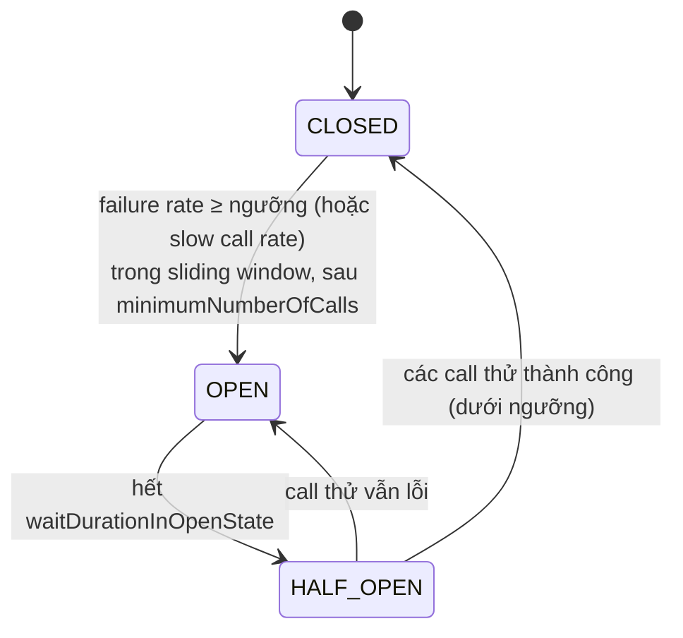
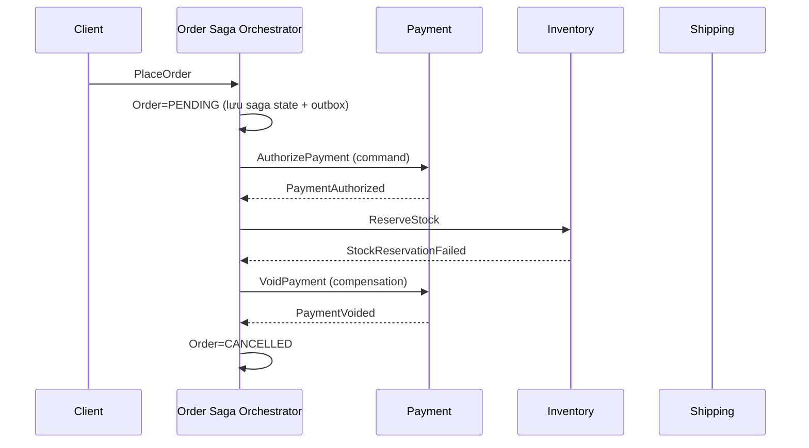
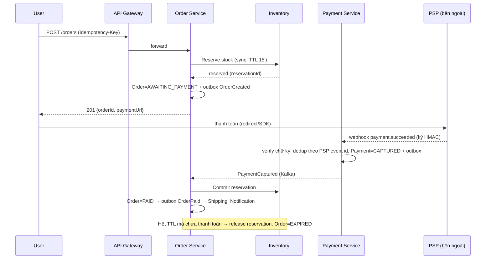

# Module 14 — Microservices & System Design

> **Mục tiêu:** sau module này bạn đánh giá được khi nào nên (và không nên) dùng microservices; tách được service theo business capability / bounded context; chọn được kiểu giao tiếp (REST, gRPC, async) và các thành phần hạ tầng (API Gateway, BFF, service discovery, config); cài đặt được các pattern resilience (timeout, retry + backoff + jitter, circuit breaker, bulkhead, rate limiter, fallback) bằng Resilience4j và giải thích được cascading failure; thiết kế được dữ liệu phân tán (database per service, Saga, outbox, CQRS, idempotency) với hiểu biết về CAP/PACELC; dựng được observability (logs, metrics, traces) và chiến lược triển khai an toàn; và trình bày được một bài **system design interview** có cấu trúc: làm rõ yêu cầu → ước lượng → thiết kế tổng thể → đào sâu → xử lý bottleneck.
> **Cấp độ:** Cơ bản → Nâng cao (Senior)
> **Thời lượng gợi ý:** 7 ngày (≈ 42 giờ: 22 giờ lý thuyết + 20 giờ bài tập/dự án)
> **Yêu cầu trước:** Module 13 (Messaging & Event-Driven), Spring Boot, Database & Transaction, Caching/Redis, kiến thức cơ bản Docker/Kubernetes và HTTP.
> **Nguồn tham khảo:**
> - Trong kho: [`Ebook IT/Newman_Building-Microservices.pdf`](../../Ebook%20IT/Newman_Building-Microservices.pdf) (Sam Newman, *Building Microservices*, 2nd edition) — chương 1 "What Are Microservices?" (single-process / modular / distributed monolith), "How to Model Microservices" (information hiding, coupling, DDD, bounded context), "Microservice Communication Styles", "Implementing Microservice Communication" (REST, gRPC, schema, API gateway, service discovery), "Workflow" (distributed transactions, sagas), "Deployment" (zero-downtime, tách deployment khỏi release).
> - Trong kho: [`Ebook IT/Kubernetes Microservices with Docker .pdf`](../../Ebook%20IT/Kubernetes%20Microservices%20with%20Docker%20.pdf) — Chapter 2 "Hello Kubernetes" (Pod, Service, replication), Chapter 3 "Using Custom Commands and Environment Variables" (cấu hình qua env), Chapter 14 "Installing Kubernetes on a Multi-Node Cluster".
> - Trong kho: [`Ebook IT/Design Pattern.pdf`](../../Ebook%20IT/Design%20Pattern.pdf) — Proxy, Facade (nền tảng cho API Gateway/BFF), Decorator (cách Resilience4j bọc lời gọi), State (máy trạng thái circuit breaker).
> - Ngoài: microservices.io (Chris Richardson — Decompose by business capability/subdomain, API Gateway, BFF, Saga, CQRS, Database per service, Service discovery); Spring Cloud docs (Gateway, Config, Netflix Eureka, LoadBalancer, Kubernetes); Resilience4j docs (resilience4j.readme.io); Martin Kleppmann — *Designing Data-Intensive Applications*: Chapter 5 Replication, Chapter 6 Partitioning, Chapter 7 Transactions, Chapter 8 The Trouble with Distributed Systems, Chapter 9 Consistency and Consensus; Alex Xu — *System Design Interview Vol. 1*: Chapter 1 Scale from Zero to Millions of Users, Chapter 2 Back-of-the-envelope Estimation, Chapter 3 A Framework for System Design Interviews, Chapter 4 Design a Rate Limiter, Chapter 5 Design Consistent Hashing, Chapter 7 Design a Unique ID Generator in Distributed Systems, Chapter 8 Design a URL Shortener, Chapter 10 Design a Notification System; Google *Site Reliability Engineering*: Chapter 6 Monitoring Distributed Systems (four golden signals), Chapter 21 Handling Overload, Chapter 22 Addressing Cascading Failures; OpenTelemetry docs; RFC 9562 (UUIDv7).

## Mục lục
1. [Monolith, Modular Monolith, Microservices & cách tách service](#p1)
2. [Giao tiếp giữa service: REST, gRPC, async; API Gateway & BFF](#p2)
3. [Service discovery & quản lý cấu hình](#p3)
4. [Resilience: timeout, retry, circuit breaker, bulkhead, rate limiter, fallback](#p4)
5. [Dữ liệu phân tán: database per service, 2PC vs Saga, outbox, CQRS, idempotency](#p5)
6. [Consistency, CAP, PACELC & distributed ID](#p6)
7. [Observability: logs, metrics, traces](#p7)
8. [Triển khai an toàn & tiến hóa API](#p8)
9. [Bảo mật giữa các service](#p9)
10. [Phương pháp System Design Interview & ước lượng](#p10)
11. [Building blocks: load balancer, cache, CDN, sharding, replication, queue, search](#p11)
12. [Thiết kế mẫu: URL shortener, rate limiter, notification, order/payment](#p12)
13. [Dự án mini của module](#du-an-mini)
14. [Checklist tự đánh giá](#checklist-tu-danh-gia)

---

<a id="p1"></a>
## 1. Monolith, Modular Monolith, Microservices & cách tách service

### 1.1 Khái niệm

| Kiến trúc | Mô tả | Đơn vị deploy | Dữ liệu |
|---|---|---|---|
| **Monolith (single-process)** | Một codebase, một tiến trình | 1 | Thường 1 DB chung, bảng nào cũng truy cập được |
| **Modular monolith** | Một tiến trình nhưng chia **module có ranh giới rõ** (API nội bộ, package private, schema riêng mỗi module) | 1 | 1 DB, mỗi module sở hữu schema riêng |
| **Microservices** | Nhiều service deploy độc lập, mỗi service sở hữu dữ liệu, giao tiếp qua mạng | N | Database per service |
| **Distributed monolith** (anti-pattern) | Nhiều service nhưng phải deploy cùng nhau, dùng chung DB, gọi đồng bộ chằng chịt | N (nhưng lock-step) | Chung |

Theo Newman, microservices là các service **deploy độc lập**, được mô hình quanh **business domain**, và **che giấu thông tin** (information hiding) — đặc biệt là không chia sẻ database.

### 1.2 Trade-off

| | Monolith / Modular monolith | Microservices |
|---|---|---|
| Độ phức tạp vận hành | Thấp | Cao (network, discovery, observability, CI/CD nhiều pipeline) |
| Transaction | ACID local | Saga, eventual consistency |
| Debug | Stack trace, debugger | Distributed tracing |
| Hiệu năng | Gọi hàm (ns) | Gọi mạng (ms), serialization |
| Deploy độc lập | Không | **Có** |
| Scale độc lập | Scale cả khối | **Scale từng service** |
| Tự chủ đội nhóm | Contention trên một codebase | **Đội sở hữu service end-to-end** |
| Đa công nghệ | Khó | Có thể (nhưng nên hạn chế) |
| Fault isolation | Một lỗi OOM sập toàn bộ | Lỗi cô lập (nếu thiết kế resilience đúng) |

**Khi nào microservices hợp lý:** nhiều team (> ~3–5 team) va chạm trên cùng codebase; các phần có nhu cầu scale/SLA rất khác nhau; domain đã ổn định đủ để vẽ ranh giới; tổ chức có năng lực DevOps (CI/CD, container, observability).

**Khi nào không:** startup đang tìm product-market fit (domain thay đổi liên tục), team nhỏ, chưa có tự động hóa. Lời khuyên phổ biến (Newman, Fowler "MonolithFirst"): bắt đầu bằng **modular monolith**, tách dần khi có lý do cụ thể.

**Định luật Conway:** kiến trúc hệ thống phản chiếu cấu trúc giao tiếp của tổ chức → "Inverse Conway Maneuver": tổ chức team theo kiến trúc mong muốn.

### 1.3 Cách tách service

**(a) Theo business capability** — những gì doanh nghiệp *làm* để tạo giá trị: Quản lý đơn hàng, Thanh toán, Kho, Vận chuyển, Khuyến mãi, Khách hàng.

**(b) Theo bounded context (DDD)** — vùng mà một mô hình (ngôn ngữ chung — *ubiquitous language*) có nghĩa nhất quán. Ví dụ "Product" trong Catalog (mô tả, ảnh, SEO), trong Inventory (SKU, số lượng, kho), trong Shipping (cân nặng, kích thước) là **các mô hình khác nhau**. Cố tạo một `Product` chung cho cả hệ thống → god object, coupling.

```
┌────────── Catalog ──────────┐   ┌───────── Inventory ─────────┐   ┌──────── Shipping ────────┐
│ Product{id,name,desc,images}│   │ StockItem{sku,qty,warehouse}│   │ Parcel{sku,weight,dims}  │
└──────────────┬──────────────┘   └──────────────┬──────────────┘   └────────────┬─────────────┘
               └──────── chỉ chia sẻ ID (productId/sku) + event ProductCreated ──┘
Context mapping: Customer–Supplier, Conformist, Anti-Corruption Layer, Shared Kernel, Published Language
```

Tiêu chí kiểm tra ranh giới tốt:
- **High cohesion, low coupling**: thay đổi một tính năng thường chỉ đụng **một** service.
- Service sở hữu dữ liệu và bất biến (invariant) của nó; transaction nghiệp vụ quan trọng nằm gọn trong một service.
- Giao tiếp "chatty" (một request gọi qua lại 10 lần) → ranh giới sai.
- Kích thước: đủ nhỏ để một team sở hữu, đủ lớn để không cần distributed transaction cho mọi thao tác.

**Tách monolith dần dần — Strangler Fig:** đặt proxy/gateway phía trước; chuyển từng route sang service mới; dữ liệu tách sau (dual-write có kiểm soát → CDC → cắt).

```java
// Modular monolith với Spring Modulith: kiểm tra ranh giới module ngay trong test
@Test
void verifyModularity() {
    ApplicationModules.of(ShopApplication.class).verify();  // fail nếu module truy cập internal của module khác
}
// Module giao tiếp qua sự kiện nội bộ — dễ tách thành service sau này
@Service class OrderManagement {
    private final ApplicationEventPublisher events;
    @Transactional public void complete(Order o) { /*...*/ events.publishEvent(new OrderCompleted(o.getId())); }
}
@Component class InventoryListener {
    @ApplicationModuleListener void on(OrderCompleted e) { /* chạy sau commit, async, transaction riêng */ }
}
```

> 💡 **Góc nhìn Senior:** Câu hỏi phỏng vấn "Bạn sẽ tách monolith thế nào?" — trả lời theo thứ tự: (1) xác định lý do kinh doanh (scale, team autonomy, deploy frequency); (2) dựng observability & CI/CD trước; (3) vẽ domain/bounded context, tìm phần ít phụ thuộc nhất + giá trị cao; (4) modular hóa trong monolith trước; (5) strangler fig cho từng phần, tách code trước rồi tách dữ liệu; (6) đo kết quả. Nêu rủi ro: distributed monolith, chia quá nhỏ (nano-services).

> ⚠️ **Lỗi thường gặp:**
> - Tách theo **tầng kỹ thuật** (UserController-service, UserDAO-service) thay vì theo domain.
> - Nhiều service dùng chung một database/schema → không deploy độc lập được, thay đổi schema phá vỡ nhau.
> - Shared library chứa domain model dùng chung → mọi service phải nâng cấp đồng loạt.
> - Tách quá sớm khi domain chưa rõ → ranh giới sai, phải gộp lại tốn kém.

### 🛠 Bài tập phần 1

**Bài 1.1 — Bounded context cho e-commerce (Cơ bản)**
- Đề bài: Liệt kê 6–8 bounded context cho một sàn thương mại điện tử, mỗi context: trách nhiệm, dữ liệu sở hữu, event phát ra, event tiêu thụ.
- Tiêu chí đạt: không có hai context cùng sở hữu một thực thể dữ liệu; chỉ ra ít nhất 2 khái niệm có nghĩa khác nhau giữa các context.

**Bài 1.2 — Modular monolith (Trung bình)**
- Đề bài: Tạo ứng dụng Spring Boot với 3 module `order`, `inventory`, `payment` (package riêng, chỉ public API ở package gốc module). Dùng Spring Modulith (hoặc ArchUnit) viết test chặn truy cập vi phạm.
- Tiêu chí đạt: test đỏ khi `order` import class `inventory.internal`; giao tiếp giữa module qua event.

**Bài 1.3 — Kế hoạch Strangler Fig (Nâng cao)**
- Đề bài: Monolith 500k dòng có module "Notification" được 30 chỗ gọi trực tiếp và đọc bảng `users`. Lập kế hoạch tách thành service riêng, không downtime.
- Tiêu chí đạt: các bước có thứ tự, chiến lược dữ liệu (ai sở hữu `users`, notification lấy email thế nào), cách rollback, metric chứng minh thành công.

<details>
<summary>Gợi ý lời giải</summary>

- 1.1: Catalog, Search, Cart, Ordering, Payment, Inventory, Shipping, Customer/Identity, Promotion, Review. "Price" trong Catalog (giá niêm yết) khác "Price" trong Ordering (giá chốt tại thời điểm đặt — phải snapshot vào đơn).
- 1.2 ArchUnit:

```java
@AnalyzeClasses(packages = "com.shop")
class ArchTest {
    @ArchTest static final ArchRule noInternalAccess = noClasses()
        .that().resideOutsideOfPackage("..inventory..")
        .should().dependOnClassesThat().resideInAPackage("..inventory.internal..");
}
```
- 1.3: (1) Gom 30 chỗ gọi về một interface `NotificationPort` trong monolith; (2) implement thứ hai gửi event `NotificationRequested` (chứa sẵn email — event-carried state) qua outbox; (3) dựng service mới tiêu thụ event; (4) feature flag chuyển dần % traffic; (5) xóa code cũ. Service mới không đọc bảng `users`.
</details>

---

<a id="p2"></a>
## 2. Giao tiếp giữa service: REST, gRPC, async; API Gateway & BFF

### 2.1 Đồng bộ vs bất đồng bộ

| | Sync (REST/gRPC) | Async (Kafka/RabbitMQ) |
|---|---|---|
| Phản hồi | Ngay | Sau (eventual) |
| Temporal coupling | Có | Không |
| Dễ hiểu/debug | Dễ hơn | Khó hơn |
| Phù hợp | Query, thao tác user chờ kết quả | Thông báo sự kiện, workflow dài, fan-out |

Quy tắc thực tế: **query đồng bộ, command/side effect lan truyền bất đồng bộ** khi có thể; tránh chuỗi gọi đồng bộ sâu (A → B → C → D) vì latency cộng dồn và availability nhân dồn.

### 2.2 REST vs gRPC

| | REST/JSON over HTTP/1.1 (hoặc 2) | gRPC (Protobuf over HTTP/2) |
|---|---|---|
| Hợp đồng | OpenAPI (tùy chọn) | `.proto` bắt buộc, sinh code |
| Payload | Text, lớn hơn | Nhị phân, nhỏ, nhanh |
| Streaming | Hạn chế (SSE, WebSocket) | Unary, server/client/bidirectional streaming |
| Trình duyệt | Native | Cần gRPC-Web/proxy |
| Debug | curl, dễ | grpcurl, khó hơn |
| Deadline/cancellation | Tự làm | **Có sẵn**, propagate qua chuỗi gọi |
| Dùng tốt cho | Public API, đối tác | Gọi nội bộ service-to-service hiệu năng cao |

```protobuf
syntax = "proto3";
package inventory.v1;
option java_multiple_files = true;
option java_package = "com.shop.inventory.grpc";

service InventoryService {
  rpc CheckStock(CheckStockRequest) returns (CheckStockResponse);
}
message CheckStockRequest { string sku = 1; int32 quantity = 2; }
message CheckStockResponse { bool available = 1; int32 on_hand = 2; }
// Tiến hóa: KHÔNG đổi số field; field bị xóa → `reserved 3;` để không ai tái sử dụng số đó
```

```java
// Client gRPC với deadline — server nhận được deadline còn lại và có thể dừng sớm
var stub = InventoryServiceGrpc.newBlockingStub(channel)
        .withDeadlineAfter(300, TimeUnit.MILLISECONDS);
CheckStockResponse r = stub.checkStock(CheckStockRequest.newBuilder()
        .setSku("SKU-1").setQuantity(2).build());
```

REST client với timeout (Spring Framework 6.1+ `RestClient`):

```java
@Bean
RestClient inventoryClient(RestClient.Builder builder) {
    var factory = new SimpleClientHttpRequestFactory();
    factory.setConnectTimeout(Duration.ofMillis(300));
    factory.setReadTimeout(Duration.ofSeconds(1));
    return builder.baseUrl("http://inventory-service")
                  .requestFactory(factory)
                  .defaultHeader("Accept", "application/json")
                  .build();
}
```

### 2.3 API Gateway

```
                ┌──────────────── API Gateway ────────────────┐
 Mobile/Web ──► │ TLS termination · AuthN (JWT) · rate limit  │──► order-service
                │ routing · request/response transform        │──► catalog-service
                │ aggregation (tùy) · CORS · observability    │──► user-service
                └─────────────────────────────────────────────┘
```

Trách nhiệm: điểm vào duy nhất, định tuyến, xác thực, rate limiting, TLS, logging/tracing, canary routing. **Không** nên chứa business logic (gateway thành "monolith mới").

```yaml
# Spring Cloud Gateway (application.yml)
spring:
  cloud:
    gateway:
      routes:
        - id: orders
          uri: lb://order-service                  # lb:// → Spring Cloud LoadBalancer + discovery
          predicates:
            - Path=/api/orders/**
          filters:
            - StripPrefix=1
            - name: RequestRateLimiter             # token bucket trên Redis
              args:
                redis-rate-limiter.replenishRate: 50
                redis-rate-limiter.burstCapacity: 100
                key-resolver: "#{@userKeyResolver}"
            - name: CircuitBreaker
              args:
                name: orders
                fallbackUri: forward:/fallback/orders
            - name: Retry
              args:
                retries: 2
                methods: GET                       # chỉ retry method idempotent
```

(Lưu ý: từ Spring Cloud 2025.0, các property của Gateway được tổ chức lại theo biến thể server WebFlux/WebMVC — ví dụ `spring.cloud.gateway.server.webflux.routes`; kiểm tra docs đúng phiên bản bạn dùng.)

### 2.4 Backend for Frontend (BFF)

Mỗi loại client (mobile, web, đối tác) có một gateway/BFF riêng do **team frontend tương ứng sở hữu**, aggregate và định dạng dữ liệu tối ưu cho client đó (mobile cần payload nhỏ, ít round-trip).

```
 iOS/Android ──► Mobile BFF ──┐
 Web SPA     ──► Web BFF    ──┼──► order, catalog, user, review services
 Partner     ──► Public API ──┘
```

Thay thế/kết hợp: GraphQL (federation) cho phép client tự chọn trường.

> 💡 **Góc nhìn Senior:**
> - Aggregation ở BFF nên gọi **song song** các service (`CompletableFuture.allOf`, structured concurrency với virtual threads) và có **degradation**: thiếu dữ liệu review thì vẫn trả trang sản phẩm.
> - gRPC qua Kubernetes `Service` (L4, kube-proxy) bị **mất cân bằng tải**: HTTP/2 giữ một connection lâu dài → mọi request dồn vào một pod. Giải pháp: client-side load balancing (headless service + gRPC `round_robin`), hoặc service mesh/L7 proxy (Envoy, Istio, Linkerd).

> ⚠️ **Lỗi thường gặp:**
> - Chuỗi gọi đồng bộ sâu không có timeout tổng (deadline).
> - Gateway retry mọi request kể cả POST không idempotent → trừ tiền 2 lần.
> - Một gateway duy nhất cho mọi client, chứa logic riêng của từng client → nút cổ chai tổ chức.

### 🛠 Bài tập phần 2

**Bài 2.1 — REST client có timeout (Cơ bản)**
- Đề bài: Viết `CatalogClient` dùng `RestClient` gọi `GET /products/{id}`, cấu hình connect/read timeout; dùng WireMock giả lập độ trễ 3 s.
- Tiêu chí đạt: test chứng minh request bị hủy sau ~1 s với exception rõ ràng; không có thread bị treo.

**Bài 2.2 — gRPC service (Trung bình)**
- Đề bài: Implement `InventoryService.CheckStock` bằng grpc-java (hoặc Spring gRPC), client đặt deadline 300 ms; server cố tình chậm 500 ms và kiểm tra `Context.current().isCancelled()`.
- Tiêu chí đạt: client nhận `DEADLINE_EXCEEDED`; server dừng xử lý sớm (log chứng minh).

**Bài 2.3 — BFF aggregation có degradation (Nâng cao)**
- Đề bài: Endpoint `GET /bff/product-page/{id}` gọi song song catalog (bắt buộc), price (bắt buộc), reviews (tùy chọn), recommendations (tùy chọn) với timeout tổng 800 ms.
- Tiêu chí đạt: nếu reviews chậm/lỗi → trả trang không có reviews, kèm cờ `partial=true`; nếu catalog lỗi → 503; p99 không vượt 850 ms khi một dependency tùy chọn treo.

<details>
<summary>Gợi ý lời giải</summary>

- 2.3:

```java
public ProductPage page(String id) {
    var exec = Executors.newVirtualThreadPerTaskExecutor();
    var catalog = CompletableFuture.supplyAsync(() -> catalogClient.get(id), exec);
    var price   = CompletableFuture.supplyAsync(() -> priceClient.get(id), exec);
    var reviews = CompletableFuture.supplyAsync(() -> reviewClient.top(id), exec)
                    .completeOnTimeout(List.of(), 500, TimeUnit.MILLISECONDS)
                    .exceptionally(ex -> List.of());
    var recs    = CompletableFuture.supplyAsync(() -> recClient.forProduct(id), exec)
                    .completeOnTimeout(List.of(), 500, TimeUnit.MILLISECONDS)
                    .exceptionally(ex -> List.of());
    try {
        CompletableFuture.allOf(catalog, price).get(800, TimeUnit.MILLISECONDS);
    } catch (Exception e) { throw new ServiceUnavailableException(e); }
    return new ProductPage(catalog.join(), price.join(), reviews.join(), recs.join());
}
```
Lưu ý: `completeOnTimeout` không hủy tác vụ bên dưới — client HTTP vẫn cần timeout riêng.
</details>

---

<a id="p3"></a>
## 3. Service discovery & quản lý cấu hình

### 3.1 Service discovery

Trong môi trường động (autoscale, container restart), IP của instance thay đổi liên tục → cần **service registry**.

```
Client-side discovery                        Server-side discovery
┌────────┐ 1.lookup ┌──────────┐            ┌────────┐      ┌──────────────┐     ┌──────────┐
│ Client │─────────►│ Registry │            │ Client │─────►│ LB / K8s Svc │────►│ instance │
│ (+ LB) │◄─────────│ (Eureka) │            └────────┘      │ (kube-proxy) │────►│ instance │
└───┬────┘ 2.list   └──────────┘                            └──────┬───────┘     └──────────┘
    │ 3.chọn instance & gọi trực tiếp                              │ registry: K8s API / endpoints
    ▼                                                              
 instance A / B / C
```

| | Client-side (Eureka + Spring Cloud LoadBalancer) | Server-side (Kubernetes Service, AWS ALB) |
|---|---|---|
| Logic LB | Trong client (thư viện) | Ở hạ tầng |
| Ngôn ngữ | Mỗi ngôn ngữ cần thư viện | Trong suốt với client |
| Thuật toán LB | Linh hoạt (zone-aware, weighted) | Theo hạ tầng (kube-proxy: ngẫu nhiên/round-robin ở mức connection) |
| Hop thêm | Không | Có thể (tùy hiện thực) |

**Eureka**: service tự đăng ký và gửi heartbeat (mặc định 30 s); client cache registry. Eureka ưu tiên **availability (AP)**: khi mất nhiều heartbeat, "self-preservation mode" giữ lại registration thay vì xóa hết.

**Kubernetes**: `Service` có tên DNS `order-service.shop.svc.cluster.local` (rút gọn `order-service` trong cùng namespace); kube-proxy (iptables/IPVS) hoặc eBPF (Cilium) phân phối tới Pod **Ready**. **Readiness probe** quyết định Pod có nhận traffic không — đây chính là "health check của registry".

```yaml
apiVersion: v1
kind: Service
metadata: { name: order-service, namespace: shop }
spec:
  selector: { app: order-service }
  ports: [{ port: 80, targetPort: 8080 }]
---
# Trong Deployment: readiness dùng Actuator health group
readinessProbe:
  httpGet: { path: /actuator/health/readiness, port: 8080 }
  periodSeconds: 5
livenessProbe:
  httpGet: { path: /actuator/health/liveness, port: 8080 }
  initialDelaySeconds: 30
```

> ⚠️ Liveness probe **không** được kiểm tra dependency bên ngoài (DB, service khác): DB chậm → liveness fail → K8s restart **mọi** pod → sập toàn bộ (cascading restart). Liveness chỉ kiểm tra tiến trình còn tự phục vụ được không; readiness mới phản ánh khả năng nhận traffic.

### 3.2 Quản lý cấu hình

Nguyên tắc 12-factor: cấu hình tách khỏi code, inject theo môi trường. Bí mật **không** nằm trong git dạng plaintext.

**Spring Cloud Config Server** (backend Git/Vault):

```yaml
# Client (Spring Boot 2.4+ dùng spring.config.import)
spring:
  application.name: order-service
  config.import: "optional:configserver:http://config-server:8888"
  profiles.active: prod
# Server đọc: {repo}/order-service-prod.yml, order-service.yml, application.yml
```

Refresh động: `@RefreshScope` + `POST /actuator/refresh` (một instance) hoặc **Spring Cloud Bus** (Kafka/RabbitMQ) để broadcast tới mọi instance. `@ConfigurationProperties` cũng được rebind khi refresh.

**Kubernetes ConfigMap/Secret:**

```yaml
apiVersion: v1
kind: ConfigMap
metadata: { name: order-config }
data:
  application.yaml: |
    order:
      max-items-per-order: 50
      payment-timeout: 2s
---
# Pod: mount thành file (cập nhật được lan truyền sau một khoảng trễ; env var thì KHÔNG đổi cho tới khi restart)
volumes:
  - name: config
    configMap: { name: order-config }
containers:
  - name: app
    volumeMounts: [{ name: config, mountPath: /etc/config }]
    env:
      - name: SPRING_CONFIG_ADDITIONAL_LOCATION
        value: "file:/etc/config/"
      - name: DB_PASSWORD
        valueFrom: { secretKeyRef: { name: order-db, key: password } }
```

- `Secret` chỉ **base64-encode**, không mã hóa → bật encryption at rest cho etcd, RBAC chặt, hoặc dùng **External Secrets Operator / Vault / cloud secret manager**.
- Spring Boot hỗ trợ `spring.config.import=configtree:/etc/secrets/` để đọc mỗi file là một property.

> 💡 **Góc nhìn Senior:** Cấu hình động là con dao hai lưỡi — thay đổi config là **một kiểu deploy** và gây ra không ít sự cố lớn. Áp dụng cùng kỷ luật: review, version, rollout dần, rollback nhanh, validate (`@Validated` trên `@ConfigurationProperties` để fail-fast khi khởi động).

### 🛠 Bài tập phần 3

**Bài 3.1 — Eureka + LoadBalancer (Cơ bản)**
- Đề bài: Dựng Eureka server, 2 instance `inventory-service`, `order-service` gọi bằng `RestClient` `@LoadBalanced` tới `http://inventory-service`.
- Tiêu chí đạt: request luân phiên giữa 2 instance; tắt một instance, sau khoảng thời gian cache hết hạn không còn lỗi.

**Bài 3.2 — Config refresh (Trung bình)**
- Đề bài: Config server backend Git; `order-service` có `@ConfigurationProperties` `order.max-items-per-order` có `@Validated @Max(1000)`. Đổi giá trị trong git và refresh qua Bus.
- Tiêu chí đạt: giá trị mới áp dụng không restart; giá trị không hợp lệ (5000) bị từ chối khi refresh và log cảnh báo.

**Bài 3.3 — Probe đúng cách (Nâng cao)**
- Đề bài: Deploy lên kind/minikube 3 replica. Cấu hình sai: liveness kiểm tra DB. Tắt DB 60 s và quan sát. Sau đó sửa cấu hình cho đúng và lặp lại.
- Tiêu chí đạt: báo cáo số lần restart trong hai trường hợp; giải thích graceful shutdown (`server.shutdown=graceful`, `preStop` sleep) để không mất request khi pod bị loại khỏi endpoints.

<details>
<summary>Gợi ý lời giải</summary>

- 3.1: `@Bean @LoadBalanced RestClient.Builder lbBuilder() { return RestClient.builder(); }` (Spring Cloud 2023.0+ hỗ trợ `@LoadBalanced` cho `RestClient.Builder`).
- 3.3: Spring Boot mặc định không đưa DB vào liveness group; readiness có thể include `db`: `management.endpoint.health.group.readiness.include=readinessState,db`. `preStop: exec: command: ["sleep","10"]` cho kube-proxy kịp cập nhật endpoints trước khi app ngừng nhận request.
</details>

---

<a id="p4"></a>
## 4. Resilience: timeout, retry, circuit breaker, bulkhead, rate limiter, fallback

### 4.1 Cascading failure — vì sao cần resilience

```
 Payment chậm (5 s) ─► Order thread pool (200) bị chiếm hết bởi request chờ Payment
       ─► Order không phục vụ được request khác (kể cả không liên quan Payment)
       ─► Gateway timeout + retry ×3 ─► tải lên Order tăng 3 lần ─► Order sập
       ─► Mọi service gọi Order cũng treo ─► SẬP TOÀN HỆ THỐNG
```

Theo Google SRE (chương "Addressing Cascading Failures"), nguyên nhân phổ biến: quá tải server, cạn tài nguyên (thread, connection, memory, file descriptor), retry khuếch đại, và phản hồi chậm làm giữ tài nguyên lâu. **Little's Law**: `số request đồng thời = throughput × latency` — latency tăng 10 lần thì cần gấp 10 lần thread/connection để giữ throughput.

### 4.2 Timeout

- **Mọi** lời gọi mạng phải có timeout: connect timeout, read/response timeout, timeout lấy connection từ pool (`connectionRequestTimeout`, HikariCP `connectionTimeout`).
- Chọn giá trị dựa trên **p99/p99.9 latency của dependency** + biên nhỏ, không phải con số tròn tùy hứng.
- **Deadline propagation**: request vào có ngân sách 2 s; đã dùng 1.5 s thì lời gọi xuống phía dưới chỉ còn 0.5 s. Timeout tầng dưới phải **nhỏ hơn** tầng trên, nếu không tầng trên đã bỏ cuộc mà tầng dưới vẫn làm việc vô ích.

### 4.3 Retry với exponential backoff + jitter

Chỉ retry khi: lỗi **tạm thời** (timeout, 503, connection reset, 429 có `Retry-After`) **và** thao tác **idempotent** (GET, PUT, DELETE, hoặc POST có idempotency key).

```
Không jitter:  mọi client retry cùng lúc tại 100ms, 200ms, 400ms → "thundering herd" đồng bộ
Full jitter:   sleep = random(0, min(cap, base × 2^attempt))   → tải được trải đều
```

```java
// Tự viết để hiểu bản chất
static <T> T retry(Supplier<T> call, int maxAttempts, Duration base, Duration cap) {
    for (int attempt = 0; ; attempt++) {
        try { return call.get(); }
        catch (TransientException e) {
            if (attempt + 1 >= maxAttempts) throw e;
            long expo = Math.min(cap.toMillis(), base.toMillis() * (1L << attempt));
            long sleep = ThreadLocalRandom.current().nextLong(expo + 1);    // full jitter
            try { Thread.sleep(sleep); } catch (InterruptedException ie) {
                Thread.currentThread().interrupt(); throw e;
            }
        }
    }
}
```

**Retry storm / khuếch đại:** 3 tầng, mỗi tầng retry 3 lần (tổng 4 lần thử) → tầng dưới cùng có thể nhận `4³ = 64` lần tải. Biện pháp:
- Retry **ở một tầng duy nhất** (thường là gần client nhất hoặc ngay trước dependency), các tầng khác không retry.
- **Retry budget**: retry tối đa ~10% tổng request (gRPC retry throttling, Envoy retry budget).
- Không retry khi circuit breaker đang OPEN; tôn trọng `Retry-After`.

### 4.4 Circuit breaker



- **CLOSED**: cho qua, đếm kết quả trong sliding window (COUNT_BASED: N call gần nhất; TIME_BASED: N giây gần nhất).
- **OPEN**: từ chối ngay (`CallNotPermittedException`) → **fail fast**, giải phóng tài nguyên, cho dependency thời gian hồi phục.
- **HALF_OPEN**: cho một số call thử (`permittedNumberOfCallsInHalfOpenState`) để quyết định đóng hay mở lại.
- Resilience4j còn có trạng thái đặc biệt: `DISABLED`, `FORCED_OPEN`, `METRICS_ONLY`.

Mặc định Resilience4j (cần biết để không bất ngờ): `failureRateThreshold=50`, `slidingWindowSize=100`, `minimumNumberOfCalls=100`, `waitDurationInOpenState=60s`, `permittedNumberOfCallsInHalfOpenState=10`, `slowCallDurationThreshold=60s`, `slowCallRateThreshold=100`. → Với mặc định, cần 100 call mới bắt đầu đánh giá, và call chậm 59 s vẫn không bị tính là "slow". **Luôn tự cấu hình**.

### 4.5 Bulkhead

Cô lập tài nguyên như vách ngăn tàu: dependency A chậm không được chiếm hết tài nguyên dùng cho B.

- **SemaphoreBulkhead**: giới hạn số call đồng thời (`maxConcurrentCalls`), chạy trên thread của caller. Nhẹ, hợp với virtual threads.
- **ThreadPoolBulkhead**: mỗi dependency một thread pool + queue riêng; trả `CompletionStage`.
- Ở mức hạ tầng: connection pool riêng cho từng dependency; tách pool Tomcat cho endpoint quan trọng; tách instance/cluster cho tenant lớn.

### 4.6 Rate limiter, load shedding, fallback

- **Rate limiter** (phía client — Resilience4j `RateLimiter`): giới hạn tốc độ ta gọi một dependency (tôn trọng quota của đối tác). Phía server (gateway): bảo vệ ta khỏi client — xem thiết kế ở phần 12.2.
- **Load shedding** (SRE "Handling Overload"): khi quá tải, chủ động từ chối sớm (503/429) các request ít quan trọng thay vì để mọi request đều chậm; ưu tiên theo criticality.
- **Fallback**: giá trị mặc định, dữ liệu cache cũ (stale), chức năng suy giảm (ẩn khuyến nghị), hoặc chuyển sang xử lý async ("đơn đang được xử lý"). Fallback **không** được gọi một dependency khác cũng mong manh, và không được che giấu lỗi nghiệp vụ (ví dụ fallback "thanh toán thành công" là thảm họa).

### 4.7 Resilience4j với Spring Boot

```xml
<dependency>
  <groupId>io.github.resilience4j</groupId>
  <artifactId>resilience4j-spring-boot3</artifactId>
</dependency>
<dependency>
  <groupId>org.springframework.boot</groupId>
  <artifactId>spring-boot-starter-aop</artifactId>
</dependency>
```

```yaml
resilience4j:
  circuitbreaker:
    instances:
      payment:
        sliding-window-type: COUNT_BASED
        sliding-window-size: 20
        minimum-number-of-calls: 10
        failure-rate-threshold: 50
        slow-call-duration-threshold: 1s
        slow-call-rate-threshold: 60
        wait-duration-in-open-state: 10s
        permitted-number-of-calls-in-half-open-state: 3
        automatic-transition-from-open-to-half-open-enabled: true
        record-exceptions:
          - org.springframework.web.client.ResourceAccessException   # RestClient bọc IOException/timeout trong exception này
          - java.util.concurrent.TimeoutException
          - org.springframework.web.client.HttpServerErrorException
        ignore-exceptions:
          - com.shop.payment.CardDeclinedException     # lỗi nghiệp vụ không phải dấu hiệu dependency hỏng
  retry:
    instances:
      payment:
        max-attempts: 3
        wait-duration: 200ms
        enable-exponential-backoff: true
        exponential-backoff-multiplier: 2
        enable-randomized-wait: true                   # jitter
        randomized-wait-factor: 0.5
        retry-exceptions:
          - org.springframework.web.client.ResourceAccessException
          - org.springframework.web.client.HttpServerErrorException$ServiceUnavailable
          - java.util.concurrent.TimeoutException
  bulkhead:
    instances:
      payment:
        max-concurrent-calls: 30
        max-wait-duration: 50ms
  ratelimiter:
    instances:
      sms-provider:
        limit-for-period: 100
        limit-refresh-period: 1s
        timeout-duration: 0                            # không chờ: vượt quota → từ chối ngay
  timelimiter:
    instances:
      payment:
        timeout-duration: 2s
        cancel-running-future: true
```

```java
@Service
@RequiredArgsConstructor
@Slf4j
public class PaymentGateway {
    private final RestClient paymentClient;

    // Thứ tự aspect mặc định của Resilience4j (ngoài → trong):
    // Retry ( CircuitBreaker ( RateLimiter ( TimeLimiter ( Bulkhead ( hàm ) ) ) ) )
    @Retry(name = "payment")
    @CircuitBreaker(name = "payment", fallbackMethod = "authorizeFallback")
    @Bulkhead(name = "payment")
    public PaymentResult authorize(PaymentRequest req) {
        return paymentClient.post().uri("/authorizations")
                .header("Idempotency-Key", req.idempotencyKey())   // retry an toàn
                .body(req)
                .retrieve()
                .body(PaymentResult.class);
    }

    // Fallback: cùng tham số + Throwable ở cuối; chọn theo kiểu exception cụ thể nhất
    private PaymentResult authorizeFallback(PaymentRequest req, CallNotPermittedException ex) {
        log.warn("Payment circuit OPEN, chuyển đơn {} sang hàng đợi xử lý sau", req.orderId());
        return PaymentResult.pending(req.orderId());            // suy giảm có kiểm soát, KHÔNG giả thành công
    }
    private PaymentResult authorizeFallback(PaymentRequest req, Throwable ex) {
        throw new PaymentUnavailableException(req.orderId(), ex);
    }
}
```

Dùng programmatic (không AOP, dễ test, rõ thứ tự):

```java
CircuitBreaker cb = CircuitBreaker.of("inventory", CircuitBreakerConfig.custom()
        .failureRateThreshold(50).slidingWindowSize(20).minimumNumberOfCalls(10)
        .waitDurationInOpenState(Duration.ofSeconds(10)).build());
io.github.resilience4j.retry.Retry retry = io.github.resilience4j.retry.Retry.of("inventory",
        RetryConfig.custom().maxAttempts(3)
            .intervalFunction(IntervalFunction.ofExponentialRandomBackoff(200, 2.0, 0.5))
            .build());

Supplier<Stock> decorated = Decorators.ofSupplier(() -> inventoryClient.get(sku))
        .withCircuitBreaker(cb)
        .withRetry(retry)                        // Decorators: lớp gọi sau bọc NGOÀI lớp trước
        .withFallback(List.of(CallNotPermittedException.class), ex -> Stock.unknown(sku))
        .decorate();
Stock s = decorated.get();
```

> 💡 **Góc nhìn Senior:**
> - **Thứ tự Retry và CircuitBreaker** quan trọng: Retry bọc ngoài CB (mặc định) → mỗi lần thử đều đi qua CB, khi CB mở thì các lần retry bị từ chối ngay (nên cấu hình Retry **không** retry `CallNotPermittedException`). CB bọc ngoài Retry → một "call" của CB gồm nhiều lần thử, CB phản ứng chậm hơn.
> - Phân biệt **lỗi nghiệp vụ** (thẻ bị từ chối, 400, 404) với **lỗi hạ tầng** (timeout, 5xx). Lỗi nghiệp vụ không được làm mở circuit, không được retry.
> - Circuit breaker là **per instance** — 50 pod có 50 trạng thái CB độc lập; điều đó thường ổn. Theo dõi qua metric `resilience4j_circuitbreaker_state` (Micrometer).
> - Timeout + bulkhead quan trọng hơn circuit breaker: CB chỉ phản ứng *sau* khi đã có đủ lỗi; timeout và bulkhead bảo vệ *ngay từ call đầu tiên*.
> - Với virtual threads (Java 21), "thread pool cạn" không còn là triệu chứng chính, nhưng **connection pool, bộ nhớ, và dependency phía sau** vẫn cạn — bulkhead dạng semaphore càng quan trọng.

> ⚠️ **Lỗi thường gặp:**
> - Gọi method có `@CircuitBreaker` từ chính class đó (self-invocation) → AOP proxy bị bỏ qua, annotation không có tác dụng.
> - Chữ ký fallback sai (khác kiểu trả về/tham số) → lỗi lúc runtime "fallback method not found".
> - Dùng cấu hình mặc định (`minimumNumberOfCalls=100`) cho service ít traffic → CB không bao giờ mở.
> - Retry POST không có idempotency key.
> - Fallback trả về dữ liệu giả không đánh dấu, khiến lỗi bị che giấu nhiều ngày.

### 🛠 Bài tập phần 4

**Bài 4.1 — Circuit breaker quan sát được (Cơ bản)**
- Đề bài: `order-service` gọi `payment-service` (WireMock) với cấu hình CB ở mục 4.7. Viết test: 10 call lỗi 500 → CB mở; chờ 10 s → HALF_OPEN; 3 call thành công → CLOSED.
- Tiêu chí đạt: test assert trạng thái qua `CircuitBreakerRegistry`; endpoint `/actuator/circuitbreakers` hiển thị đúng; metric có trong `/actuator/prometheus`.

**Bài 4.2 — Tái hiện cascading failure (Trung bình)**
- Đề bài: Chuỗi Gateway → Order → Payment. Payment chậm 5 s. Không có timeout/bulkhead: đo latency của endpoint `GET /orders/health-unrelated` (không gọi Payment) dưới tải 200 RPS (Gatling/k6). Sau đó thêm timeout 1 s + bulkhead 30 + CB và đo lại.
- Tiêu chí đạt: số liệu chứng minh endpoint không liên quan bị ảnh hưởng ở cấu hình 1 và được bảo vệ ở cấu hình 2; giải thích bằng Little's Law.

**Bài 4.3 — Retry storm & retry budget (Nâng cao)**
- Đề bài: 3 tầng service, mỗi tầng retry 3 lần. Đo số request tầng cuối nhận được khi tầng cuối lỗi 100%. Thiết kế lại: retry chỉ ở một tầng, thêm retry budget (tự cài đặt: token bucket cho retry = 10% request thành công) và so sánh.
- Tiêu chí đạt: số request khuếch đại trước/sau; code retry budget có test.

<details>
<summary>Gợi ý lời giải</summary>

- 4.1: `circuitBreakerRegistry.circuitBreaker("payment").getState()`; dùng `transitionToOpenState()` trong test cho nhanh nếu cần. Với `automatic-transition-from-open-to-half-open-enabled=true` chuyển trạng thái không cần có call.
- 4.2: Little's Law: 200 RPS × 5 s = 1000 request đồng thời > 200 thread Tomcat → mọi endpoint xếp hàng. Với timeout 1 s + bulkhead 30: các call tới Payment tối đa 30 đồng thời, phần dư bị từ chối ngay → thread được giải phóng.
- 4.3: Khuếch đại 4×4×4 = 64. Retry budget đơn giản:

```java
final class RetryBudget {
    private final double ratio; private final AtomicLong tokens = new AtomicLong(); private final long max;
    RetryBudget(double ratio, long max) { this.ratio = ratio; this.max = max; }
    void onSuccess() { tokens.updateAndGet(t -> Math.min(max, t + Math.round(1000 * ratio))); }  // đơn vị milli-token
    boolean tryAcquireRetry() {
        return tokens.getAndUpdate(t -> t >= 1000 ? t - 1000 : t) >= 1000;
    }
}
```
</details>

---

<a id="p5"></a>
## 5. Dữ liệu phân tán: database per service, 2PC vs Saga, outbox, CQRS, idempotency

### 5.1 Database per service

Mỗi service **sở hữu** dữ liệu của mình; service khác chỉ truy cập qua API hoặc event. Có thể là schema riêng trên cùng một cluster DB (rẻ, nhưng vẫn chia sẻ tài nguyên) hoặc DB riêng (cô lập hoàn toàn, chọn công nghệ phù hợp — *polyglot persistence*).

Hệ quả cần xử lý:
- **Query xuyên service** (ví dụ "đơn hàng kèm tên khách và trạng thái giao hàng"): **API composition** (BFF gọi nhiều service rồi ghép) hoặc **CQRS read model** (một service dựng view tổng hợp từ event).
- **Transaction xuyên service**: không còn ACID chung → Saga.
- **Tham chiếu dữ liệu**: chỉ giữ ID của thực thể service khác (không foreign key xuyên DB); khi cần, sao chép dữ liệu cần thiết qua event (event-carried state transfer) và chấp nhận dữ liệu có độ trễ.

### 5.2 Two-Phase Commit (2PC)

```
Coordinator                 Participant A (Order DB)      Participant B (Payment DB)
    │──── PREPARE ───────────────►│                              │
    │──── PREPARE ─────────────────────────────────────────────►│
    │◄─── YES (đã ghi log, giữ lock)│                              │
    │◄─── YES ──────────────────────────────────────────────────│
    │  (ghi quyết định COMMIT vào log của coordinator)            │
    │──── COMMIT ────────────────►│                              │
    │──── COMMIT ───────────────────────────────────────────────►│
```

- Đảm bảo atomicity giữa nhiều resource (XA trong Java: JTA với Atomikos/Narayana).
- Nhược điểm (DDIA chương 9): **blocking** — nếu coordinator chết sau PREPARE, participant ở trạng thái *in-doubt*, **giữ lock** cho tới khi coordinator hồi phục; latency cao (nhiều round-trip + fsync); coordinator là điểm lỗi đơn; availability bị nhân dồn; nhiều công nghệ (Kafka, hầu hết NoSQL, REST API của bên thứ ba) không hỗ trợ XA.
- Vì vậy microservices hầu như **không** dùng 2PC giữa các service. (Bên trong một hệ quản trị phân tán như Spanner/CockroachDB thì commit protocol kiểu 2PC kết hợp đồng thuận vẫn được dùng — đó là chuyện khác.)

### 5.3 Saga — orchestration vs choreography

Saga = chuỗi local transaction T1…Tn; nếu Tk thất bại thì chạy các **compensating transaction** Ck-1…C1 theo thứ tự ngược.

Phân loại bước (Chris Richardson):
- **Compensatable**: có thể hoàn tác (tạo đơn PENDING → hủy đơn).
- **Pivot**: điểm "không quay lại" — nếu thành công thì saga chắc chắn sẽ đi tới cùng (ví dụ capture tiền).
- **Retriable**: sau pivot, các bước phải **luôn thành công khi được retry** (gửi lệnh giao hàng).

| | Choreography (Module 13) | Orchestration |
|---|---|---|
| Điều phối | Các service phản ứng với event của nhau | Một **orchestrator** gửi command, nhận reply |
| Hiển thị luồng | Phân tán, khó theo dõi | Tập trung trong một state machine |
| Coupling | Service phụ thuộc event của nhau | Service chỉ phụ thuộc orchestrator (command API) |
| Phù hợp | 2–4 bước, đơn giản | Nhiều bước, nhiều nhánh, cần timeout/monitor |
| Rủi ro | Vòng phụ thuộc event, "ai lắng nghe gì?" | Orchestrator phình logic nghiệp vụ |



Orchestrator tối giản (state machine lưu trong DB, mỗi bước = cập nhật state + outbox trong một transaction):

```java
public enum SagaState { STARTED, PAYMENT_AUTHORIZED, STOCK_RESERVED, COMPLETED,
                        COMPENSATING_PAYMENT, CANCELLED }

@Entity
class OrderSaga {
    @Id String orderId;
    @Enumerated(EnumType.STRING) SagaState state;
    @Version long version;            // optimistic lock: chống hai reply xử lý đồng thời
    Instant deadline;                 // timeout cho bước hiện tại
    String failureReason;
}

@Service
@RequiredArgsConstructor
class OrderSagaOrchestrator {
    private final OrderSagaRepository sagas;
    private final Outbox outbox;      // ghi command vào outbox, relay/CDC gửi đi

    @Transactional
    public void start(PlaceOrder cmd) {
        sagas.save(new OrderSaga(cmd.orderId(), SagaState.STARTED, Instant.now().plusSeconds(30)));
        outbox.add("payment.commands", cmd.orderId(), new AuthorizePayment(cmd.orderId(), cmd.amount()));
    }

    @Transactional
    public void on(PaymentAuthorized evt) {
        OrderSaga s = sagas.findById(evt.orderId()).orElseThrow();
        if (s.state != SagaState.STARTED) return;            // duplicate/muộn → idempotent
        s.state = SagaState.PAYMENT_AUTHORIZED;
        s.deadline = Instant.now().plusSeconds(30);
        outbox.add("inventory.commands", s.orderId, new ReserveStock(s.orderId));
    }

    @Transactional
    public void on(StockReservationFailed evt) {
        OrderSaga s = sagas.findById(evt.orderId()).orElseThrow();
        if (s.state != SagaState.PAYMENT_AUTHORIZED) return;
        s.state = SagaState.COMPENSATING_PAYMENT;
        s.failureReason = evt.reason();
        outbox.add("payment.commands", s.orderId, new VoidPayment(s.orderId));
    }

    @Transactional
    public void on(PaymentVoided evt) {
        sagas.findById(evt.orderId())
             .filter(s -> s.state == SagaState.COMPENSATING_PAYMENT)
             .ifPresent(s -> { s.state = SagaState.CANCELLED;
                               outbox.add("order.events", s.orderId, new OrderCancelled(s.orderId, s.failureReason)); });
    }

    @Scheduled(fixedDelay = 5000)  // lưới an toàn: bước nào quá hạn → gửi lại command hoặc bù trừ
    @Transactional
    public void timeouts() { sagas.findExpired(Instant.now()).forEach(this::handleTimeout); }
}
```

Framework thực tế: **Temporal** (durable execution — workflow viết như code tuần tự, engine lo retry/timeout/trạng thái), Camunda/Zeebe (BPMN), Axon, Eventuate Tram Sagas.

**Thiếu isolation trong saga** và các countermeasure:
- *Semantic lock*: trạng thái `*_PENDING` báo cho các thao tác khác biết bản ghi đang trong saga.
- *Commutative updates*: thiết kế để thứ tự không quan trọng (cộng/trừ số dư thay vì set).
- *Reread value*: kiểm tra lại dữ liệu chưa bị đổi trước khi ghi (optimistic).
- *By value*: chọn cơ chế theo rủi ro nghiệp vụ (giao dịch lớn dùng cơ chế chặt hơn).

### 5.4 Transactional outbox (nhắc lại) và CQRS

Outbox giải quyết **dual-write**: cập nhật DB và phát event nguyên tử (chi tiết ở Module 13, phần 10).

**CQRS (Command Query Responsibility Segregation):** tách mô hình ghi (command — chuẩn hóa, giữ bất biến) và mô hình đọc (query — phi chuẩn hóa, tối ưu cho màn hình/tìm kiếm). Read model được cập nhật từ event.

```
 Command ──► Order Service (write DB, PostgreSQL) ──outbox/CDC──► Kafka
                                                                    │
                       ┌────────────────────────────────────────────┤
                       ▼                                            ▼
          Order History View (MongoDB/Postgres)          Search (Elasticsearch)
                       ▲                                            ▲
 Query ────────────────┴────────────────────────────────────────────┘
```

- Ưu: scale đọc/ghi độc lập, query xuyên service hiệu quả, nhiều view cho nhiều nhu cầu.
- Nhược: eventual consistency (đọc ngay sau ghi có thể chưa thấy — xử lý bằng *read-your-writes* tạm: trả dữ liệu từ write side trong response, hoặc chờ version), thêm hạ tầng, phải xử lý rebuild projection.

### 5.5 Idempotency xuyên service

Client (hoặc service gọi) sinh **Idempotency-Key** (UUID) cho mỗi thao tác nghiệp vụ, gửi kèm mọi lần retry. Server lưu `(key → trạng thái, hash request, response)`:

```sql
CREATE TABLE idempotency_record (
    idem_key      VARCHAR(64) PRIMARY KEY,
    request_hash  CHAR(64)    NOT NULL,
    status        VARCHAR(16) NOT NULL,   -- IN_PROGRESS | COMPLETED
    response_code INT,
    response_body JSONB,
    created_at    TIMESTAMP   NOT NULL DEFAULT now()
);
```

```java
@PostMapping("/payments")
public ResponseEntity<PaymentResponse> pay(@RequestHeader("Idempotency-Key") String key,
                                           @RequestBody @Valid PaymentRequest req) {
    String hash = sha256(canonicalJson(req));
    Optional<IdempotencyRecord> existing = idem.tryInsertInProgress(key, hash); // INSERT ... ON CONFLICT DO NOTHING
    if (existing.isPresent()) {
        IdempotencyRecord r = existing.get();
        if (!r.requestHash().equals(hash))
            return ResponseEntity.unprocessableEntity().build();     // cùng key, khác nội dung → 422
        if (r.status() == Status.IN_PROGRESS)
            return ResponseEntity.status(HttpStatus.CONFLICT).build(); // đang xử lý → client thử lại sau
        return ResponseEntity.status(r.responseCode()).body(r.responseBody(PaymentResponse.class)); // replay kết quả
    }
    PaymentResponse resp = paymentService.charge(req, key);  // truyền key xuống PSP bên ngoài
    idem.complete(key, 201, resp);
    return ResponseEntity.status(201).body(resp);
}
```

Điểm tinh tế: lưu kết quả lỗi nghiệp vụ (4xx) để replay, nhưng lỗi tạm thời (5xx) thì xóa record để cho retry; TTL record (ví dụ 24 h); crash giữa chừng để lại `IN_PROGRESS` → cần cơ chế hết hạn/đối soát.

> 💡 **Góc nhìn Senior:** Khi được hỏi "làm sao đảm bảo không trừ tiền hai lần?", trả lời theo lớp: (1) client sinh idempotency key; (2) API lưu key với unique constraint; (3) truyền key xuống PSP; (4) consumer event dedup theo eventId; (5) job **đối soát (reconciliation)** cuối ngày so với sao kê PSP — vì không có cơ chế nào hoàn hảo, đối soát là lưới an toàn cuối cùng trong hệ thống tài chính.

> ⚠️ **Lỗi thường gặp:**
> - Compensating transaction không idempotent (void payment 2 lần → lỗi hoặc hoàn tiền 2 lần).
> - Saga không có timeout → đơn kẹt `PENDING` vĩnh viễn khi một reply bị mất.
> - Dùng `@Transactional` bao quanh lời gọi HTTP sang service khác rồi nghĩ rằng rollback sẽ "hoàn tác" service kia.
> - Idempotency kiểm tra bằng SELECT rồi INSERT (race condition).

### 🛠 Bài tập phần 5

**Bài 5.1 — Thiết kế saga (Cơ bản)**
- Đề bài: Cho luồng đặt vé máy bay + khách sạn + thuê xe. Liệt kê các bước, compensating action, xác định pivot và retriable step.
- Tiêu chí đạt: mỗi bước có compensation hoặc lý do không cần; chỉ ra bước nào không thể hoàn tác hoàn toàn (vé không hoàn tiền) và cách sắp thứ tự để giảm rủi ro.

**Bài 5.2 — Idempotent API (Trung bình)**
- Đề bài: Implement `POST /payments` như mục 5.5 với PostgreSQL. Test: (a) cùng key 2 lần tuần tự → 1 charge, response giống nhau; (b) 10 request đồng thời cùng key → đúng 1 charge; (c) cùng key khác body → 422.
- Tiêu chí đạt: 3 test xanh ổn định; mock PSP đếm số lần charge.

**Bài 5.3 — Saga orchestration có timeout (Nâng cao)**
- Đề bài: Hoàn thiện orchestrator ở mục 5.3 với Kafka + outbox; thêm bước Shipping (retriable, sau pivot capture payment). Mô phỏng: mất reply từ Inventory, Payment trả lỗi tạm thời, Shipping lỗi 3 lần rồi thành công.
- Tiêu chí đạt: mọi saga kết thúc ở trạng thái terminal; không có compensation nào chạy sau pivot; dashboard đếm saga theo state.

<details>
<summary>Gợi ý lời giải</summary>

- 5.1: Thứ tự: giữ chỗ khách sạn (hủy được) → thuê xe (hủy được) → **xuất vé máy bay (pivot, không hoàn)** → gửi xác nhận (retriable). Đặt bước khó hoàn tác nhất làm pivot ở cuối phần compensatable.
- 5.2: Unique constraint trên `idem_key` là chìa khóa cho (b). Với PostgreSQL: `INSERT ... ON CONFLICT (idem_key) DO NOTHING RETURNING idem_key` — không có dòng trả về nghĩa là key đã tồn tại → SELECT để đọc trạng thái.
- 5.3: Sau `PaymentCaptured` (pivot), lỗi Shipping → retry vô hạn có backoff + alert, không void payment. Timeout cho bước Inventory → gửi lại `ReserveStock` (Inventory phải idempotent theo orderId) tối đa N lần rồi bù trừ.
</details>

---

<a id="p6"></a>
## 6. Consistency, CAP, PACELC & distributed ID

### 6.1 Các mô hình consistency (từ mạnh đến yếu)

| Mô hình | Đảm bảo | Ví dụ |
|---|---|---|
| **Linearizability** (strong) | Mọi thao tác như xảy ra tức thời tại một điểm, đọc luôn thấy ghi mới nhất | etcd, ZooKeeper, Spanner (external consistency) |
| **Sequential** | Mọi node thấy cùng một thứ tự thao tác, nhưng không nhất thiết theo thời gian thực | |
| **Causal** | Thao tác có quan hệ nhân quả được thấy đúng thứ tự (trả lời sau câu hỏi) | |
| **Read-your-writes** | User luôn thấy dữ liệu chính mình vừa ghi | Đọc từ primary sau khi ghi |
| **Monotonic reads** | Không "đi lùi thời gian" giữa các lần đọc | Gắn user vào một replica |
| **Eventual** | Nếu ngừng ghi, cuối cùng mọi replica hội tụ | DNS, Cassandra với CL thấp, read model CQRS |

Replication lag với read replica (DDIA chương 5) gây ra các bất thường read-your-writes và monotonic reads — biện pháp: đọc từ primary trong N giây sau khi user ghi, hoặc theo dõi vị trí replication (LSN/GTID) tối thiểu cần có.

### 6.2 CAP

Khi có **network Partition**, hệ phân tán phải chọn giữa **Consistency** (linearizable — từ chối phục vụ nếu không chắc chắn dữ liệu mới nhất) và **Availability** (mọi node còn sống đều trả lời, có thể dữ liệu cũ).

- Partition **không phải lựa chọn** — mạng sẽ lỗi; nên CAP thực chất là "khi partition: C hay A?".
- CAP nói về một định nghĩa rất hẹp (linearizability vs total availability); trong thực tế hệ thống thường có nhiều mức trung gian và có thể chọn khác nhau cho từng thao tác.

### 6.3 PACELC

Mở rộng của Daniel Abadi: **if Partition → A or C; Else → Latency or Consistency**. Ngay cả khi không partition, replication đồng bộ (consistency) tốn latency.

| Hệ thống | P → | E → | Ghi chú |
|---|---|---|---|
| Cassandra, DynamoDB (mặc định) | A | L | Tunable: QUORUM read+write cho consistency mạnh hơn |
| Spanner, CockroachDB | C | C | Đồng thuận (Paxos/Raft), trả latency cho consistency |
| PostgreSQL primary + async replica | (failover có thể mất dữ liệu) | L | Sync replica → đổi sang C, latency tăng |
| Kafka `acks=all`, `min.insync.replicas=2` | C (từ chối ghi khi thiếu ISR) | C/L (tùy `acks`) | |

**Quorum** (Dynamo-style, DDIA chương 5): N replica, ghi chờ W ack, đọc hỏi R replica; `R + W > N` → tập đọc và tập ghi giao nhau → đọc thấy bản ghi mới nhất (trong điều kiện không có lỗi biên như sloppy quorum, ghi đồng thời).

### 6.4 Eventual consistency trong thiết kế sản phẩm

- Hiển thị trạng thái trung gian cho user: "Đơn hàng đang được xử lý".
- Trả về dữ liệu từ write side ngay trong response (không bắt client đọc lại read model).
- Dùng version/ETag để client biết dữ liệu chưa cập nhật.
- Xác định **nghiệp vụ nào bắt buộc strong consistency** (số dư ví, tồn kho flash sale) và giữ chúng trong một service/một DB transaction.

### 6.5 Distributed ID

| Phương án | Ưu | Nhược |
|---|---|---|
| Auto-increment DB | Đơn giản, nhỏ gọn | Điểm nghẽn, lộ số lượng, khó merge giữa shard |
| UUIDv4 (random) | Sinh ở đâu cũng được | 128 bit; **random** → B-tree index phân mảnh, page split, cache miss khi insert |
| **UUIDv7** (RFC 9562, 2024) | 48 bit Unix timestamp (ms) đầu → **gần như tăng dần theo thời gian**, insert thân thiện index, vẫn sinh phân tán | 128 bit; lộ thời điểm tạo |
| **Snowflake** (Twitter) | 64 bit (vừa `BIGINT`), sắp theo thời gian, rất nhanh | Cần cấp worker id duy nhất; phụ thuộc đồng hồ (clock rollback) |
| Segment/range từ DB (kiểu Leaf) | Lấy một dải ID mỗi lần, ít truy cập DB | Thêm service |
| ULID | Tương tự UUIDv7, chuỗi Crockford base32 | Không phải chuẩn IETF |

Snowflake layout: `1 bit dấu | 41 bit timestamp (ms từ custom epoch, ~69 năm) | 10 bit machine id (1024 node) | 12 bit sequence (4096 ID/ms/node)`.

```java
public final class SnowflakeIdGenerator {
    private static final long EPOCH = 1735689600000L;          // 2025-01-01T00:00:00Z
    private static final long WORKER_BITS = 10, SEQ_BITS = 12;
    private static final long MAX_SEQ = (1L << SEQ_BITS) - 1;
    private final long workerId;
    private long lastTs = -1, seq = 0;

    public SnowflakeIdGenerator(long workerId) {
        if (workerId < 0 || workerId >= (1L << WORKER_BITS)) throw new IllegalArgumentException();
        this.workerId = workerId;   // cấp từ StatefulSet ordinal / ZooKeeper / DB lease
    }

    public synchronized long nextId() {
        long ts = System.currentTimeMillis();
        if (ts < lastTs) {                                      // đồng hồ lùi (NTP chỉnh)
            if (lastTs - ts > 5) throw new IllegalStateException("Clock moved backwards " + (lastTs - ts) + "ms");
            ts = lastTs;                                        // lùi ít: dùng tiếp timestamp cũ
        }
        if (ts == lastTs) {
            seq = (seq + 1) & MAX_SEQ;
            if (seq == 0) {                                     // hết 4096 ID trong ms này → chờ ms kế
                while ((ts = System.currentTimeMillis()) <= lastTs) Thread.onSpinWait();
            }
        } else seq = 0;
        lastTs = ts;
        return ((ts - EPOCH) << (WORKER_BITS + SEQ_BITS)) | (workerId << SEQ_BITS) | seq;
    }
}
```

UUIDv7 (JDK chưa có sẵn factory; có thể dùng thư viện như `java-uuid-generator` hoặc tự viết):

```java
public static UUID uuidV7() {
    long ts = System.currentTimeMillis() & 0xFFFF_FFFF_FFFFL;            // 48 bit
    long randA = RANDOM.nextLong();
    long randB = RANDOM.nextLong();
    long msb = (ts << 16) | 0x7000L | (randA & 0x0FFFL);                 // version 7 + 12 bit random
    long lsb = (randB & 0x3FFF_FFFF_FFFF_FFFFL) | 0x8000_0000_0000_0000L; // variant 10 + 62 bit random
    return new UUID(msb, lsb);
}
private static final SecureRandom RANDOM = new SecureRandom();
// Lưu ý: trong cùng 1 ms, phần random không đảm bảo tăng dần — RFC 9562 mô tả các cách
// (counter trong rand_a) nếu cần monotonic chặt chẽ.
```

> 💡 **Góc nhìn Senior:** Chọn ID là quyết định khó đảo ngược. Với PostgreSQL/MySQL InnoDB (clustered index theo PK), UUIDv4 làm PK gây write amplification rõ rệt ở bảng lớn — UUIDv7 hoặc Snowflake giải quyết. Đừng dùng ID tuần tự lộ ra ngoài API công khai nếu không muốn bị đoán/đếm (IDOR, lộ doanh số).

### 🛠 Bài tập phần 6

**Bài 6.1 — Phân loại (Cơ bản)**
- Đề bài: Với các nghiệp vụ: số dư ví, số lượt like, giỏ hàng, tồn kho flash sale, profile user, feed bài viết — chọn mức consistency cần thiết và giải thích.
- Tiêu chí đạt: chỉ ra ≥ 2 nghiệp vụ cần strong consistency và cách đạt (một DB transaction, row lock, đồng thuận).

**Bài 6.2 — Benchmark PK (Trung bình)**
- Đề bài: Insert 5 triệu dòng vào PostgreSQL với PK là UUIDv4, UUIDv7, BIGINT Snowflake. Đo thời gian insert, kích thước index (`pg_relation_size`).
- Tiêu chí đạt: bảng số liệu; giải thích bằng cấu trúc B-tree.

**Bài 6.3 — Snowflake trên Kubernetes (Nâng cao)**
- Đề bài: Thiết kế cấp `workerId` duy nhất cho 50 pod autoscale (không dùng StatefulSet). Xử lý: pod chết rồi pod mới tái sử dụng id; đồng hồ lùi 2 s.
- Tiêu chí đạt: thiết kế lease (Redis/DB) có TTL + renew; chứng minh không có hai pod cùng id đồng thời; chiến lược khi clock lùi lớn.

<details>
<summary>Gợi ý lời giải</summary>

- 6.1: Ví, tồn kho flash sale: strong (transaction + `SELECT ... FOR UPDATE` hoặc `UPDATE stock SET qty = qty - 1 WHERE sku=? AND qty > 0`, hoặc Redis Lua atomic + đối soát). Like count, feed: eventual. Giỏ hàng: read-your-writes. Profile: read-your-writes.
- 6.2: UUIDv4 thường insert chậm hơn và index lớn hơn do page split ngẫu nhiên; UUIDv7 và Snowflake gần như append ở cuối B-tree.
- 6.3: Bảng `worker_lease(worker_id PK, owner, expires_at)`; pod lấy id bằng `UPDATE ... SET owner=?, expires_at=now()+30s WHERE worker_id = (SELECT worker_id FROM worker_lease WHERE expires_at < now() LIMIT 1 FOR UPDATE SKIP LOCKED)`; renew mỗi 10 s; nếu không renew được thì **ngừng sinh ID**. Clock lùi lớn → từ chối sinh ID và báo động, hoặc chờ.
</details>

---

<a id="p7"></a>
## 7. Observability: logs, metrics, traces

### 7.1 Ba trụ cột

| | Logs | Metrics | Traces |
|---|---|---|---|
| Trả lời | Chuyện gì đã xảy ra (chi tiết) | Bao nhiêu, nhanh thế nào, xu hướng | Request đi qua đâu, chậm ở đâu |
| Chi phí | Cao (volume lớn) | Thấp (số tổng hợp) | Trung bình (sampling) |
| Công cụ | ELK/EFK (Elasticsearch, Logstash/Fluent Bit, Kibana), Loki | Micrometer → Prometheus → Grafana | OpenTelemetry → Jaeger/Tempo/Zipkin |

**Phương pháp chọn metric:**
- **Four golden signals** (Google SRE, chương 6): Latency, Traffic, Errors, Saturation.
- **RED** cho service: Rate, Errors, Duration. **USE** cho tài nguyên: Utilization, Saturation, Errors.
- **SLI/SLO/Error budget**: SLI = "tỉ lệ request < 300 ms và không lỗi"; SLO = 99.9% trong 30 ngày; error budget = 0.1% → hết budget thì ưu tiên ổn định thay vì tính năng; alert theo **burn rate** thay vì ngưỡng tĩnh.

### 7.2 Correlation ID và distributed tracing

```
traceparent: 00-4bf92f3577b34da6a3ce929d0e0e4736-00f067aa0ba902b7-01
             │  └──────── trace-id (16 byte) ─────┘ └─ parent span ─┘ └ flags (sampled)
Gateway [span A] ─HTTP─► Order [span B] ─Kafka header─► Inventory [span C] ─JDBC─► DB [span D]
```

- **Trace** = cây các **span**; context lan truyền qua HTTP header (W3C Trace Context `traceparent`), Kafka/RabbitMQ header.
- Spring Boot 3 dùng **Micrometer Observation + Micrometer Tracing** (thay Spring Cloud Sleuth) với bridge OpenTelemetry hoặc Brave; `traceId`/`spanId` tự động vào **MDC** → xuất hiện trong log.
- **Sampling**: head-based (quyết định ở đầu, ví dụ 10%) rẻ nhưng có thể bỏ sót trace lỗi; tail-based (OpenTelemetry Collector quyết định sau khi trace kết thúc — giữ mọi trace lỗi/chậm) tốn tài nguyên collector hơn.

```xml
<dependency><groupId>org.springframework.boot</groupId><artifactId>spring-boot-starter-actuator</artifactId></dependency>
<dependency><groupId>io.micrometer</groupId><artifactId>micrometer-registry-prometheus</artifactId></dependency>
<dependency><groupId>io.micrometer</groupId><artifactId>micrometer-tracing-bridge-otel</artifactId></dependency>
<dependency><groupId>io.opentelemetry</groupId><artifactId>opentelemetry-exporter-otlp</artifactId></dependency>
```

```yaml
management:
  endpoints.web.exposure.include: health,info,prometheus
  tracing.sampling.probability: 0.1
  otlp.tracing.endpoint: http://otel-collector:4318/v1/traces
  metrics.distribution:
    percentiles-histogram.http.server.requests: true      # histogram để tính p99 trong Prometheus
  observations.key-values.application: order-service
logging:
  structured.format.console: ecs                            # Spring Boot 3.4+: JSON log theo ECS
  pattern.correlation: "[${spring.application.name:},%X{traceId:-},%X{spanId:-}] "
```

```java
@Service
@RequiredArgsConstructor
class CheckoutService {
    private final MeterRegistry registry;
    private final ObservationRegistry observations;

    public Receipt checkout(Cart cart) {
        return Observation.createNotStarted("checkout", observations)
            .lowCardinalityKeyValue("payment.method", cart.paymentMethod().name()) // tag ít giá trị → metric + span
            .highCardinalityKeyValue("cart.id", cart.id())                         // chỉ vào span, KHÔNG vào metric
            .observe(() -> doCheckout(cart));       // tạo đồng thời Timer metric và span
    }

    void recordOrder(Order o) {
        Counter.builder("orders.placed").tag("channel", o.channel()).register(registry).increment();
    }
}
```

```promql
# Error rate 5 phút
sum(rate(http_server_requests_seconds_count{application="order-service",status=~"5.."}[5m]))
  / sum(rate(http_server_requests_seconds_count{application="order-service"}[5m]))
# p99 latency
histogram_quantile(0.99, sum by (le, uri) (rate(http_server_requests_seconds_bucket{application="order-service"}[5m])))
```

**Correlation id nghiệp vụ** (ngoài traceId): `orderId`, `requestId` do client gửi — đưa vào MDC và header để tra cứu xuyên hệ thống, kể cả qua các luồng async kéo dài hàng giờ (trace thường chỉ bao một request).

> 💡 **Góc nhìn Senior:**
> - **Cardinality** là kẻ thù số một của Prometheus: tag `userId`, `orderId`, URL chưa template hóa (`/orders/123`) → hàng triệu time series → Prometheus OOM. Giá trị cao-cardinality chỉ đưa vào log/trace.
> - Log: JSON có cấu trúc, mức INFO cho sự kiện nghiệp vụ, không log PII/secret (mask số thẻ, token), có sampling cho log lặp; log bất đồng bộ (async appender) để không chặn request khi hạ tầng log chậm.
> - Alert theo **triệu chứng ảnh hưởng user** (SLO burn rate), không theo nguyên nhân (CPU 80%) — alert nguyên nhân dẫn tới alert fatigue.
> - Exemplars: liên kết điểm metric p99 tới trace cụ thể (Prometheus + Grafana Tempo) để đi từ "p99 tăng" tới "request nào chậm".

> ⚠️ **Lỗi thường gặp:**
> - Mất trace context khi chuyển sang thread khác (`@Async`, `CompletableFuture` với executor tự tạo) — cần `ContextPropagatingTaskDecorator` / `ContextSnapshot` của Micrometer Context Propagation.
> - Sampling 100% trên production lưu lượng lớn → chi phí khổng lồ.
> - Health endpoint, actuator bị public ra internet.

### 🛠 Bài tập phần 7

**Bài 7.1 — Stack observability (Cơ bản)**
- Đề bài: Compose gồm 2 service + Prometheus + Grafana + Tempo (hoặc Jaeger) + Loki. Một request HTTP đi qua 2 service.
- Tiêu chí đạt: trace có ≥ 3 span; log 2 service cùng traceId; Grafana panel RED cho mỗi service.

**Bài 7.2 — SLO & burn-rate alert (Trung bình)**
- Đề bài: Định nghĩa SLO 99.5% request `/orders` thành công và < 500 ms trong 30 ngày. Viết recording rule + alert multi-window burn rate (1 h và 5 m).
- Tiêu chí đạt: giải thích ngưỡng burn rate chọn; mô phỏng lỗi 10% và alert kích hoạt trong thời gian hợp lý.

**Bài 7.3 — Context propagation qua async (Nâng cao)**
- Đề bài: Service có `@Async` + `CompletableFuture` + Kafka listener. Chứng minh traceId bị mất ở cấu hình mặc định với executor tự tạo, rồi sửa.
- Tiêu chí đạt: log trước/sau; test tự động kiểm tra MDC `traceId` trong thread con.

<details>
<summary>Gợi ý lời giải</summary>

- 7.2: Error budget 0.5%. Burn rate 14.4 trong 1 h (và 5 m xác nhận) nghĩa là tiêu khoảng 2% budget tháng trong 1 giờ → page; burn rate 6 trong 6 h → page; burn rate thấp hơn → ticket (theo khuyến nghị trong *The Site Reliability Workbook*).
- 7.3: `@Bean ThreadPoolTaskExecutor exec() { var e = new ThreadPoolTaskExecutor(); e.setTaskDecorator(new ContextPropagatingTaskDecorator()); return e; }` (Spring Framework 6.1+). Với `CompletableFuture`, bọc executor bằng `ContextExecutorService.wrap(...)` của context-propagation.
</details>

---

<a id="p8"></a>
## 8. Triển khai an toàn & tiến hóa API

### 8.1 Chiến lược deploy

| Chiến lược | Cách làm | Ưu | Nhược |
|---|---|---|---|
| **Rolling** (mặc định K8s Deployment, `maxSurge`/`maxUnavailable` 25%) | Thay dần pod cũ bằng pod mới | Không cần thêm tài nguyên lớn | Hai version chạy song song; rollback chậm |
| **Blue-green** | Dựng đầy đủ môi trường mới (green), chuyển toàn bộ traffic một lần | Rollback tức thì (chuyển lại blue) | Gấp đôi tài nguyên; DB dùng chung phải tương thích cả hai |
| **Canary** | Đưa 1% → 5% → 25% → 100% traffic sang version mới, theo dõi metric | Giới hạn blast radius, quyết định dựa trên dữ liệu | Cần routing L7 (service mesh, gateway, Argo Rollouts/Flagger) và metric tốt |
| **Shadow / dark launch** | Nhân bản traffic thật sang version mới, bỏ response | Kiểm thử với tải thật | Cẩn thận side effect (ghi DB, gửi email) |

**Tách deployment khỏi release (Newman)**: deploy code lên production nhưng tính năng ẩn sau **feature flag**; bật dần theo % user/nhóm; tắt ngay khi có sự cố mà không cần redeploy. Công cụ: Unleash, LaunchDarkly, OpenFeature (chuẩn API), Togglz. Dọn flag cũ định kỳ (flag là nợ kỹ thuật).

### 8.2 Thay đổi tương thích ngược

Trong rolling/canary, **version N và N+1 chạy đồng thời**, nên mọi thay đổi phải tương thích hai chiều trong giai đoạn chuyển tiếp.

**API:**
- Thay đổi an toàn (additive): thêm endpoint, thêm field optional trong response, thêm field optional trong request có default.
- Thay đổi phá vỡ: xóa/đổi tên field, đổi kiểu, đổi ngữ nghĩa, thêm field bắt buộc ở request, đổi mã lỗi.
- **Tolerant reader**: client bỏ qua field không biết (`@JsonIgnoreProperties(ignoreUnknown = true)` — mặc định `FAIL_ON_UNKNOWN_PROPERTIES=false` trong Spring Boot).
- Versioning khi bắt buộc phá vỡ: URL (`/v2/orders`), header/media type (`Accept: application/vnd.shop.v2+json`); chạy song song và **deprecate** có thời hạn (header `Deprecation`, `Sunset`), theo dõi ai còn gọi v1.
- **Consumer-driven contract testing** (Pact, Spring Cloud Contract): consumer định nghĩa kỳ vọng, provider kiểm tra trong CI → phát hiện breaking change trước khi deploy.

**Database — expand/contract (parallel change):**

```
Đổi cột customer_name → full_name:
1. EXPAND:   thêm cột full_name (nullable)                 ← migration (Flyway/Liquibase)
2. Deploy N+1: ghi CẢ HAI cột, đọc full_name (fallback customer_name)
3. Backfill: UPDATE ... SET full_name = customer_name WHERE full_name IS NULL (theo lô)
4. Deploy N+2: chỉ đọc/ghi full_name
5. CONTRACT: xóa cột customer_name (sau khi chắc chắn không version nào còn dùng)
```

> 💡 **Góc nhìn Senior:** Rollback ứng dụng dễ, rollback **dữ liệu** khó. Mọi migration phải tương thích với version code trước đó (để rollback được), không chạy migration phá vỡ cùng lúc với deploy code. Migration nặng (thêm index trên bảng 500 triệu dòng) → `CREATE INDEX CONCURRENTLY` (PostgreSQL), công cụ online schema change (gh-ost, pt-online-schema-change cho MySQL).

> ⚠️ **Lỗi thường gặp:**
> - Đổi tên field JSON trong một lần deploy → mọi client cũ vỡ.
> - Enum mới trong response → client cũ deserialize lỗi (dùng `READ_UNKNOWN_ENUM_VALUES_USING_DEFAULT_VALUE` hoặc `@JsonEnumDefaultValue`).
> - Canary không có metric so sánh tự động → "canary" chỉ là rolling chậm.
> - Feature flag kiểm tra trong vòng lặp nóng gọi remote mỗi lần → latency tăng (phải cache local, SDK streaming).

### 🛠 Bài tập phần 8

**Bài 8.1 — Phân loại thay đổi API (Cơ bản)**
- Đề bài: Với 8 thay đổi cho API `GET/POST /orders` (thêm field response, đổi tên field, thêm field bắt buộc request, thêm enum value, đổi `amount` int → string, thêm endpoint, đổi status code 200 → 201, xóa query param), xác định phá vỡ hay không và cách làm an toàn.
- Tiêu chí đạt: đúng ≥ 7/8.

**Bài 8.2 — Expand/contract thực hành (Trung bình)**
- Đề bài: Thực hiện đổi tên cột theo 5 bước trên với Flyway và Spring Boot, chạy rolling update trên kind với tải liên tục (k6).
- Tiêu chí đạt: 0 request lỗi trong suốt quá trình; mỗi bước có migration riêng và có thể rollback về bước trước.

**Bài 8.3 — Canary tự động (Nâng cao)**
- Đề bài: Dùng Argo Rollouts (hoặc Flagger) với Prometheus analysis: canary 10% → 50% → 100%, tự rollback nếu error rate > 1% hoặc p99 > 500 ms. Deploy một version lỗi để chứng minh.
- Tiêu chí đạt: rollback tự động xảy ra; mô tả AnalysisTemplate; thời gian phát hiện.

<details>
<summary>Gợi ý lời giải</summary>

- 8.1: Không phá vỡ: thêm field response, thêm endpoint. Phá vỡ (hoặc có thể): đổi tên field, thêm field bắt buộc, thêm enum (với client nghiêm ngặt), đổi kiểu, đổi status code (client kiểm tra `== 200`), xóa query param (client đang dùng sẽ bị bỏ qua lặng lẽ → sai hành vi).
- 8.3: AnalysisTemplate với `successCondition: result[0] < 0.01` cho query error rate; `failureLimit: 1`; bước `setWeight: 10` → `pause: {duration: 5m}` → analysis.
</details>

---

<a id="p9"></a>
## 9. Bảo mật giữa các service

### 9.1 Zero trust & mTLS

Không tin mạng nội bộ ("đã ở trong VPC thì an toàn" là sai): mọi lời gọi service-to-service đều cần **xác thực danh tính service** và **mã hóa**.

- **mTLS**: cả client và server trình certificate; server biết chính xác service nào đang gọi. Khó khăn: cấp phát, xoay vòng (rotation) certificate cho hàng trăm service.
- **Service mesh** (Istio, Linkerd): sidecar/ambient proxy tự động mTLS, cấp cert ngắn hạn (SPIFFE ID như `spiffe://cluster.local/ns/shop/sa/order-service`), tự xoay vòng; áp **authorization policy** (chỉ `order-service` được gọi `payment-service` `POST /authorizations`).

### 9.2 JWT và propagation danh tính người dùng

```
User ──(login OIDC)──► Identity Provider (Keycloak/Auth0/Cognito) ── access token (JWT, 5–15 phút)
User ──Bearer JWT──► API Gateway (validate chữ ký, exp, aud) ──► Order ──► Payment
                                                    propagate JWT? hay token exchange?
```

- Mỗi service **tự validate** JWT (chữ ký qua JWKS cache, `exp`, `iss`, `aud`) — đừng chỉ tin gateway (defense in depth).
- **Propagate token người dùng** để service phía sau biết "ai" và áp quyền theo user; nhưng token có `aud` rộng dùng được ở mọi service → rủi ro nếu một service bị chiếm quyền. Tốt hơn: **OAuth 2.0 Token Exchange (RFC 8693)** đổi sang token có audience hẹp cho service đích.
- **Danh tính service** (không có user, ví dụ job batch): **client credentials grant**.
- Không đưa PII/secret vào JWT (chỉ base64, ai cũng đọc được); giữ token ngắn hạn; thu hồi bằng TTL ngắn + kiểm tra danh sách thu hồi nếu cần.

```java
// Resource server: mỗi service tự validate JWT
@Configuration
@EnableMethodSecurity
class SecurityConfig {
    @Bean
    SecurityFilterChain api(HttpSecurity http) throws Exception {
        return http
            .authorizeHttpRequests(a -> a
                .requestMatchers("/actuator/health/**").permitAll()
                .requestMatchers(HttpMethod.POST, "/orders").hasAuthority("SCOPE_orders:write")
                .anyRequest().authenticated())
            .oauth2ResourceServer(o -> o.jwt(Customizer.withDefaults()))
            .sessionManagement(s -> s.sessionCreationPolicy(SessionCreationPolicy.STATELESS))
            .build();
    }
}
// application.yml: spring.security.oauth2.resourceserver.jwt.issuer-uri: https://idp.example.com/realms/shop
//                  (+ kiểm tra audience bằng JwtDecoder tùy chỉnh / property audiences ở Boot 3.x)

// Propagate bearer token sang service phía sau
@Bean
RestClient paymentClient(RestClient.Builder b) {
    return b.baseUrl("http://payment-service")
        .requestInterceptor((req, body, exec) -> {
            if (SecurityContextHolder.getContext().getAuthentication() instanceof JwtAuthenticationToken jwt) {
                req.getHeaders().setBearerAuth(jwt.getToken().getTokenValue());
            }
            return exec.execute(req, body);
        })
        .build();
}
```

> 💡 **Góc nhìn Senior:** Phân biệt **authentication của service** (mTLS/SPIFFE — "đây là order-service") và **authorization theo user** (JWT — "đây là user 42 với scope X"). Hệ thống tốt có cả hai. Bài toán **confused deputy**: service A có quyền rộng bị user lừa gọi B thay mặt mình → luôn mang theo danh tính user và kiểm tra quyền ở B.

> ⚠️ **Lỗi thường gặp:**
> - Chấp nhận JWT `alg: none` hoặc không kiểm tra `aud`/`iss`.
> - Gọi JWKS endpoint ở mỗi request (không cache) → IdP thành điểm nghẽn.
> - Log nguyên header `Authorization`.
> - Tắt kiểm tra TLS (`trustAll`) trong client nội bộ "cho nhanh".

### 🛠 Bài tập phần 9

**Bài 9.1 — Resource server (Cơ bản)**
- Đề bài: Keycloak (Docker) + 2 service resource server; gateway chuyển tiếp token; `order-service` gọi `payment-service` có propagate token.
- Tiêu chí đạt: token thiếu scope → 403; token hết hạn → 401; token của realm khác → 401.

**Bài 9.2 — mTLS thủ công (Trung bình)**
- Đề bài: Tạo CA nội bộ bằng `openssl`, cấp cert cho 2 service; cấu hình Spring Boot `server.ssl.client-auth=need` + SSL bundle cho `RestClient`.
- Tiêu chí đạt: client không có cert bị từ chối ở TLS handshake; mô tả quy trình xoay vòng cert và vì sao mesh giải quyết tốt hơn.

<details>
<summary>Gợi ý lời giải</summary>

- 9.2: Spring Boot 3.1+ SSL bundles: `spring.ssl.bundle.jks.client.keystore.location=...`, `truststore...`; `RestClient.Builder` dùng `ClientHttpRequestFactorySettings.defaults().withSslBundle(sslBundles.getBundle("client"))` (API có thể khác chút theo phiên bản Boot). Server: `server.ssl.bundle=server`, `server.ssl.client-auth=need`.
</details>

---

<a id="p10"></a>
## 10. Phương pháp System Design Interview & ước lượng

### 10.1 Khung 4 bước (45–60 phút)

Theo Alex Xu (chương 3), một buổi system design hiệu quả đi theo khung:

| Bước | Thời lượng (45') | Việc cần làm | Đầu ra |
|---|---|---|---|
| **1. Làm rõ yêu cầu & phạm vi** | 3–10' | Hỏi functional requirements (tính năng nào trong phạm vi), non-functional (QPS, latency, availability, consistency, durability), người dùng, quy mô, ràng buộc | Danh sách yêu cầu được *viết ra* |
| **2. Ước lượng** (back-of-the-envelope) | 3–5' | QPS trung bình/đỉnh, read:write, storage, bandwidth, cache size | Con số định hướng thiết kế |
| **3. High-level design** | 10–15' | API, data model, sơ đồ khối các thành phần, luồng chính; *xin đồng thuận* với interviewer | Sơ đồ + API |
| **4. Deep dive** | 10–25' | Đào sâu 2–3 thành phần quan trọng/khó nhất; bottleneck, failure mode, scale, trade-off | Quyết định có lý do |
| **5. Tổng kết** | 3–5' | Nhắc lại, nêu điểm cải tiến, monitoring, xử lý lỗi, mở rộng tương lai | |

Câu hỏi làm rõ mẫu: "Bao nhiêu DAU? Tỉ lệ đọc/ghi? Cần realtime không? Dữ liệu giữ bao lâu? Mất một vài bản ghi có chấp nhận được không? Toàn cầu hay một region? Có yêu cầu thứ tự/exactly-once không?"

### 10.2 Ước lượng nhanh

**Các con số cần thuộc:**

```
1 ngày ≈ 86 400 s ≈ 10^5 s        1 tháng ≈ 2.5 × 10^6 s        1 năm ≈ 3 × 10^7 s
2^10 ≈ 10^3 (KB) · 2^20 ≈ 10^6 (MB) · 2^30 ≈ 10^9 (GB) · 2^40 ≈ 10^12 (TB) · 2^50 (PB)

Độ trễ (bậc độ lớn, làm tròn từ bảng "Latency numbers every programmer should know"):
  L1 cache            ~1 ns          Main memory ref       ~100 ns
  Nén 1 KB (nhanh)    ~µs            Đọc 1 MB tuần tự RAM  ~µs đến chục µs
  SSD random read     ~16–100 µs     Round trip cùng DC    ~0.5 ms
  Disk seek (HDD)     ~10 ms         Round trip liên lục địa ~150 ms

Năng lực tham chiếu (rất thô, tùy phần cứng & workload):
  Một instance web app Java đơn giản: ~1k–10k RPS
  PostgreSQL/MySQL một node: ~vài nghìn đến vài chục nghìn query đơn giản/s
  Redis một node: ~100k+ ops/s
  Kafka một broker: hàng trăm MB/s ghi tuần tự
```

**Ví dụ:** Mạng xã hội 100M DAU, mỗi user đăng 1 bài/ngày, đọc feed 20 lần/ngày.
- Write QPS = 100M / 10^5 ≈ **1 000/s**, đỉnh (×2–3) ≈ 3 000/s.
- Read QPS = 2 tỷ / 10^5 ≈ **20 000/s**, đỉnh ≈ 60 000/s → read-heavy → cache, read replica, precompute feed.
- Storage: 100M bài/ngày × 1 KB = 100 GB/ngày ≈ **36 TB/năm** (chưa tính media, replication ×3).
- Media: 10% bài có ảnh 500 KB → 5 TB/ngày → object storage + CDN.

> 💡 **Góc nhìn Senior:** Ước lượng không cần chính xác — cần **đúng bậc độ lớn** và **rút ra quyết định**: "20k read QPS vượt khả năng một DB → cần cache với hit ratio ≥ 90% và read replicas". Một con số không dẫn tới quyết định thiết kế nào là thời gian lãng phí.

> ⚠️ **Lỗi thường gặp trong phỏng vấn:**
> - Nhảy vào vẽ ngay (Kafka, Redis, K8s...) mà không hỏi yêu cầu.
> - Thiết kế cho "Google scale" khi đề chỉ 10k user.
> - Không nói trade-off; chỉ liệt kê công nghệ.
> - Im lặng suy nghĩ quá lâu — hãy "nghĩ thành tiếng".
> - Bỏ qua failure mode: "nếu Redis chết thì sao?", "nếu message bị gửi hai lần?".

### 🛠 Bài tập phần 10

**Bài 10.1 — Ước lượng (Cơ bản)**
- Đề bài: Ứng dụng chat 50M DAU, mỗi user gửi 40 tin/ngày, tin trung bình 100 byte, lưu 5 năm. Tính write QPS (trung bình, đỉnh), storage 5 năm (có replication ×3), số kết nối WebSocket đồng thời nếu 20% DAU online cùng lúc.
- Tiêu chí đạt: công thức rõ ràng, đơn vị đúng, rút ra ≥ 2 quyết định thiết kế.

**Bài 10.2 — Bộ câu hỏi làm rõ (Trung bình)**
- Đề bài: Viết 10 câu hỏi làm rõ cho đề "Thiết kế hệ thống đặt vé xem phim" và phân loại functional/non-functional; với mỗi câu, nêu câu trả lời khác nhau dẫn tới thiết kế khác nhau thế nào.
- Tiêu chí đạt: có câu hỏi về concurrency (hai người cùng chọn một ghế), thời gian giữ ghế, thanh toán, peak (phim bom tấn mở bán).

**Bài 10.3 — Mock interview tự ghi âm (Nâng cao)**
- Đề bài: Tự ghi âm/ghi hình 45 phút giải đề "Thiết kế hệ thống news feed" theo khung 10.1. Xem lại và tự chấm theo rubric: làm rõ yêu cầu, ước lượng, API, data model, deep dive, trade-off, failure mode, giao tiếp.
- Tiêu chí đạt: bảng tự chấm 8 tiêu chí × thang 1–5 và 3 điểm cải thiện cụ thể.

<details>
<summary>Gợi ý lời giải</summary>

- 10.1: 50M × 40 = 2 tỷ tin/ngày → ~20 000 write/s trung bình, ~50–60k/s đỉnh. Storage: 2 × 10^9 × 100 B = 200 GB/ngày → ×365×5 ≈ 365 TB → ×3 ≈ 1.1 PB. Kết nối: 10M WebSocket đồng thời → nếu mỗi gateway giữ ~50–100k kết nối thì cần ~100–200 node → cần service định vị "user đang kết nối ở gateway nào" (presence/session registry). Write nặng, truy cập theo (conversation, thời gian) → wide-column store (Cassandra/ScyllaDB) partition theo conversationId.
- 10.2: "Giữ ghế bao lâu khi chưa thanh toán?" → reservation có TTL (Redis/DB với `expires_at`); "Hai người chọn cùng ghế?" → unique constraint (showId, seatId) hoặc optimistic lock; "Mở bán bom tấn?" → waiting room/virtual queue.
</details>

---

<a id="p11"></a>
## 11. Building blocks: load balancer, cache, CDN, sharding, replication, queue, search

### 11.1 Load balancer

| | L4 (transport) | L7 (application) |
|---|---|---|
| Quyết định dựa trên | IP, port (TCP/UDP) | HTTP path, header, cookie, gRPC method |
| Hiệu năng | Rất cao, đơn giản | Thấp hơn (parse HTTP, TLS termination) |
| Tính năng | Cân bằng connection | Routing theo path, canary, retry, rate limit, auth, cân bằng **per request** (HTTP/2, gRPC) |
| Ví dụ | AWS NLB, kube-proxy, LVS | Nginx, HAProxy (mode http), Envoy, AWS ALB, Spring Cloud Gateway |

**Thuật toán:** Round robin; Weighted round robin (node mạnh nhận nhiều hơn); Least connections (request dài/không đều); Least response time; IP hash / consistent hash (sticky — cache locality, session); Random + **Power of two choices** (chọn ngẫu nhiên 2, lấy cái ít tải hơn — gần tối ưu, ít trạng thái).

Health check (active/passive), connection draining khi gỡ node, LB tự nó phải HA (cặp active-passive với VIP, hoặc dịch vụ managed). Sticky session là dấu hiệu thiết kế **stateful** — ưu tiên service stateless, session lưu Redis/JWT.

### 11.2 Caching

```
Cache-aside (phổ biến nhất)              Write-through               Write-behind (write-back)
read:  cache → miss → DB → set cache     write: cache + DB đồng bộ   write: cache, DB ghi sau (async)
write: update DB → DELETE cache                                      nhanh, rủi ro mất dữ liệu
```

| Vấn đề | Mô tả | Giải pháp |
|---|---|---|
| **Cache stampede** (dogpile) | Key nóng hết hạn → hàng nghìn request cùng đập DB | Request coalescing / single-flight (một request load, số khác chờ), lock phân tán ngắn, **probabilistic early expiration**, refresh nền |
| **Cache penetration** | Truy vấn key không tồn tại → luôn miss → DB | Cache giá trị rỗng TTL ngắn, **Bloom filter** |
| **Cache avalanche** | Nhiều key hết hạn cùng lúc / cache cluster sập | **TTL + jitter**, cache nhiều tầng (local Caffeine + Redis), circuit breaker trước DB |
| **Inconsistency** | Ghi DB rồi set cache: race giữa hai writer, hoặc reader set giá trị cũ sau khi writer xóa | Ưu tiên **delete** thay vì set khi ghi; TTL làm lưới an toàn; invalidation qua CDC; "delayed double delete" |
| **Hot key** | Một key nhận lượng truy cập khổng lồ (sản phẩm flash sale) | Local cache trong app (TTL vài giây), nhân bản key (`key#1..#N`) |

```java
// Single-flight đơn giản trong một JVM bằng Caffeine: chỉ một thread load cho mỗi key
LoadingCache<String, Product> local = Caffeine.newBuilder()
        .maximumSize(10_000)
        .expireAfterWrite(Duration.ofSeconds(30))
        .refreshAfterWrite(Duration.ofSeconds(20))   // làm mới nền, request vẫn nhận giá trị cũ
        .build(id -> productRepository.findById(id).orElse(null));
```

Kích thước cache: quy tắc 80/20 — cache ~20% dữ liệu nóng. Ví dụ 20k read QPS, 1 KB/đối tượng, 10M đối tượng nóng → ~10 GB → vừa một node Redis lớn (nhưng nên có replica/cluster để HA).

### 11.3 CDN

- Phục vụ nội dung tĩnh (ảnh, JS, CSS, video) — và cả API cache được — từ edge gần user → giảm latency và tải origin.
- **Pull CDN** (edge lấy từ origin khi miss, theo `Cache-Control`) vs **Push CDN** (chủ động upload — hợp nội dung lớn, ít thay đổi).
- Invalidation: dùng **versioned URL** (`app.3f9a1c.js`) thay vì purge; purge API cho trường hợp khẩn.
- Header: `Cache-Control: public, max-age=31536000, immutable` cho asset có hash; `s-maxage`, `stale-while-revalidate` cho nội dung động. Signed URL cho nội dung riêng tư.

### 11.4 Sharding (partitioning) & consistent hashing

| Chiến lược | Ưu | Nhược |
|---|---|---|
| **Range** (theo khoảng key, ví dụ ngày) | Range query hiệu quả | Hot spot (mọi ghi mới vào shard cuối) |
| **Hash** (`hash(key) % N`) | Phân phối đều | Range query phải scatter-gather; **đổi N → di chuyển gần hết dữ liệu** |
| **Consistent hashing** | Thêm/bớt node chỉ di chuyển ~`1/N` dữ liệu | Cần virtual node để đều |
| **Directory/lookup** | Linh hoạt (di chuyển tenant tùy ý) | Thêm service tra cứu |

Chọn **shard key**: cardinality cao, phân phối đều, và **khớp mẫu truy cập chính** (query phổ biến chỉ chạm 1 shard). Vấn đề: hot shard (celebrity), join/transaction xuyên shard, resharding (cần double-write + backfill + cutover), unique constraint toàn cục.

```java
/** Consistent hashing với virtual nodes. */
public final class ConsistentHashRing<N> {
    private final NavigableMap<Long, N> ring = new TreeMap<>();
    private final int virtualNodes;

    public ConsistentHashRing(Collection<N> nodes, int virtualNodes) {
        this.virtualNodes = virtualNodes;
        nodes.forEach(this::add);
    }
    public void add(N node) {
        for (int i = 0; i < virtualNodes; i++) ring.put(hash(node + "#" + i), node);
    }
    public void remove(N node) {
        for (int i = 0; i < virtualNodes; i++) ring.remove(hash(node + "#" + i));
    }
    public N nodeFor(String key) {
        if (ring.isEmpty()) throw new IllegalStateException("empty ring");
        Map.Entry<Long, N> e = ring.ceilingEntry(hash(key));   // node đầu tiên theo chiều kim đồng hồ
        return (e != null ? e : ring.firstEntry()).getValue();  // quay vòng
    }
    private static long hash(String s) {
        try {
            byte[] d = MessageDigest.getInstance("MD5").digest(s.getBytes(StandardCharsets.UTF_8));
            return ByteBuffer.wrap(d).getLong();                 // 64 bit đầu; production dùng murmur3/xxHash
        } catch (NoSuchAlgorithmException e) { throw new IllegalStateException(e); }
    }
}
```

Ứng dụng: Redis Cluster (dùng **16384 hash slot** — biến thể "fixed partitions" thay vì ring), Cassandra/DynamoDB (token ring), cache client-side sharding (Memcached), load balancing sticky.

### 11.5 Replication (DDIA chương 5)

- **Single-leader** (PostgreSQL, MySQL): ghi vào leader, đọc từ follower. Async → nhanh nhưng failover có thể mất dữ liệu và replication lag; sync → bền nhưng chậm, follower chết thì ghi bị chặn (thường dùng semi-sync: 1 sync + còn lại async).
- **Multi-leader**: ghi ở nhiều region; phải giải quyết **xung đột** (last-write-wins mất dữ liệu, CRDT, logic hợp nhất).
- **Leaderless** (Dynamo, Cassandra): quorum `R + W > N`, read repair, hinted handoff, anti-entropy.
- Failover: phát hiện (timeout), bầu leader mới, chuyển client; nguy cơ **split brain** → fencing token, consensus (Raft/Paxos).

### 11.6 Message queue & search

- **Message queue** (Module 13): buffer peak, decouple, async processing, fan-out. Trong phỏng vấn: nói rõ delivery semantics, ordering, idempotency, DLQ.
- **Search** (Elasticsearch/OpenSearch): inverted index, full-text, relevance scoring, aggregation. **Không** làm source of truth: dữ liệu gốc ở DB, đồng bộ sang index qua CDC/event (near-real-time, refresh mặc định ~1 s); rebuild index bằng alias swap (`products_v2` → alias `products`).

> 💡 **Góc nhìn Senior:** Mỗi building block thêm vào là thêm một failure mode. Trong phỏng vấn, khi thêm Redis/Kafka/ES, hãy nói luôn: "nếu thành phần này chậm/chết thì hệ thống hành xử thế nào" (fail-open hay fail-closed, degrade ra sao).

### 🛠 Bài tập phần 11

**Bài 11.1 — Consistent hashing (Cơ bản)**
- Đề bài: Dùng `ConsistentHashRing` với 4 node; phân phối 1 triệu key; thêm node thứ 5. Đo % key bị di chuyển với 1, 10, 100, 500 virtual node; so sánh với `hash % N`.
- Tiêu chí đạt: bảng độ lệch chuẩn tải giữa các node và % key di chuyển (~20% với consistent hashing vs ~80% với modulo).

**Bài 11.2 — Cache stampede (Trung bình)**
- Đề bài: Endpoint sản phẩm dùng cache-aside với Redis, TTL 10 s, DB query 200 ms. Bắn 2000 RPS vào một key; đo số query DB mỗi lần key hết hạn. Áp dụng 2 giải pháp: (a) lock phân tán ngắn (`SET NX PX`), (b) Caffeine local + `refreshAfterWrite`.
- Tiêu chí đạt: số query DB/lần hết hạn giảm từ hàng trăm xuống ~1 (mỗi instance); p99 ổn định.

**Bài 11.3 — Thiết kế sharding (Nâng cao)**
- Đề bài: Bảng `orders` 5 tỷ dòng, query chính: theo `orderId`, theo `customerId` (lịch sử đơn), theo `merchantId` + khoảng thời gian (báo cáo). Chọn shard key, giải thích cách phục vụ cả 3 query, và kế hoạch resharding từ 16 lên 64 shard.
- Tiêu chí đạt: nêu rõ query nào single-shard, query nào cần index phụ/CQRS; kế hoạch resharding không downtime.

<details>
<summary>Gợi ý lời giải</summary>

- 11.2 (a): `SET lock:product:42 <uuid> NX PX 3000` — ai lấy được lock thì load DB và set cache; những request khác đợi ngắn rồi đọc lại cache (hoặc trả giá trị stale nếu có). Giải phóng lock bằng Lua so sánh uuid.
- 11.3: Shard key `customerId` → query lịch sử khách single-shard; nhúng shard id vào `orderId` (ví dụ bit trong Snowflake) → tra theo orderId cũng single-shard; báo cáo merchant → CQRS read model (bảng theo merchant hoặc OLAP như ClickHouse) cập nhật qua CDC. Resharding: dùng **logical shard** (ví dụ 1024 logical shard ánh xạ vào 16 physical) → di chuyển logical shard sang node mới (copy + CDC catch-up + cutover theo từng logical shard).
</details>

---

<a id="p12"></a>
## 12. Thiết kế mẫu: URL shortener, rate limiter, notification, order/payment

### 12.1 URL shortener (tham khảo Alex Xu, chương 8)

**Yêu cầu:** rút gọn URL dài → `https://sho.rt/aZ3kP9x`; redirect; 100M URL mới/ngày; read:write = 10:1; lưu 10 năm; tùy chọn custom alias, hết hạn, analytics.

**Ước lượng:** write ≈ 100M/10^5 ≈ **1 160/s**; read ≈ **11 600/s**; 10 năm ≈ 365 tỷ bản ghi; ×~100 byte ≈ **36.5 TB**. Độ dài mã: base62, `62^7 ≈ 3.5 × 10^12` > 365 × 10^9 → **7 ký tự** đủ.

**API:**
```
POST /api/v1/urls   {longUrl, customAlias?, expireAt?}  → 201 {shortUrl}
GET  /{code}        → 301/302 Location: longUrl
```

**Sinh mã — hai cách:**

| | Hash (MD5/SHA → lấy 7 ký tự) + xử lý va chạm | Base62(unique ID) |
|---|---|---|
| Cách làm | Hash longUrl, cắt 7 ký tự, va chạm → thêm salt, thử lại | Lấy ID duy nhất (Snowflake/sequence) → encode base62 |
| Trùng lặp | Phải kiểm tra DB (Bloom filter giúp) | Không bao giờ trùng |
| Cùng longUrl → cùng mã | Có (tự nhiên) | Không (cần bảng tra ngược nếu muốn) |
| Đoán được | Khó | ID tuần tự → mã đoán được (xáo trộn bằng bijective mapping nếu cần) |

```java
public final class Base62 {
    private static final char[] ALPHABET =
        "0123456789abcdefghijklmnopqrstuvwxyzABCDEFGHIJKLMNOPQRSTUVWXYZ".toCharArray();
    public static String encode(long id) {
        if (id == 0) return "0";
        StringBuilder sb = new StringBuilder();
        while (id > 0) { sb.append(ALPHABET[(int) (id % 62)]); id /= 62; }
        return sb.reverse().toString();
    }
    public static long decode(String s) {
        long id = 0;
        for (char c : s.toCharArray()) id = id * 62 + indexOf(c);
        return id;
    }
    private static int indexOf(char c) {
        if (c >= '0' && c <= '9') return c - '0';
        if (c >= 'a' && c <= 'z') return c - 'a' + 10;
        if (c >= 'A' && c <= 'Z') return c - 'A' + 36;
        throw new IllegalArgumentException("Invalid char " + c);
    }
}
```

**High-level:**
```
Client ─► CDN/LB ─► Shortener API (stateless) ─► Redis cache (code → longUrl, LRU, hot ~20%)
                             │                         │ miss
                             ├─► ID generator          ▼
                             └─► KV store / sharded DB (code PK) ─► Kafka (click events) ─► Analytics
```

**Deep dive & trade-off:**
- **301 vs 302**: 301 (permanent) → trình duyệt cache, giảm tải server nhưng **mất số liệu click**; 302 (temporary) → mọi click qua server, phục vụ analytics.
- Storage: KV store (DynamoDB/Cassandra) hoặc MySQL/PostgreSQL shard theo `code` — truy cập chỉ theo khóa.
- Cache: 11.6k read/s, hit ratio cao do phân phối lệch (power law); TTL + LRU.
- Analytics: ghi click event bất đồng bộ qua Kafka, không làm chậm redirect.
- Bảo mật/lạm dụng: rate limit tạo URL, quét URL độc hại (Safe Browsing), mã không đoán được.
- Hết hạn: lazy delete khi đọc + job dọn.

### 12.2 Rate limiter (tham khảo Alex Xu, chương 4)

**Yêu cầu:** giới hạn theo user/IP/API key (ví dụ 100 request/phút), phân tán (nhiều instance gateway), latency thêm < 5 ms, trả `429 Too Many Requests` + `Retry-After`, cấu hình rule linh hoạt.

**Thuật toán:**

| Thuật toán | Cách hoạt động | Ưu | Nhược |
|---|---|---|---|
| **Token bucket** | Bucket chứa tối đa *capacity* token, nạp *rate*/s; mỗi request lấy 1 token | Cho phép burst, ít bộ nhớ, phổ biến (AWS, Stripe) | 2 tham số cần tinh chỉnh |
| **Leaky bucket** | Queue FIFO xả với tốc độ cố định | Đầu ra mượt, ổn định | Burst làm request mới bị bỏ dù request cũ đã cũ |
| **Fixed window counter** | Đếm theo cửa sổ cố định (phút) | Đơn giản nhất (`INCR` + `EXPIRE`) | Burst ở biên cửa sổ (tới 2× giới hạn trong khoảng ngắn) |
| **Sliding window log** | Lưu timestamp từng request (sorted set) | Chính xác | Tốn bộ nhớ (mỗi request một entry) |
| **Sliding window counter** | Cửa sổ hiện tại + tỉ lệ cửa sổ trước | Xấp xỉ tốt, ít bộ nhớ | Xấp xỉ (giả định phân phối đều) |

**Token bucket phân tán bằng Redis + Lua (atomic, tránh race giữa các instance):**

```lua
-- KEYS[1] = rate_limit:{userId}
-- ARGV: capacity, refill_per_sec, now_ms, requested
local capacity  = tonumber(ARGV[1])
local rate      = tonumber(ARGV[2])
local now       = tonumber(ARGV[3])
local requested = tonumber(ARGV[4])

local state  = redis.call('HMGET', KEYS[1], 'tokens', 'ts')
local tokens = tonumber(state[1]) or capacity
local ts     = tonumber(state[2]) or now

tokens = math.min(capacity, tokens + math.max(0, now - ts) * rate / 1000)
local allowed = 0
if tokens >= requested then
  tokens = tokens - requested
  allowed = 1
end
redis.call('HSET', KEYS[1], 'tokens', tostring(tokens), 'ts', now)
redis.call('PEXPIRE', KEYS[1], math.ceil(capacity / rate * 1000) + 1000)
return { allowed, math.floor(tokens) }
```

```java
@Component
@RequiredArgsConstructor
public class RedisTokenBucketLimiter {
    private final StringRedisTemplate redis;
    private final RedisScript<List> script =
        RedisScript.of(new ClassPathResource("scripts/token_bucket.lua"), List.class);

    public Decision tryAcquire(String clientId, int capacity, double refillPerSec) {
        try {
            List<Long> r = redis.execute(script, List.of("rate_limit:{" + clientId + "}"),
                    String.valueOf(capacity), String.valueOf(refillPerSec),
                    String.valueOf(System.currentTimeMillis()), "1");
            return new Decision(r.get(0) == 1L, r.get(1));
        } catch (RedisConnectionFailureException e) {
            return Decision.allow();      // FAIL-OPEN: Redis chết thì không chặn user (chọn có chủ đích!)
        }
    }
    public record Decision(boolean allowed, long remaining) {
        static Decision allow() { return new Decision(true, -1); }
    }
}

// Filter trả 429
@Component
@RequiredArgsConstructor
class RateLimitFilter extends OncePerRequestFilter {
    private final RedisTokenBucketLimiter limiter;
    @Override
    protected void doFilterInternal(HttpServletRequest req, HttpServletResponse res, FilterChain chain)
            throws ServletException, IOException {
        String client = Optional.ofNullable(req.getHeader("X-API-Key")).orElse(req.getRemoteAddr());
        var d = limiter.tryAcquire(client, 100, 100.0 / 60);       // 100 req/phút, burst 100
        res.setHeader("X-RateLimit-Remaining", String.valueOf(Math.max(0, d.remaining())));
        if (!d.allowed()) {
            res.setStatus(429);
            res.setHeader("Retry-After", "1");
            return;
        }
        chain.doFilter(req, res);
    }
}
```

**Deep dive:**
- Dùng thời gian của client app → lệch đồng hồ giữa các instance; có thể dùng `redis.call('TIME')` trong script để lấy thời gian Redis (một nguồn duy nhất).
- Hash tag `{clientId}` để key của một client nằm trên cùng slot Redis Cluster.
- **Fail-open vs fail-closed**: API công khai thường fail-open (ưu tiên availability); API tốn kém/nhạy cảm (gửi SMS OTP) nên fail-closed hoặc fallback sang limiter local.
- Giảm latency: limiter local (Guava/Resilience4j/Bucket4j) với hạn mức chia cho số instance + đồng bộ định kỳ — chấp nhận sai số.
- Nhiều tầng: theo IP tại edge (chống DDoS cơ bản), theo user/API key tại gateway, theo tài nguyên đắt tại service.

### 12.3 Notification system (tham khảo Alex Xu, chương 10)

**Yêu cầu:** gửi push (iOS/Android), SMS, email; 10M push + 1M SMS + 5M email/ngày; soft real-time (vài giây tới vài phút); tôn trọng opt-out/preference; không gửi trùng (tối đa có thể); retry khi nhà cung cấp lỗi; theo dõi trạng thái gửi.

```
 Services (order, marketing...) ─► Notification API (validate, auth, rate limit, idempotency key)
                                         │
                       ┌─────────────────┼─────────────────────────────┐
                       ▼                 ▼                             ▼
            User/Device/Preference DB   Template service       Notification log DB (status)
                                         │
                                         ▼ phân loại theo channel & priority
                    ┌──────────────┬───────────────┬──────────────┐
                    ▼              ▼               ▼              ▼
              queue: push-ios  push-android     sms           email        (Kafka topic / RabbitMQ queue)
                    ▼              ▼               ▼              ▼
               workers APNs    workers FCM    workers SMS     workers Email (SES/SendGrid)
                    └───── retry (backoff) ── DLQ ── tracking (delivered/opened) ─────┘
```

**Deep dive:**
- **Tách queue theo channel** (bulkhead): nhà cung cấp SMS chậm không làm chậm email/push.
- **Priority**: OTP/giao dịch (cao) tách khỏi marketing (thấp) — queue riêng, worker riêng; marketing có thể bị throttle.
- **Dedup**: idempotency key từ caller (`orderId + type`) + bảng log với unique constraint; worker kiểm tra trước khi gửi. Không thể đảm bảo exactly-once tới thiết bị (nhà cung cấp có thể nhận rồi timeout) → chấp nhận "hiếm khi trùng".
- **Rate limit per user** (không spam: tối đa N marketing/ngày) và **per provider** (quota của SMS gateway — Resilience4j RateLimiter).
- **Retry**: lỗi tạm thời → backoff; token thiết bị không hợp lệ (APNs báo unregistered) → xóa token, không retry.
- **Template & i18n**, quiet hours theo múi giờ, opt-out bắt buộc (luật).
- **Observability**: số lượng theo trạng thái (queued/sent/delivered/failed), lag queue, tỉ lệ lỗi theo provider; failover sang provider dự phòng.

### 12.4 Luồng order/payment trong e-commerce

**Yêu cầu:** đặt hàng nhiều sản phẩm, thanh toán qua PSP (cổng thanh toán), **không bán quá tồn kho**, **không trừ tiền hai lần**, chịu được lỗi từng thành phần, chịu flash sale.



**Điểm thiết kế quan trọng:**

1. **Tồn kho không âm** — giữ trong một service, thao tác nguyên tử:
   ```sql
   UPDATE inventory SET available = available - :qty, reserved = reserved + :qty
   WHERE sku = :sku AND available >= :qty;      -- 0 dòng → hết hàng
   ```
   Flash sale: trừ trước trên **Redis** (Lua `DECRBY` có kiểm tra ≥ 0) để chặn phần lớn traffic, sau đó ghi bền vào DB bất đồng bộ + đối soát; kèm **waiting room/queue** ở edge để làm phẳng peak.
2. **Reservation có TTL**: giữ hàng 15 phút; job/delayed message giải phóng nếu không thanh toán (lưu ý race: thanh toán thành công đúng lúc reservation hết hạn → quy tắc nghiệp vụ: vẫn nhận tiền và cố cấp hàng, hoặc hoàn tiền tự động).
3. **Thanh toán idempotent**: Idempotency-Key từ client → Order; `paymentId` làm idempotency key khi gọi PSP; **webhook dedup** theo event id của PSP; xác thực chữ ký webhook; không tin redirect phía client là bằng chứng thanh toán.
4. **Payment state machine**: `CREATED → AUTHORIZED → CAPTURED → (REFUNDED)`, `→ FAILED`, `→ VOIDED`; chuyển trạng thái chỉ theo hướng hợp lệ (update có điều kiện `WHERE status = 'AUTHORIZED'`).
5. **Không mất event**: outbox ở cả Order và Payment; consumer idempotent.
6. **Trạng thái không rõ (unknown)**: gọi PSP timeout → *không biết đã trừ tiền hay chưa* → không retry mù quáng với key mới; dùng cùng idempotency key hoặc **query trạng thái** từ PSP; job đối soát định kỳ cho các payment `PENDING` lâu.
7. **Reconciliation hằng ngày**: so sổ cái nội bộ với báo cáo settlement của PSP; chênh lệch → xử lý thủ công/tự động hoàn tiền.
8. **Sổ cái (ledger)**: ghi theo kiểu double-entry, append-only, số tiền dùng `BigDecimal`/số nguyên đơn vị nhỏ nhất (đồng/cent) — không bao giờ `double`.

> 💡 **Góc nhìn Senior:** Với thiết kế thanh toán, interviewer thường đào vào: (a) "PSP timeout thì làm gì?", (b) "webhook đến trước response đồng bộ?", (c) "webhook đến 2 lần?", (d) "user bấm thanh toán 2 lần ở 2 tab?". Chuẩn bị câu trả lời cho cả 4 bằng state machine + idempotency key + unique constraint + reconciliation.

> ⚠️ **Lỗi thường gặp:**
> - Gọi PSP bên trong DB transaction đang giữ lock tồn kho → lock bị giữ hàng giây, deadlock/timeout dưới tải.
> - Dùng `SELECT available` rồi `UPDATE` không điều kiện → oversell.
> - Tin trạng thái từ redirect URL phía trình duyệt.
> - Tạo idempotency key mới cho mỗi lần retry (vô hiệu hóa idempotency).

### 🛠 Bài tập phần 12

**Bài 12.1 — URL shortener (Cơ bản)**
- Đề bài: Implement shortener với Spring Boot + PostgreSQL + Redis (cache-aside), mã base62 từ Snowflake ID, redirect 302, click event gửi Kafka bất đồng bộ.
- Tiêu chí đạt: `POST` và `GET` hoạt động; cache hit ratio > 90% với tải k6 phân phối Zipf; p99 redirect < 20 ms trên máy local.

**Bài 12.2 — Distributed rate limiter (Trung bình)**
- Đề bài: Implement token bucket Redis + Lua và sliding window log (sorted set) cho 3 instance app sau Nginx. Viết test tải chứng minh tổng số request được chấp nhận ≈ giới hạn với sai số < 2%.
- Tiêu chí đạt: test chạy với 3 instance đồng thời; đo latency thêm vào; chứng minh fixed window bị burst ở biên còn token bucket thì không vượt `capacity + rate × t`.

**Bài 12.3 — Order/payment với PSP giả lập (Nâng cao)**
- Đề bài: Implement luồng 12.4 với mock PSP có thể: timeout sau khi đã trừ tiền, gửi webhook 2 lần, gửi webhook trước khi response đồng bộ trả về. Thêm job reconciliation.
- Tiêu chí đạt: sau 10 000 đơn với lỗi ngẫu nhiên: 0 đơn bị trừ tiền 2 lần, 0 oversell, mọi đơn ở trạng thái terminal sau khi reconciliation chạy; báo cáo đối soát.

<details>
<summary>Gợi ý lời giải</summary>

- 12.1: Click event: `kafkaTemplate.send("clicks", code, event)` không `.join()` trong luồng redirect; nếu Kafka chậm, buffer producer (`max.block.ms` nhỏ, ví dụ 50 ms) + bỏ qua event (analytics best-effort) thay vì làm chậm redirect.
- 12.2 sliding window log:

```lua
-- KEYS[1]=key, ARGV: now_ms, window_ms, limit, member(uuid)
redis.call('ZREMRANGEBYSCORE', KEYS[1], 0, tonumber(ARGV[1]) - tonumber(ARGV[2]))
local count = redis.call('ZCARD', KEYS[1])
if count < tonumber(ARGV[3]) then
  redis.call('ZADD', KEYS[1], ARGV[1], ARGV[4])
  redis.call('PEXPIRE', KEYS[1], ARGV[2])
  return 1
end
return 0
```
- 12.3: Webhook đến trước response: Payment service dùng `paymentId` (tạo trước khi gọi PSP, lưu trạng thái `CREATED`) → webhook cập nhật bằng `UPDATE payment SET status='CAPTURED' WHERE id=? AND status IN ('CREATED','AUTHORIZED')`; response đồng bộ đến sau thấy đã `CAPTURED` thì bỏ qua. Timeout: đặt `UNKNOWN`, job query PSP theo idempotency key.
</details>

---

<a id="du-an-mini"></a>
## Dự án mini

### Đề bài: "Mini Shop Platform" — microservices có resilience, observability và một bài thiết kế viết

**Phần A — Hiện thực (Spring Boot 3.x, Java 21, Docker Compose hoặc kind):**

```
                 ┌──────────────────────── Spring Cloud Gateway ───────────────────────┐
 Client ──JWT──► │ JWT validate · rate limit (Redis token bucket) · routing · tracing │
                 └───────┬───────────────────┬────────────────────┬────────────────────┘
                         ▼                   ▼                    ▼
                  catalog-service      order-service ───────► payment-service ──► mock PSP
                  (Postgres + Redis    (Postgres, saga         (Postgres, idempotency,
                   cache-aside)         orchestrator, outbox)   webhook, reconciliation)
                                             │  Kafka                 ▲
                                             └────► inventory-service ┘
                    Observability: OpenTelemetry Collector → Tempo/Jaeger · Prometheus · Grafana · Loki
```

**Yêu cầu chức năng**
1. Catalog: CRUD sản phẩm, `GET /products/{id}` có cache Redis + Caffeine, chống stampede.
2. Order: `POST /orders` (Idempotency-Key bắt buộc) → saga orchestration: reserve stock → authorize/capture payment → confirm; bù trừ khi lỗi; timeout saga.
3. Payment: idempotent API, webhook có chữ ký HMAC, state machine, job reconciliation với mock PSP.
4. Gateway: route, JWT (Keycloak), rate limit theo user, circuit breaker + fallback cho catalog.
5. ID: Snowflake hoặc UUIDv7 cho orderId/paymentId.

**Yêu cầu phi chức năng**
- Resilience4j cho mọi lời gọi đồng bộ (timeout, retry chỉ cho idempotent, CB, bulkhead) — có bảng cấu hình và lý do.
- Toàn bộ request có trace xuyên suốt (gateway → order → Kafka → inventory → payment); log JSON có traceId và orderId.
- Dashboard Grafana: RED cho mỗi service, trạng thái circuit breaker, saga theo state, Kafka lag; 2 alert theo SLO burn rate.
- Kiểm thử: unit, integration (Testcontainers), contract test (Spring Cloud Contract hoặc Pact) giữa order và payment.
- Chaos: kịch bản (a) payment chậm 5 s, (b) inventory chết 2 phút, (c) Kafka broker restart, (d) Redis chết. Với mỗi kịch bản, ghi lại hành vi quan sát được và chứng minh: endpoint không liên quan vẫn khỏe, không trừ tiền 2 lần, không oversell, mọi đơn về trạng thái terminal.
- Triển khai: rolling update không lỗi request (graceful shutdown, readiness), một thay đổi schema DB theo expand/contract.

**Phần B — Bài thiết kế viết (2–4 trang):** chọn **một** trong: "Thiết kế hệ thống flash sale 1 triệu user trong 1 phút cho 10 000 sản phẩm" hoặc "Thiết kế notification system cho 50M user". Theo đúng khung 10.1: yêu cầu, ước lượng có số, API, data model, sơ đồ, deep dive 3 thành phần, failure mode, monitoring.

**Tiêu chí chấm (100 điểm)**

| Hạng mục | Điểm |
|---|---|
| Ranh giới service & data ownership hợp lý (ADR giải thích) | 10 |
| Saga + outbox + idempotency đúng, có test các điểm crash | 20 |
| Resilience cấu hình có lý do, chaos test có số liệu | 20 |
| Observability (trace, metrics, logs, dashboard, alert SLO) | 15 |
| Bảo mật (JWT validate ở mỗi service, không lộ secret) | 5 |
| Deploy an toàn (graceful shutdown, expand/contract) | 10 |
| Bài thiết kế viết (Phần B) | 20 |

---

<a id="checklist-tu-danh-gia"></a>
## Checklist tự đánh giá

- [ ] Tôi so sánh được monolith, modular monolith, microservices, distributed monolith và biết khi nào **không** nên dùng microservices.
- [ ] Tôi tách được service theo business capability / bounded context và nhận ra dấu hiệu ranh giới sai.
- [ ] Tôi mô tả được Strangler Fig và kế hoạch tách dữ liệu khỏi monolith.
- [ ] Tôi chọn được REST vs gRPC vs async và giải thích vấn đề gRPC + L4 load balancing.
- [ ] Tôi giải thích được vai trò API Gateway, BFF và không nhét business logic vào gateway.
- [ ] Tôi phân biệt client-side vs server-side discovery; liveness vs readiness probe.
- [ ] Tôi quản lý được cấu hình bằng Spring Cloud Config / ConfigMap / Secret và biết rủi ro của Secret.
- [ ] Tôi giải thích được cascading failure, Little's Law, retry storm và retry budget.
- [ ] Tôi cài đặt được timeout, retry + exponential backoff + jitter, circuit breaker (các trạng thái và tham số), bulkhead, rate limiter, fallback bằng Resilience4j và hiểu thứ tự decorator.
- [ ] Tôi giải thích được vì sao microservices tránh 2PC và thiết kế được Saga (orchestration/choreography, compensatable/pivot/retriable).
- [ ] Tôi cài đặt được idempotency xuyên service (Idempotency-Key, unique constraint) và nói được vai trò của reconciliation.
- [ ] Tôi giải thích được CQRS, API composition và cách xử lý eventual consistency trên UI.
- [ ] Tôi phân biệt các mô hình consistency, giải thích CAP và PACELC, quorum `R + W > N`.
- [ ] Tôi so sánh được UUIDv4, UUIDv7, Snowflake và tự viết được Snowflake generator xử lý clock rollback.
- [ ] Tôi dựng được observability: Micrometer, Prometheus, Grafana, OpenTelemetry, log có traceId; tránh high cardinality; alert theo SLO.
- [ ] Tôi giải thích được rolling, blue-green, canary, feature flag và expand/contract cho DB/API.
- [ ] Tôi giải thích được mTLS, JWT validation ở mỗi service, token propagation/exchange, confused deputy.
- [ ] Tôi trình bày được một bài system design theo khung: làm rõ yêu cầu → ước lượng → high-level → deep dive → tổng kết.
- [ ] Tôi ước lượng được QPS, storage, bandwidth nhanh và rút ra quyết định thiết kế.
- [ ] Tôi giải thích được L4/L7 LB và các thuật toán; cache patterns và các vấn đề stampede/penetration/avalanche; CDN; sharding & consistent hashing; replication.
- [ ] Tôi thiết kế được URL shortener, rate limiter (5 thuật toán), notification system và luồng order/payment chống oversell và trừ tiền hai lần.
